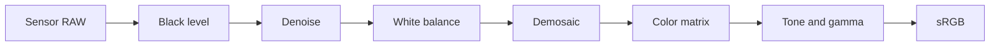

<!-- Generated by scripts/build.py from data/*.yaml. Edit the YAML files, not this file. -->

# Awesome Neural ISP 

**Neural (learned) camera ISPs with released code and pretrained weights, plus a primer on the classical pipeline they build on.**

     

**[Interactive page](https://RoryLi98.github.io/Awesome-Neural-ISP/) · [Weights index](WEIGHTS.md) · [ISP 101](guide/isp-101.md) · [Contributing](CONTRIBUTING.md)**

A curated list of research on neural (learned) camera image signal processors (ISPs). It covers learned replacements for each stage of the classical pipeline (denoising, demosaicing, white balance, color and tone), end-to-end RAW-to-sRGB networks, inverse ISPs, ISPs for machine vision, and ISP tuning. For every paper the list records whether code and pretrained weights are public, and links the weights exactly as the official repository does.

It currently holds **410 papers**, of which **201 have public code** and **136 release pretrained weights**, plus 28 datasets. The [interactive page](https://RoryLi98.github.io/Awesome-Neural-ISP/) has the same data with search and filters by pipeline stage and weight host.

**Reading the tables.** In each section, papers with downloadable weights come first. The *Weights* column copies the links from each repository README; "in repo" means the checkpoint files are committed to the repository. In the *Code* column, "unofficial" marks a third-party implementation, "coming soon" a placeholder repository, and "—" means no public code was found.

## Contents

- [ISP 101](#isp-101)
- [Research Threads](#research-threads)
- [Papers](#papers)
  - [End-to-End RAW-to-sRGB](#end-to-end-raw-to-srgb) (45 papers, 14 with weights)
  - [Mobile & Lightweight ISP](#mobile--lightweight-isp) (12 papers, 5 with weights)
  - [RAW Denoising & Noise Modeling](#raw-denoising--noise-modeling) (28 papers, 14 with weights)
  - [Low-Light RAW Enhancement](#low-light-raw-enhancement) (32 papers, 12 with weights)
  - [Demosaicing, Joint Restoration & RAW Super-Resolution](#demosaicing-joint-restoration--raw-super-resolution) (55 papers, 15 with weights)
  - [Burst & HDR](#burst--hdr) (37 papers, 14 with weights)
  - [RAW Video](#raw-video) (15 papers, 6 with weights)
  - [White Balance, Color & Tone](#white-balance-color--tone) (63 papers, 29 with weights)
  - [Inverse ISP, RAW Reconstruction & Compression](#inverse-isp-raw-reconstruction--compression) (37 papers, 12 with weights)
  - [ISP for Machine Vision](#isp-for-machine-vision) (44 papers, 12 with weights)
  - [ISP Parameter Tuning](#isp-parameter-tuning) (15 papers, 2 with weights)
  - [Challenges & Surveys](#challenges--surveys) (27 papers, 1 with weights)
- [Datasets](#datasets)
- [Tools & Open-source ISPs](#tools--open-source-isps)
- [Learning Resources](#learning-resources)
- [Related Lists](#related-lists)
- [Contributing](#contributing)
- [About This List](#about-this-list)
- [License](#license)

## ISP 101

A camera sensor records a noisy, linear mosaic with one color per pixel. The ISP turns it into a display-ready image.
The classical stages below are where learned methods plug in; the [full primer](guide/isp-101.md) explains each stage
and comes with a [50-line NumPy pipeline](guide/minimal_isp.py) you can run on your own RAW files.

| Classical stage | What it does | Learned methods in this list |
|:--|:--|:--|
| Black level, defect pixels, lens shading | remove sensor offsets and optical falloff | usually kept classical |
| Denoising | remove Poisson-Gaussian sensor noise | [Denoising](#raw-denoising--noise-modeling) · [Low-light RAW](#low-light-raw-enhancement) · [Burst / HDR](#burst--hdr) · [RAW video](#raw-video) |
| Demosaicing | interpolate the two missing colors per pixel | [Demosaic / SR](#demosaicing-joint-restoration--raw-super-resolution) |
| White balance | estimate and cancel the illuminant color | [WB / Color / Tone](#white-balance-color--tone) |
| Color correction, tone, gamma | map camera RGB to sRGB and compress dynamic range | [WB / Color / Tone](#white-balance-color--tone) |
| The whole pipeline | RAW in, sRGB out | [End-to-end](#end-to-end-raw-to-srgb) · [Mobile](#mobile--lightweight-isp) |
| The pipeline in reverse | sRGB back to RAW | [Inverse ISP](#inverse-isp-raw-reconstruction--compression) |
| Output for machines, not people | detection or segmentation on RAW | [For vision tasks](#isp-for-machine-vision) |
| Parameters of a hardware ISP | automatic tuning | [ISP tuning](#isp-parameter-tuning) |

## Research Threads

- **From CNNs to generative ISPs.** CNNs dominated until 2023. Transformers and Mamba then entered low-light enhancement and demosaicing, and from 2025 diffusion and flow matching are used both for the forward ISP and for RGB-to-RAW. Examples: PyNET → LiteISPNet → ISPDiffuser · LDM-ISP · RAW-Flow · SpiralDiff
- **Training data is the bottleneck.** Phone RAW and DSLR sRGB are never perfectly aligned and differ in color. Responses moved from alignment-aware losses to synthetic data and cross-camera RAW mapping; the 2025-2026 challenges switched to fully unpaired training. Examples: LiteISPNet · Unprocessing · Day-to-Night · Rawformer · NTIRE 2026 Unpaired ISP
- **Feeding camera metadata to the network.** EXIF, ISO, color matrices and capture time are encoded explicitly for cross-camera generalization and controllable rendering. Examples: ParamISP · MetaISP · CCMNet · Time-Aware AWB · PMRID k-Sigma
- **Deployment: from challenges to low-bit networks.** The MAI challenges time submissions on phone NPUs, which produced compact designs such as MicroISP and PyNET-V2. Explicit quantization and binarization work concentrates on RAW video and demosaicing. Examples: MAI 2021/2022/2025 · MicroISP · BRVE · BinRVR · BMTNet · RAWDet-7
- **ISPs that serve machines.** RAW detection datasets and methods grew quickly after 2023: jointly trained ISPs, reinforcement-learned ISP sequences, and adapters that consume RAW directly. Examples: Dirty Pixels · AdaptiveISP · RAW-Adapter · TA-ISP · POS-ISP · RAWild
- **Controllable and modular again.** After black-box end-to-end models, work is splitting the ISP back into interpretable, replaceable modules, with attention to user editing and style control. Examples: Modular Neural ISP · CtrlISP · Edit-aware RAW · DualDn · NILUT

## Papers

### End-to-End RAW-to-sRGB

One network replaces the whole ISP. Early work is CNN-based (DeepISP, PyNET, LiteISPNet); recent work moves to diffusion and autoregressive priors, camera-parameter conditioning and modular designs. Misaligned RAW/sRGB training pairs are a recurring problem.

**With pretrained weights (14)**

| Paper | Venue | Code | Weights |
|:--|:--|:--|:--|
| **[ISPDiffuser](https://arxiv.org/abs/2503.19283)** ISPDiffuser: Learning RAW-to-sRGB Mappings with Texture-Aware Diffusion Models and Histogram-Guided Color Consistency Diffusion model for RAW-to-sRGB with a texture-aware loss and histogram-guided color consistency. | AAAI 2025 | [GitHub](https://github.com/RenYangSCU/ISPDiffuser) PyTorch | [ZRR / MAI weights (Google Drive)](https://drive.google.com/drive/folders/1smqKEttfKNEZfS8OT-g9yoMOCoRs90Gy?usp=sharing) [Mirror (Baidu, code f1gv)](https://pan.baidu.com/s/1eAAZf0TbHakxrqwyl2AZVA?pwd=f1gv) |
| **[Modular Neural ISP](https://arxiv.org/abs/2512.08564)** Modular Neural Image Signal Processing Splits a neural ISP into swappable modules for denoising, AWB/CCM, photofinishing and upsampling, with an interactive photo-editing GUI. <i>Note: Afifi / Brown group; a standalone executable GUI is also available</i> | arXiv 2025 | [GitHub](https://github.com/mahmoudnafifi/modular_neural_isp) PyTorch | [denoising/models/\*.pth (lite/base/large)](https://github.com/mahmoudnafifi/modular_neural_isp/tree/main/denoising/models) [photofinishing/models/\*.pth (multiple styles)](https://github.com/mahmoudnafifi/modular_neural_isp/tree/main/photofinishing/models) |
| **[ParamISP](https://arxiv.org/abs/2312.13313)** ParamISP: Learned Forward and Inverse ISPs using Camera Parameters Encodes EXIF parameters such as exposure, ISO and focal length into the network to learn both forward and inverse ISPs, trained per camera model. | CVPR 2024 | [GitHub](https://github.com/woo525/ParamISP) PyTorch | [Official weights (Google Drive, inverse and forward)](https://drive.google.com/drive/folders/1L7ZSikYt5eaCOEINpjjwmPX0CoZLbBG6) |
| **[MetaISP](https://arxiv.org/abs/2401.03220)** MetaISP – Exploiting Global Scene Structure for Accurate Multi-Device Color Rendition Uses global scene features and device metadata so that one network renders the distinct color styles of multiple smartphones. | VMV 2023 | [GitHub](https://github.com/vccimaging/MetaISP) PyTorch | [MetaISPNet weights (Google Drive)](https://drive.google.com/drive/folders/1tLWlx0LDUjQ9niZje0cfLKt98dx1VEIR?usp=sharing) |
| **[CBUnet](https://arxiv.org/abs/2204.08970)** Rendering Nighttime Image Via Cascaded Color and Brightness Compensation Cascaded color-compensation and brightness-compensation networks for night RAW rendering. <i>Note: Stage-2 and other weights are listed in the README</i> | CVPRW (NTIRE) 2022 | [GitHub](https://github.com/njuvision/CBUnet) PyTorch | [stage-1 cube++.pth (Google Drive)](https://drive.google.com/file/d/1K8CgwXp0Pk7yPNUWXOF6zbK9iHgpiVDS/view?usp=sharing) |
| **[Deep-FlexISP](https://openaccess.thecvf.com/content/CVPR2022W/NTIRE/html/Liu_Deep-FlexISP_A_Three-Stage_Framework_for_Night_Photography_Rendering_CVPRW_2022_paper.html)** Deep-FlexISP: A Three-Stage Framework for Night Photography Rendering NTIRE 2022 night rendering winner with three stages: denoising, white balance and tone mapping. <i>Note: Released as a Docker container</i> | CVPRW (NTIRE) 2022 | [GitHub](https://github.com/q935970314/Deep-FlexISP) | [Docker image (includes models, Google Drive)](https://drive.google.com/file/d/1f6EhX3kZvgE6FIj0dRnGuCVryT3BIYOz/view?usp=sharing) |
| **[LiteISPNet](https://openaccess.thecvf.com/content/ICCV2021/html/Zhang_Learning_RAW-to-sRGB_Mappings_With_Inaccurately_Aligned_Supervision_ICCV_2021_paper.html)** Learning RAW-to-sRGB Mappings with Inaccurately Aligned Supervision Joint alignment and global color mapping to handle spatial misalignment and color differences in RAW/sRGB training pairs; includes the lightweight LiteISPNet. <i>Note: The README also provides ZRR via Baidu (code 8sq1) and a preprocessed SR-RAW.</i> | ICCV 2021 | [GitHub](https://github.com/cszhilu1998/RAW-to-sRGB) PyTorch | [ZRR / SR-RAW pretrained models (Google Drive)](https://drive.google.com/drive/folders/12eMNZh-A9E4bVup-Kcy_F0_c0IToUyw7?usp=sharing) |
| **[AWNet](https://arxiv.org/abs/2008.09228)** AWNet: Attentive Wavelet Network for Image ISP Wavelet-transform and attention ISP network with dual inputs (RAW / demosaiced image); a top-ranked AIM 2020 entry. | ECCVW (AIM) 2020 | [GitHub](https://github.com/Charlie0215/AWNet-Attentive-Wavelet-Network-for-Image-ISP) PyTorch | [demosaiced_model (Google Drive)](https://drive.google.com/file/d/1uhohG6cYkM_-W4dGLl8yGlo85UMF6KEK/view?usp=sharing) [Raw_model (Google Drive)](https://drive.google.com/file/d/1jBwEm7_zbU55qOlGAVuOAQ8BIwx2g7Fw/view?usp=sharing) |
| **[MW-ISPNet](https://arxiv.org/abs/2011.04994)** MW-ISPNet (AIM 2020 Learned ISP winning solution; see the challenge report) U-Net with multi-level wavelets and residual channel attention; ranked first in both AIM 2020 tracks. | ECCVW (AIM) 2020 | [GitHub](https://github.com/cszhilu1998/MW-ISPNet) PyTorch | [Track1 models (Google Drive)](https://drive.google.com/drive/folders/1lt5eXn49LgLzdj3z7k7lPK0B7obiLIHd?usp=sharing) [Track2 models (Google Drive)](https://drive.google.com/drive/folders/1uyU1huZnh8Wf7BYFkXVfrTl64EuFNcO7?usp=sharing) |
| **[PyNET](https://arxiv.org/abs/2002.05509)** Replacing Mobile Camera ISP with a Single Deep Learning Model Inverted-pyramid multi-scale network trained level by level on Huawei P20 RAW to Canon 5D Mark IV photos (ZRR dataset). <i>Note: PyTorch version at aiff22/PyNET-PyTorch; training also requires VGG-19</i> | CVPRW 2020 | [GitHub](https://github.com/aiff22/PyNET) TensorFlow / PyTorch | [PyNET_pretrained.zip (TF)](https://download.ai-benchmark.com/s/C4a3C5WxB8p2my8/download/PyNET_pretrained.zip) [pynet_level_0.pth (PyTorch version)](https://download.ai-benchmark.com/s/A5wkJNztkpex8T4/download/pynet_level_0.pth) |
| **[PyNET-CA](https://arxiv.org/abs/2104.02895)** PyNET-CA: Enhanced PyNET with Channel Attention for End-to-End Mobile ISP Adds channel attention and sub-pixel upsampling to PyNET; a solution for the AIM 2020 ISP track. <i>Note: Authors warn that results may not be reproducible with PyTorch &gt; 1.4</i> | ECCVW (AIM) 2020 | [GitHub](https://github.com/egyptdj/skyb-aim2020-public) PyTorch | [pretrained_model.zip (Dropbox)](https://www.dropbox.com/s/psoz0auaynu3e5x/pretrained_model.zip?dl=0) |
| **[HERN](https://arxiv.org/abs/1911.08098)** HighEr-Resolution Network for Image Demosaicing and Enhancing Winning AIM 2019 RAW-to-RGB solution with a dual-branch design: a high-resolution detail branch and a low-resolution global branch. <i>Note: README provides weights from two epochs</i> | ICCVW (AIM) 2019 | [GitHub](https://github.com/MKFMIKU/RAW2RGBNet) PyTorch | [114.pth / 115.pth (OneDrive)](https://cuhko365-my.sharepoint.com/:u:/g/personal/219019003_link_cuhk_edu_cn/EZrS367uMMlPjVEQ41j1N30B-4d6fcfNESWNi0JPH2Pyfg?e=IlRYiU) |
| **[W-Net](https://arxiv.org/abs/1911.08656)** W-Net: Two-stage U-Net with misaligned data for raw-to-RGB mapping AIM 2019 RAW-to-RGB challenge entry; a two-stage U-Net that handles misaligned supervision between smartphone RAW and DSLR RGB. | ICCVW (AIM) 2019 | [GitHub](https://github.com/khuhm/W-Net) | [pretrained models (Google Drive)](https://drive.google.com/drive/folders/1eH_prE7EWEUqxJes5IfHTdsFyqP64o7w?usp=sharing) |
| **[DPED](https://arxiv.org/abs/1704.02470)** DSLR-Quality Photos on Mobile Devices with Deep Convolutional Networks sRGB→sRGB enhancement of phone photos to DSLR quality (DPED dataset); the precursor of the PyNET family of learned ISPs. | ICCV 2017 | [GitHub](https://github.com/aiff22/DPED) TensorFlow | [models_orig/{iphone,sony,blackberry}_orig (in repo)](https://github.com/aiff22/DPED/tree/master/models_orig) |

**Code only or not released (31)**

| Paper | Venue | Code |
|:--|:--|:--|
| **[RAW vs RGB Restoration Benchmark](https://arxiv.org/abs/2609.02831)** Benchmarking RAW and RGB Restoration in Image Signal Processors Systematically compares restoration in the RAW versus RGB domain, giving empirical evidence on where to place restoration modules in an ISP. <i>Note: Code merged into the mv-lab/AISP repo</i> | BMVC 2026 | [GitHub](https://github.com/mv-lab/AISP) |
| **[RGB-Event ISP](https://arxiv.org/abs/2501.19129)** RGB-Event ISP: The Dataset and Benchmark First ISP dataset and benchmark for hybrid RGB-event sensors, studying how event data helps demosaicing, denoising and color. <i>Note: Dataset on HF yunfanlu/RGB-Event-ISP-Dataset and Baidu; non-commercial research use only</i> | ICLR 2025 | [GitHub](https://github.com/yunfanLu/RGB-Event-ISP) |
| **[FourierISP](https://arxiv.org/abs/2401.02161)** Enhancing RAW-to-sRGB with Decoupled Style Structure in Fourier Domain Decouples style (color/brightness) from structure in the Fourier domain and learns each separately. <i>Note: README explicitly states checkpoints will not be released; you need to train it yourself</i> | AAAI 2024 | [GitHub](https://github.com/alexhe101/FourierISP) PyTorch |
| **[Day-to-Night](https://openaccess.thecvf.com/content/CVPR2022/html/Punnappurath_Day-to-Night_Image_Synthesis_for_Training_Nighttime_Neural_ISPs_CVPR_2022_paper.html)** Day-to-Night Image Synthesis for Training Nighttime Neural ISPs Synthesizes nighttime RAW (with noise and multiple illuminants) from daytime RAW to train nighttime neural ISPs. <i>Note: README references pretrained_\* directories, but no weight files were found in the repo and the dataset link is empty</i> | CVPR 2022 | [GitHub](https://github.com/SamsungLabs/day-to-night) PyTorch |
| **[CameraNet](https://arxiv.org/abs/1908.01481)** CameraNet: A Two-Stage Framework for Effective Camera ISP Learning Splits the ISP into separately supervised restoration and enhancement subnetworks, easing the conflict of one network learning both denoising and color adjustment. <i>Note: Official TF1.15 code; README only provides HDR+/SID processed data, no weight link found</i> | IEEE TIP 2019 | [GitHub](https://github.com/zhetongliang/CameraNet_official) TensorFlow |
| **[DRIFT](https://openaccess.thecvf.com/content/CVPR2026W/NTIRE/html/Majee_DRIFT_Deep_Restoration_ISP_Fusion_and_Tone-mapping_CVPRW_2026_paper.html)** DRIFT: Deep Restoration, ISP Fusion, and Tone-mapping Combines restoration, ISP fusion and tone mapping into a single unified framework. | CVPRW (NTIRE) 2026 | — |
| **[NPR Color Bias](https://arxiv.org/abs/2604.28136)** Beyond Pixel Fidelity: Minimizing Perceptual Distortion and Color Bias in Night Photography Rendering Night photography rendering that jointly constrains perceptual distortion and color bias. | ICIP 2026 | — |
| **[Reference-free ISP Evaluation](https://arxiv.org/abs/2607.23321)** A Reference-Free Framework for Evaluating Single-Frame ISP Pipelines A framework for evaluating the output quality of single-frame ISP pipelines without reference images. | arXiv 2026 | — |
| **[RPBA-Net](https://arxiv.org/abs/2605.03626)** RPBA-Net: An Interpretable Residual Pyramid Bilateral Affine Network for RAW-Domain ISP Enhancement Interpretable RAW-domain ISP enhancement built on a residual pyramid and bilateral affine grids. | arXiv 2026 | — |
| **[Small-Pixel Neural ISP](https://arxiv.org/abs/2606.07675)** The Need for Neural ISP in the Small-Pixel Era Position paper: as pixels shrink and optics approach their limits, neural ISPs are needed to compensate through restoration. | arXiv 2026 | — |
| **[VAR-ISP](https://arxiv.org/abs/2609.18302)** Visual Autoregressive Priors for RAW-to-sRGB Image Signal Processing Introduces visual autoregressive (VAR) generative priors into RAW-to-sRGB processing. | ECCVW (LoViF) 2026 | — |
| **[EGUOT-ISP](https://arxiv.org/abs/2512.05635)** Experts-Guided Unbalanced Optimal Transport for ISP Learning from Unpaired and/or Paired Data Unifies paired and unpaired ISP learning with expert-guided unbalanced optimal transport. <i>Note: Repo currently contains only a README</i> | arXiv 2025 | [GitHub (coming soon)](https://github.com/gosha20777/EGUOT-ISP) |
| **[EvRAW](https://scholar.google.com/scholar?q=%22EvRAW%22+RAW-to-sRGB)** EvRAW: Event-guided Structural and Color Modeling for RAW-to-sRGB Image Reconstruction Event-camera-guided structural and color modeling for RAW→sRGB reconstruction. | ACM MM 2025 | — |
| **[SemiISP](https://arxiv.org/abs/2504.02345)** SemiISP/SemiIE: Semi-Supervised Image Signal Processor and Image Enhancement Leveraging One-to-Many Mapping sRGB-to-RAW Expands training pairs through one-to-many sRGB-to-RAW synthesis to train the ISP in a semi-supervised manner. | arXiv 2025 | — |
| **[DiR](https://openaccess.thecvf.com/content/CVPR2024/html/Guo_Learning_Degradation-Independent_Representations_for_Camera_ISP_Pipelines_CVPR_2024_paper.html)** Learning Degradation-Independent Representations for Camera ISP Pipelines Learns degradation-independent representations so the ISP is more robust to unknown degradations such as noise and blur. | CVPR 2024 | — |
| **[Real-World Camera Pipeline](https://arxiv.org/abs/2411.10773)** An End-to-End Real-World Camera Imaging Pipeline End-to-end ISP for real smartphone imaging pipelines, covering denoising, color and tone. | ACM MM 2024 | — |
| **[RMFA-Net](https://arxiv.org/abs/2406.11469)** RMFA-Net: A Neural ISP for Real RAW to RGB Image Reconstruction ISP network for real smartphone RAW images using multi-frequency attention fusion. | arXiv 2024 | — |
| **[Simple ISP](https://arxiv.org/abs/2404.11569)** Simple Image Signal Processing using Global Context Guidance Adds a global context guidance module to a lightweight ISP backbone to improve tonal consistency across the whole image. | ICIP 2024 | — |
| **[Uni-ISP](https://arxiv.org/abs/2406.01003)** Uni-ISP: Toward Unifying the Learning of ISPs from Multiple Mobile Cameras A single model that learns the ISPs of multiple smartphones and supports style transfer between cameras. | IEEE TIP 2024 | — |
| **[Back to the Future ISP](https://openaccess.thecvf.com/content/CVPR2023W/NTIRE/html/Zini_Back_to_the_Future_A_Night_Photography_Rendering_ISP_Without_CVPRW_2023_paper.html)** Back to the Future: A Night Photography Rendering ISP Without Deep Learning A night photography rendering ISP without deep learning, serving as a reference point for learned methods. | CVPRW (NTIRE) 2023 | — |
| **[Contrastive Subspace ISP](https://arxiv.org/abs/2104.00253)** Deep Contrastive Patch-Based Subspace Learning for Camera Image Signal Processing Learns ISP modules using patch-based subspaces and contrastive learning. | IEEE AIC 2023 | — |
| **[Single-Frame HDR ISP](https://openaccess.thecvf.com/content/WACV2023/html/Dinh_End-to-End_Single-Frame_Image_Signal_Processing_for_High_Dynamic_Range_Scenes_WACV_2023_paper.html)** End-to-End Single-Frame Image Signal Processing for High Dynamic Range Scenes End-to-end ISP operating on a single RAW frame in high dynamic range scenes. | WACV 2023 | — |
| **[CRISPnet](https://arxiv.org/abs/2203.10562)** CRISPnet: Color Rendition ISP Net ISP network aimed at accurate color rendition, incorporating global scene semantics and metadata. | arXiv 2022 | — |
| **[ISPW / LiteISP-in-the-wild](https://arxiv.org/abs/2203.10636)** Transform your Smartphone into a DSLR Camera: Learning the ISP in the Wild Learns an ISP from weakly paired smartphone-DSLR data captured in the wild (ISPW), handling alignment and color differences. <i>Note: Repo currently only offers the ISPW dataset download; README says "Code will be released soon"</i> | ECCV 2022 | [GitHub (coming soon)](https://github.com/4rdhendu/TransformPhone2DSLR) |
| **[RAWtoBit](https://arxiv.org/abs/2208.07639)** RAWtoBit: A Fully End-to-end Camera ISP Network Merges the ISP and image compression into a single end-to-end network that outputs a bitstream directly from RAW. | ECCV 2022 | — |
| **[Shallow Night Pipeline](https://arxiv.org/abs/2204.08972)** Shallow Camera Pipeline for Night Photography Rendering NTIRE 2022 night photography rendering: a shallow camera pipeline built from a few learnable modules. <i>Note: The paper states code will be released upon acceptance; no repo found.</i> | arXiv 2022 | — |
| **[StereoISP](https://arxiv.org/abs/2211.07390)** StereoISP: Rethinking Image Signal Processing for Dual Camera Systems Performs ISP jointly on the two RAW streams captured by a dual-camera system. | arXiv 2022 | — |
| **[Sky Optimization](https://openaccess.thecvf.com/content_CVPRW_2020/html/w31/Liba_Sky_Optimization_Semantically_Aware_Image_Processing_of_Skies_in_Low-Light_CVPRW_2020_paper.html)** Sky Optimization: Semantically Aware Image Processing of Skies in Low-Light Photography Processes sky regions separately in a mobile night-mode ISP using a lightweight segmentation network (related to Google Night Sight). | CVPRW 2020 | — |
| **[Deep Camera](https://arxiv.org/abs/1908.09191)** Deep Camera: A Fully Convolutional Neural Network for Image Signal Processing An early attempt to replace the entire camera ISP with a single fully convolutional network. | ICCVW 2019 | — |
| **[DeepISP](https://arxiv.org/abs/1801.06724)** DeepISP: Towards Learning an End-to-End Image Processing Pipeline One of the earliest end-to-end learned ISPs, with two stages: local denoising/demosaicing and global tone/color adjustment; comes with a Samsung S7 dataset. | IEEE TIP 2018 | — |
| **[Scene-Dependent Imaging](https://arxiv.org/abs/1707.08350)** Modelling the Scene Dependent Imaging in Cameras with a Deep Neural Network Models a camera's scene-dependent RAW→sRGB rendering with a DNN; one of the early attempts at a learned ISP. | ICCV 2017 | — |

<a href="#contents">back to contents</a>

### Mobile & Lightweight ISP

ISPs built to run in real time on phone NPUs and GPUs, mostly from the Mobile AI (MAI) and NTIRE challenges. Since 2025 the focus has shifted to training without paired data.

**With pretrained weights (5)**

| Paper | Venue | Code | Weights |
|:--|:--|:--|:--|
| **[Unpaired ISP Transfer](https://arxiv.org/abs/2605.07495)** Lightweight Unpaired Smartphone ISP Transfer with Semantic Pseudo-Pairing Builds training pairs through semantic pseudo-pairing for unpaired smartphone ISP transfer; an NTIRE 2026 unpaired ISP track entry. | CVPRW (NTIRE) 2026 | [GitHub](https://github.com/nuniniyujin/Unpaired-ISP) PyTorch | [checkpoint (Google Drive, see checkpoints/weight_url.txt)](https://drive.google.com/drive/folders/1kwby-1qOq67RGABkmkLD3OXLC5eYK3OM?usp=sharing) |
| **[Unpaired Lightweight ISP](https://arxiv.org/abs/2505.10420)** Learned Lightweight Smartphone ISP with Unpaired Data Trains a lightweight ISP without paired data using multiple losses and adversarial training; evaluated on ZRR / UltraISP. | CVPRW (MAI) 2025 | [GitHub](https://github.com/AndreiiArhire/Learned-Lightweight-Smartphone-ISP-with-Unpaired-Data) PyTorch | [pretrained/models/{ZRR,Fujifilm} (in repo)](https://github.com/AndreiiArhire/Learned-Lightweight-Smartphone-ISP-with-Unpaired-Data/tree/main/pretrained) |
| **[LAN](https://openaccess.thecvf.com/content/CVPR2022W/NTIRE/html/Raimundo_LAN_Lightweight_Attention-Based_Network_for_RAW-to-RGB_Smartphone_Image_Processing_CVPRW_2022_paper.html)** LAN: Lightweight Attention-Based Network for RAW-to-RGB Smartphone Image Processing Lightweight attention network targeting the MAI 2021 mobile ISP data (Sony IMX586 RAW to Fujifilm GFX100). | CVPRW (NTIRE) 2022 | [GitHub](https://github.com/draimundo/LAN) TensorFlow | [models/LAN_iteration_200000.ckpt (in repo)](https://github.com/draimundo/LAN/tree/main/models) |
| **[MicroISP](https://arxiv.org/abs/2211.06770)** MicroISP: Processing 32MP Photos on Mobile Devices with Deep Learning Very small ISP with per-channel branches that processes 32MP photos in under 1 s on smartphones; comes with the Fujifilm UltraISP dataset. <i>Note: Academic use only</i> | ECCVW 2022 | [GitHub](https://github.com/aiff22/MicroISP) TensorFlow | [pretrained_weights/MicroISP.ckpt (in repo)](https://github.com/aiff22/MicroISP/tree/master/pretrained_weights) |
| **[PyNET-V2 Mobile](https://arxiv.org/abs/2211.06263)** PyNet-V2 Mobile: Efficient On-Device Photo Processing With Neural Networks Mobile version of PyNET redesigned around NPU operator constraints, able to process full-resolution photos on smartphones. | ICPR 2022 | [GitHub](https://github.com/gmalivenko/PyNET-v2) TensorFlow / Keras | [PyNET-V2 pretrained models (Google Drive)](https://drive.google.com/file/d/1txsJaCbeC-Tk53TPlvVk3IPpRw1Ro3BS/view?usp=sharing) |

**Code only or not released (7)**

| Paper | Venue | Code |
|:--|:--|:--|
| **[PyNET-QxQ](https://arxiv.org/abs/2203.04314)** PyNET-QxQ: An Efficient PyNET Variant for QxQ Bayer Pattern Demosaicing in CMOS Image Sensors Lightweight PyNET variant for Quad/QxQ Bayer pattern sensors. <i>Note: README says to place best_acc_model.pth but gives no download link</i> | IEEE Access 2023 | [GitHub](https://github.com/Minhyeok01/PyNET-QxQ) |
| **[SYENet](https://openaccess.thecvf.com/content/ICCV2023/html/Gou_SYENet_A_Simple_Yet_Effective_Network_for_Multiple_Low-Level_Vision_ICCV_2023_paper.html)** SYENet: A Simple Yet Effective Network for Multiple Low-Level Vision Tasks with Real-time Performance on Mobile Device Small reparameterized network handling ISP, low-light enhancement and super-resolution; top score in the MAI 2022 mobile ISP track. <i>Note: README describes the arguments for loading pretrained models, but no weight download link was found; includes an ONNX export script</i> | ICCV 2023 | [GitHub](https://github.com/sanechips-multimedia/syenet) PyTorch |
| **[Fourier Unpaired ISP](https://openaccess.thecvf.com/content/CVPR2026W/NTIRE/html/Kim_Freeze_the_Structure_Free_the_Color_Fourier-Domain_Training_for_Unpaired_CVPRW_2026_paper.html)** Freeze the Structure, Free the Color: Fourier-Domain Training for Unpaired Smartphone ISP Freezes structure during unpaired training and learns color only on the Fourier amplitude; an NTIRE 2026 unpaired ISP solution. | CVPRW (NTIRE) 2026 | — |
| **[CoDISP](https://openaccess.thecvf.com/content/CVPR2024W/MAI/html/Zhang_CoDISP_Exploring_Compressed_Domain_Camera_ISP_with_RGB-guided_Encoder_CVPRW_2024_paper.html)** CoDISP: Exploring Compressed Domain Camera ISP with RGB-guided Encoder Performs the camera ISP in the compressed domain to reduce bandwidth on mobile devices. | CVPRW (MAI) 2024 | — |
| **[LW-ISP](https://arxiv.org/abs/2210.03904)** LW-ISP: A Lightweight Model with ISP and Deep Learning Lightweight learned ISP for mobile devices, replacing large PyNET-style models with fewer parameters. | BMVC 2022 | — |
| **[CSANet](https://openaccess.thecvf.com/content/CVPR2021W/MAI/html/Hsyu_CSAnet_High_Speed_Channel_Spatial_Attention_Network_for_Mobile_ISP_CVPRW_2021_paper.html)** CSAnet: High Speed Channel Spatial Attention Network for Mobile ISP MAI 2021 mobile ISP solution using channel and spatial attention, with an emphasis on NPU inference speed. | CVPRW (MAI) 2021 | — |
| **[Del-Net](https://arxiv.org/abs/2108.01623)** Del-Net: A Single-Stage Network for Mobile Camera ISP Single-stage ISP network designed for smartphones; an MAI 2021 challenge entry. | arXiv 2021 | — |

<a href="#contents">back to contents</a>

### RAW Denoising & Noise Modeling

The front of the pipeline. The main thread runs from Poisson-Gaussian models to physics-based noise formation (ELD), dark-frame sampling, generative noise models, and calibration-free and blind denoising.

**With pretrained weights (14)**

| Paper | Venue | Code | Weights |
|:--|:--|:--|:--|
| **[2-Shots in the Dark](https://arxiv.org/abs/2512.03245)** 2-Shots in the Dark: Low-Light Denoising with Minimal Data Acquisition Prepares low-light denoising data for a new camera with only two captures. | CVPR 2026 | [GitHub](https://github.com/IVRL/2-Shots-in-the-Dark) PyTorch | [SID/ELD and LRID models + dark-frame resources (Google Drive)](https://drive.google.com/drive/folders/1Hz4rzV8578lHCTzQkwCHE2nrphQy1QYG?usp=sharing) |
| **[Nonlocal MatchFilter](https://arxiv.org/abs/2604.17453)** Learned Nonlocal Feature Matching and Filtering for RAW Image Denoising RAW image denoising with learned nonlocal feature matching combined with filtering. | arXiv 2026 | [GitHub](https://github.com/MIA-UIB/nonlocal-matchfilter) PyTorch | [GitHub Releases (with weights)](https://github.com/MIA-UIB/nonlocal-matchfilter/releases) |
| **[PNNP](https://arxiv.org/abs/2310.09126)** Learning Physics-Informed Noise Models from Dark Frames for Low-Light Raw Image Denoising Learns a physics-informed noise model (PNNP) from dark frames; releases the LRID dataset. <i>Note: Provides PNNP weights for Sony A7S2 and IMX686; the training code for PNNP itself is not open-sourced</i> | IEEE TPAMI 2026 | [GitHub](https://github.com/fenghansen/PNNP) PyTorch | [Checkpoints & Resources (Baidu, code vmcl)](https://pan.baidu.com/s/1WMv2x7yqg0kMTBCddqkCLQ?pwd=vmcl) [LRID dataset (Hugging Face)](https://huggingface.co/datasets/hansen97/LRID) |
| **[Noise Modeling in One Hour](https://arxiv.org/abs/2505.00045)** Noise Modeling in One Hour: Minimizing Preparation Efforts for Self-supervised Low-Light RAW Image Denoising Reduces noise-modeling preparation to under one hour and uses dark shading for self-supervised low-light RAW image denoising. | CVPR 2025 | [GitHub](https://github.com/SonyResearch/raw_image_denoising) PyTorch | [pretrained checkpoints (Google Drive)](https://drive.google.com/drive/folders/1KyR9f6SIciXWv29owm0xYPCOnaMd9YWh?usp=sharing) |
| **[YOND](https://arxiv.org/abs/2506.03645)** YOND: Practical Blind Raw Image Denoising Free from Camera-Specific Data Dependency Blind RAW denoising without camera-specific data: estimate the noise first, apply variance stabilization, then run a generic denoiser. | IEEE TPAMI 2025 | [GitHub](https://github.com/fenghansen/YOND_public) PyTorch | [SNR-Net weights + training data (Baidu, code nn4v)](https://pan.baidu.com/s/1tAJW_57v2jWJ605MWKMKVg?pwd=nn4v) [Online demo (HF Spaces)](https://huggingface.co/spaces/hansen97/YOND) |
| **[DualDn](https://arxiv.org/abs/2409.18783)** DualDn: Dual-domain Denoising via Differentiable ISP Denoises once in the RAW domain and once in the sRGB domain, linked by a differentiable ISP, generalizing to different camera ISPs. <i>Note: The README table also lists weights and visual results for other training sets</i> | ECCV 2024 | [GitHub](https://github.com/OpenImagingLab/DualDn) PyTorch | [FiveK-trained model (OneDrive)](https://mycuhk-my.sharepoint.com/:u:/g/personal/1155231343_link_cuhk_edu_hk/EUWR-KgxXD5OsH85ylom4H4BPv2hjYSMAyp4MkopiVnqoQ?e=mfcZBX) |
| **[LED](https://arxiv.org/abs/2308.03448)** Lighting Every Darkness in Two Pairs: A Calibration-Free Pipeline for RAW Denoising Calibration-free pipeline: pretrains on virtual cameras, then fine-tunes with only 2 real pairs to adapt to a new sensor. <i>Note: Since 2025-12 also includes UltraLED code and data</i> | ICCV 2023 | [GitHub](https://github.com/Srameo/LED) PyTorch | [Models Zoo (Google Drive)](https://drive.google.com/drive/folders/11MYkjzbPIZ7mJbu9vrgaVC-OwGcOFKsM?usp=sharing) [related files (Baidu, code iay5)](https://pan.baidu.com/s/17rA_8GvfNPZJY5Zl9dyILw?pwd=iay5) [weight table by camera/method](https://github.com/Srameo/LED/blob/main/docs/pretrained-models.md) |
| **[LRD](https://arxiv.org/abs/2307.16508)** Towards General Low-Light Raw Noise Synthesis and Modeling Uses a physical model for the signal-dependent part and a generative model for the signal-independent part; releases the LRD dataset. <i>Note: Noise synthesis model not released due to commercial licensing</i> | ICCV 2023 | [GitHub](https://github.com/fengzhang427/LRD) PyTorch | [RAW denoising models (Google Drive)](https://drive.google.com/file/d/1VkgHyEU6hNsXLL1vRfFWWLZCmGYGyi_h/view?usp=sharing) [Mirror (Baidu, code ujzm)](https://pan.baidu.com/s/1iMNrQh5P4g2prhhk2Tcu_g) |
| **[Pseudo-ISP](https://arxiv.org/abs/2103.10234)** Pseudo-ISP: Learning Pseudo In-camera Signal Processing Pipeline from A Color Image Denoiser Derives a pseudo ISP from an sRGB denoiser to adapt to the real noise of new sensors. | arXiv 2021 | [GitHub](https://github.com/happycaoyue/Pseudo-ISP) PyTorch | [pretrained denoising models (Baidu, code 6aj4)](https://pan.baidu.com/s/1W8_Uemrm8coX3wFZ_Jlw1g) |
| **[Rethinking Noise Synthesis](https://openaccess.thecvf.com/content/ICCV2021/html/Zhang_Rethinking_Noise_Synthesis_and_Modeling_in_Raw_Denoising_ICCV_2021_paper.html)** Rethinking Noise Synthesis and Modeling in Raw Denoising Samples signal-independent noise from real dark frames and combines it with a signal-dependent component, replacing parametric noise models. | ICCV 2021 | [GitHub](https://github.com/zhangyi-3/noise-synthesis) PyTorch | [pretrained (Baidu, code v4dh)](https://pan.baidu.com/s/1RMYgubpdKZFO8JUkdTC7vg?pwd=v4dh) |
| **[CA-NoiseGAN](https://arxiv.org/abs/2008.09370)** Learning Camera-Aware Noise Models Camera-aware GAN noise model that generates realistic RAW noise per camera and ISO. | ECCV 2020 | [GitHub](https://github.com/arcchang1236/CA-NoiseGAN) PyTorch | [checkpoints.zip (Google Drive)](https://drive.google.com/drive/folders/1jnv9rKEv1uTO7uyAf5fQCBHPL_4PCrhj?usp=sharing) |
| **[ELD](https://arxiv.org/abs/2003.12751)** A Physics-based Noise Formation Model for Extreme Low-light Raw Denoising Models shot, read (including long-tailed), row and quantization noise from CMOS imaging physics; releases the ELD dataset. <i>Note: TPAMI 2021 extended version (arXiv 2108.02158); also accessible under the repo name Vandermode/NoiseModel</i> | CVPR 2020 | [GitHub](https://github.com/Vandermode/ELD) PyTorch | [ELD data + pretrained models (Google Drive)](https://drive.google.com/drive/folders/1QoEhB1P-hNzAc4cRb7RdzyEKktexPVgy?usp=sharing) [Mirror (Baidu, code 0lby)](https://pan.baidu.com/s/11ksugpPH5uyDL-Z6S71Q5g) |
| **[MWRCANet](https://arxiv.org/abs/2005.04117)** NTIRE 2020 RAW denoising winning solution (see the NTIRE 2020 Real Image Denoising report) Multi-level wavelet residual channel attention network, first in the NTIRE 2020 RAW denoising track; night-scene solutions such as CBUnet reuse its weights directly. | CVPRW (NTIRE) 2020 | [GitHub](https://github.com/happycaoyue/NTIRE20_raw_image_denoising_winner_MWRCANet) PyTorch | [RAW model dn_mwrcanet_raw_c1.pth (Google Drive)](https://drive.google.com/drive/folders/1T23SqUEE1_oGGBK-gaRJ3L1jfVctRQtX?usp=sharing) [Mirror (Baidu, code 0odp)](https://pan.baidu.com/s/1Hbo86y3NYYf-WtLONRH3Sg) |
| **[PMRID](https://arxiv.org/abs/2010.06935)** Practical Deep Raw Image Denoising on Mobile Devices Calibrated sensor noise and a k-Sigma transform unify ISO levels; a small network runs at about 70 ms/MP on a Snapdragon 855. | ECCV 2020 | [GitHub](https://github.com/MegEngine/PMRID) PyTorch / MegEngine | [models/torch_pretrained.ckp + mge_pretrained.ckp (in repo)](https://github.com/MegEngine/PMRID/tree/main/models) [benchmark data (OneDrive)](https://megvii-my.sharepoint.cn/:f:/g/personal/wangyuzhi_megvii_com/Et4v2Z7CkRxHnbcFUq6RXZMBfXUrlm_Se5OVDvcdujVsMA?e=vcfJWs) |

**Code only or not released (14)**

| Paper | Venue | Code |
|:--|:--|:--|
| **[GALOSH](https://arxiv.org/abs/2607.03768)** GALOSH: Blind, Training-Free Denoising of Raw Bayer and sRGB Images by Parallel-Friendly Local Shrinkage Training-free local-shrinkage denoiser that estimates Poisson-Gaussian parameters from the input, designed for parallel hardware and applicable to both Bayer RAW and sRGB. <i>Note: Training-free method with no network weights; Releases provide a Windows executable.</i> | arXiv 2026 | [GitHub](https://github.com/luxgrain/GALOSH) C++ / Python |
| **[SeNM-VAE](https://openaccess.thecvf.com/content/CVPR2024/html/Zheng_SeNM-VAE_Semi-Supervised_Noise_Modeling_with_Hierarchical_Variational_Autoencoder_CVPR_2024_paper.html)** SeNM-VAE: Semi-Supervised Noise Modeling with Hierarchical Variational Autoencoder Semi-supervised noise modeling with a hierarchical VAE, using a small amount of paired data and a large amount of unpaired data. | CVPR 2024 | [GitHub](https://github.com/zhengdihan/SeNM-VAE) PyTorch |
| **[LLD (Physics-Guided ISO Noise)](https://openaccess.thecvf.com/content/CVPR2023/html/Cao_Physics-Guided_ISO-Dependent_Sensor_Noise_Modeling_for_Extreme_Low-Light_Photography_CVPR_2023_paper.html)** Physics-Guided ISO-Dependent Sensor Noise Modeling for Extreme Low-Light Photography Physics-guided ISO-dependent noise model; releases the LLD dataset, including dark frames and flat-field frames. <i>Note: Repo is mainly for the dataset</i> | CVPR 2023 | [GitHub](https://github.com/happycaoyue/LLD) |
| **[Noise2NoiseFlow](https://openaccess.thecvf.com/content/CVPR2022/html/Maleky_Noise2NoiseFlow_Realistic_Camera_Noise_Modeling_Without_Clean_Images_CVPR_2022_paper.html)** Noise2NoiseFlow: Realistic Camera Noise Modeling without Clean Images Trains a normalizing-flow noise model using only pairs of noisy images, without clean images; the same repo includes sRGB noise modeling (CVPR 2022). | CVPR 2022 | [GitHub](https://github.com/SamsungLabs/Noise2NoiseFlow) PyTorch |
| **[PMN](https://arxiv.org/abs/2207.06103)** Learnability Enhancement for Low-light Raw Denoising: Where Paired Real Data Meets Noise Modeling Shot-noise augmentation and dark-shading correction make small amounts of real paired data more learnable. <i>Note: README provides ISO noise parameters and data; pretrained weights are in the later PNNP / LRID release</i> | ACM MM 2022 | [GitHub](https://github.com/megvii-research/PMN) PyTorch |
| **[Bayer Unify Aug](https://arxiv.org/abs/1904.12945)** Learning Raw Image Denoising with Bayer Pattern Unification and Bayer Preserving Augmentation Bayer pattern unification and Bayer-preserving data augmentation; winner of NTIRE 2019 RAW denoising. <i>Note: Repo contains only the BayerUnify/Aug utility functions</i> | CVPRW (NTIRE) 2019 | [GitHub](https://github.com/Jiaming-Liu/BayerUnifyAug) |
| **[Noise Flow](https://arxiv.org/abs/1908.08453)** Noise Flow: Noise Modeling with Conditional Normalizing Flows Conditional normalizing flow that learns real camera noise distributions and generates noise conditioned on ISO/gain. <i>Note: Automatically downloads SIDD_Medium_Raw; no separate weight link found</i> | ICCV 2019 | [GitHub](https://github.com/BorealisAI/noise_flow) TensorFlow |
| **[SIDD](https://openaccess.thecvf.com/content_cvpr_2018/html/Abdelhamed_A_High-Quality_Denoising_CVPR_2018_paper.html)** A High-Quality Denoising Dataset for Smartphone Cameras About 30,000 noisy RAW / sRGB images from 5 smartphones with estimated clean ground truth; a foundational dataset for real noise modeling. <i>Note: The repo contains the ground-truth estimation code; the dataset is on the SIDD website</i> | CVPR 2018 | [GitHub](https://github.com/AbdoKamel/sidd-ground-truth-image-estimation) |
| **[Color-Blind LL Cameras](https://arxiv.org/abs/2607.11090)** Why Low-Light Cameras Go Color Blind: Removing Color Bias in Raw Denoising Analyzes the color shift introduced by low-light RAW denoising and proposes a method to remove this color bias. | ICCP 2026 | — |
| **[RPG-VST](https://arxiv.org/abs/2607.24291)** RPG-VST: Robust Poisson-Gaussian Variance Stabilization for Blind RAW Denoising Robust variance-stabilizing transform that turns Poisson-Gaussian RAW noise with unknown parameters into near-constant variance before a Gaussian denoiser. | IEEE SPL 2026 | — |
| **[Non-parametric Noise](https://www.ecva.net/papers/eccv_2024/papers_ECCV/html/3438_ECCV_2024_paper.php)** Non-parametric Sensor Noise Modeling and Synthesis Models and synthesizes sensor noise directly from calibration data without assuming a parametric distribution. | ECCV 2024 | — |
| **[Contrastive LL Denoise](https://arxiv.org/abs/2305.03352)** Contrastive Learning for Low-light Raw Denoising Uses contrastive learning to constrain features for low-light RAW denoising. | AAAI 2023 | — |
| **[ELMformer](https://arxiv.org/abs/2208.14704)** ELMformer: Efficient Raw Image Restoration with a Locally Multiplicative Transformer Locally multiplicative Transformer for RAW denoising and deblurring. <i>Note: Repo contains only a README</i> | ACM MM 2022 | [GitHub (coming soon)](https://github.com/leonmakise/ELMformer) |
| **[NODE](https://arxiv.org/abs/1909.05249)** NODE: Extreme Low Light Raw Image Denoising using a Noise Decomposition Network Decomposes noise into signal-dependent and signal-independent parts and estimates each separately. | arXiv 2019 | — |

<a href="#contents">back to contents</a>

### Low-Light RAW Enhancement

Extreme low-light RAW-to-sRGB, started by SID. Methods progress from U-Nets to decoupled two-stage designs (DNF), Mamba and diffusion models.

**With pretrained weights (12)**

| Paper | Venue | Code | Weights |
|:--|:--|:--|:--|
| **[HiMA](https://arxiv.org/abs/2510.15497)** Hierarchical Mixing Architecture for Low-light RAW Image Enhancement Low-light RAW enhancement network with hierarchical mixing of Transformer and Mamba (same authors as Retinex-RAWMamba). | arXiv 2025 | [GitHub](https://github.com/Cynicarlos/HiMA) PyTorch | [pretrained (Google Drive)](https://drive.google.com/drive/folders/196hPm0aLqpgsxLryKqKpE0UKgvXE_0ap?usp=drive_link) [pretrained (Baidu, code 8fem)](https://pan.baidu.com/s/146zs6nfFdNcTmA3ytsd7vQ?pwd=8fem) |
| **[LDM-ISP](https://arxiv.org/abs/2312.01027)** LDM-ISP: Enhancing Neural ISP for Low Light with Latent Diffusion Models Introduces latent diffusion priors into a neural ISP to recover detail and color in extremely low-light RAW. <i>Note: Authors state the released model is a retrained version that scores slightly higher than the paper</i> | ICRA 2025 | [GitHub](https://github.com/csqiangwen/LDM-ISP) PyTorch | [pretrained_models (OneDrive/SharePoint)](https://hkustconnect-my.sharepoint.com/:f:/g/personal/qwenab_connect_ust_hk/EglycxTmf0RNqWc5C3uvRRcBGISUNq2rsOiOqx_fT23Scg?e=kb1BNY) |
| **[SIED](https://arxiv.org/abs/2506.21132)** Learning to See in the Extremely Dark Pushes low-light RAW enhancement to scenes darker than SID, releasing the SIED dataset and a corresponding enhancement method. | ICCV 2025 | [GitHub](https://github.com/JianghaiSCU/SIED) PyTorch | [pre-trained model (OneDrive)](https://1drv.ms/f/c/e379fe7c770e3033/Ekg7dQ-J7PxCuJ3_-FQ_uNsB0ZWvwL2HUK3dSFcogki0jA?e=XWToVn) [Mirror (Baidu, code m9zp)](https://pan.baidu.com/s/1m3pP50qopY8TRoGwt6wrjA) |
| **[Retinex-RAWMamba](https://arxiv.org/abs/2409.07040)** Retinex-RAWMamba: Bridging Demosaicing and Denoising for Low-Light RAW Image Enhancement Mamba architecture with Retinex decomposition that handles demosaicing and denoising together. <i>Note: Each checkpoint also has a Baidu mirror</i> | IEEE TCSVT 2024 | [GitHub](https://github.com/Cynicarlos/RetinexRawMamba) PyTorch | [Sony (Google Drive)](https://drive.google.com/file/d/1eAgm5HHDH0CBUsl-czZ7Kdues3tAPy7W/view?usp=drive_link) [Fuji (Google Drive)](https://drive.google.com/file/d/1C9x-VcHdkFt-7MQONSkZAWtttu3Gtp12/view?usp=drive_link) [MCR (Google Drive)](https://drive.google.com/file/d/1OOuyC7PcODPrcNm1uXx2CZwIS8mchtj7/view?usp=drive_link) |
| **[DNF](https://openaccess.thecvf.com/content/CVPR2023/html/Jin_DNF_Decouple_and_Feedback_Network_for_Seeing_in_the_Dark_CVPR_2023_paper.html)** DNF: Decouple and Feedback Network for Seeing in the Dark Decouples RAW-domain denoising from sRGB-domain color restoration, then links the two stages with feedback connections. | CVPR 2023 | [GitHub](https://github.com/Srameo/DNF) PyTorch | [SID Sony (Google Drive)](https://drive.google.com/file/d/1FHreF_UHFutkiQ0LMdWjX2fahznka0Cb/view?usp=share_link) [SID Fuji (Google Drive)](https://drive.google.com/file/d/1WfwZLBbj0EUf_QTYS8Qq5Rzk2iV8QKQ7/view?usp=share_link) [MCR (Google Drive)](https://drive.google.com/file/d/1kFYnqJTYfYkRWcojGxgV9DpVup4uFFBR/view?usp=share_link) [SID Sony (Baidu, code eoiz)](https://pan.baidu.com/s/1-r29zUvCS-Wa2wEYovX89g?pwd=eoiz) |
| **[ExposureDiffusion](https://arxiv.org/abs/2307.07710)** ExposureDiffusion: Learning to Expose for Low-light Image Enhancement Embeds the physical exposure process into a diffusion model to progressively “expose” low-light RAW to normal light. <i>Note: Same author as R2LCM</i> | ICCV 2023 | [GitHub](https://github.com/wyf0912/ExposureDiffusion) PyTorch | [SID_Pg / SID_PGru / SID_real etc. (Google Drive)](https://drive.google.com/drive/folders/1qdxZBg-GsYxHaDj3Zd_NikYiweqDOFzo?usp=drive_link) |
| **[MCR](https://openaccess.thecvf.com/content/CVPR2022/html/Dong_Abandoning_the_Bayer-Filter_To_See_in_the_Dark_CVPR_2022_paper.html)** Abandoning the Bayer-Filter to See in the Dark Paired data (MCR) from a Bayer-filter-free monochrome sensor and a color sensor; the image is decoded first and then colorized. <i>Note: MCR dataset also available via Baidu (code 22cv)</i> | CVPR 2022 | [GitHub](https://github.com/TCL-AILab/Abandon_Bayer-Filter_See_in_the_Dark) PyTorch | [MCR_pretrained_model (Google Drive)](https://drive.google.com/file/d/1GDQxKobmIxw1hn9EToghcBNmKcnT_eJo/view?usp=sharing) [SID_pretrained_model (Google Drive)](https://drive.google.com/file/d/1m4Os_EpOQpBbaFXcHbEQA048prMrE8Rl/view?usp=sharing) |
| **[RED](https://openaccess.thecvf.com/content/CVPR2021/html/Lamba_Restoring_Extremely_Dark_Images_in_Real_Time_CVPR_2021_paper.html)** Restoring Extremely Dark Images in Real Time Lightweight low-light RAW restoration network that does most computation at very low resolution; about 1.8 s per 8MP image on CPU, about 0.78M parameters. <i>Note: The repo also includes comparison training scripts for SID / SGN / DID</i> | CVPR 2021 | [GitHub](https://github.com/MohitLamba94/Restoring-Extremely-Dark-Images-In-Real-Time) PyTorch | [demo_imgs/weights (in repo, loaded directly by demo.py)](https://github.com/MohitLamba94/Restoring-Extremely-Dark-Images-In-Real-Time/tree/main/demo_imgs) |
| **[EEMEFN](https://github.com/MinfengZhu/EEMEFN)** EEMEFN: Low-Light Image Enhancement via Edge-Enhanced Multi-Exposure Fusion Network Generates multiple exposures from a single extremely dark RAW, fuses them, and refines details with an edge branch (SID data). <i>Note: Published at AAAI 2020 (no arXiv version)</i> | AAAI 2020 | [GitHub](https://github.com/MinfengZhu/EEMEFN) PyTorch | [Sony / Fuji models (MEGA)](https://mega.nz/file/uBUhDCaS#sl_3X-ceBsConxcytAH-FUmBfbaO2Zh6e4X3GIVf24w) |
| **[Moving Objects in the Dark](https://openaccess.thecvf.com/content_ICCV_2019/html/Jiang_Learning_to_See_Moving_Objects_in_the_Dark_ICCV_2019_paper.html)** Learning to See Moving Objects in the Dark Captures paired low-light / normal-light RAW videos with a beam-splitter coaxial camera to train low-light RAW video enhancement. | ICCV 2019 | [GitHub](https://github.com/MichaelHYJiang/Learning-to-See-Moving-Objects-in-the-Dark) TensorFlow | [python download_model.py (script download)](https://github.com/MichaelHYJiang/Learning-to-See-Moving-Objects-in-the-Dark) |
| **[Seeing Motion in the Dark](https://openaccess.thecvf.com/content_ICCV_2019/html/Chen_Seeing_Motion_in_the_Dark_ICCV_2019_paper.html)** Extends SID to low-light RAW video (DRV dataset), training on static videos and suppressing temporal flicker. | ICCV 2019 | [GitHub](https://github.com/cchen156/Seeing-Motion-in-the-Dark) TensorFlow | [pre-trained model (Google Drive)](https://drive.google.com/drive/folders/1OO97dDJp9GlqijGfcvKpas2PZB0q9o8n?usp=sharing) |
| **[SID](https://arxiv.org/abs/1805.01934)** Learning to See in the Dark U-Net mapping short-exposure extremely dark RAW to long-exposure sRGB; releases the SID (Sony/Fuji) dataset and started low-light RAW research. <i>Note: In 2025-09 the authors removed the dataset download script due to storage costs, so data must be downloaded manually; models are still fetched via script</i> | CVPR 2018 | [GitHub](https://github.com/cchen156/Learning-to-See-in-the-Dark) TensorFlow | [python download_models.py (script download)](https://github.com/cchen156/Learning-to-See-in-the-Dark#testing) |

**Code only or not released (20)**

| Paper | Venue | Code |
|:--|:--|:--|
| **[NEC-Diff](https://arxiv.org/abs/2603.20005)** NEC-Diff: Noise-Robust Event-RAW Complementary Diffusion for Seeing Motion in Extreme Darkness Diffusion model that combines complementary event-camera and RAW data for motion in extremely dark scenes. <i>Note: Dataset is being uploaded in batches; no weights yet</i> | CVPR 2026 | [GitHub](https://github.com/jinghan-xu/NEC-Diff) |
| **[ERIENet](https://arxiv.org/abs/2512.15186)** ERIENet: An Efficient RAW Image Enhancement Network under Low-Light Environment Efficient low-light RAW→sRGB enhancement network emphasizing low parameter count and fast inference (ICVISP 2025 Best Paper). <i>Note: The repo has training/testing code; no weights found.</i> | ICVISP 2025 | [GitHub](https://github.com/whiteknight-WJN/An-Efficient-RAW-Image-Enhancement-Network-under-Low-Light-Environment) PyTorch |
| **[TS-Diff](https://arxiv.org/abs/2505.04281)** TS-Diff: Two-Stage Diffusion Model for Low-Light RAW Image Enhancement Two-stage diffusion: pretrains on multiple cameras, then quickly fine-tunes on the target camera. <i>Note: The pretrained_models/ directory contains only placeholder files</i> | IJCNN 2025 | [GitHub](https://github.com/CircccleK/TS-Diff) PyTorch |
| **[LLPackNet](https://www.bmvc2020-conference.com/assets/papers/0145.pdf)** Towards Fast and Light-Weight Restoration of Dark Images Pack/unpack operations let the network work at very low resolution and self-estimate the amplification factor, running much faster than SID. | BMVC 2020 | [GitHub](https://github.com/MohitLamba94/LLPackNet) PyTorch |
| **[CtrlISP](https://openaccess.thecvf.com/content/CVPR2026F/html/Zhang_CtrlISP_Rescuing_Low-Light_RAW_Images_via_Controllable_Neural_ISP_CVPRF_2026_paper.html)** CtrlISP: Rescuing Low-Light RAW Images via Controllable Neural ISP Controllable neural ISP that lets users adjust the brightness and style of low-light RAW. | CVPR 2026 (Findings) 2026 | — |
| **[MeanFlow RAW](https://arxiv.org/abs/2608.01720)** When Extreme Darkness Meets Motion Blur: MeanFlow for Unified RAW Restoration RAW restoration that handles extreme darkness and motion blur jointly. | arXiv 2026 | — |
| **[RawMetaDiff](https://openaccess.thecvf.com/content/CVPR2026/html/Liu_RawMetaDiff_Unlocking_Extreme_Darkness_from_Dual-Exposure_RAW_with_Meta-Guided_Diffusion_CVPR_2026_paper.html)** RawMetaDiff: Unlocking Extreme Darkness from Dual-Exposure RAW with Meta-Guided Diffusion Metadata-guided diffusion on dual-exposure RAW for extremely dark scenes. | CVPR 2026 | — |
| **[DarkDiff](https://arxiv.org/abs/2505.23743)** DarkDiff: Advancing Low-Light Raw Enhancement by Retasking Diffusion Models for Camera ISP Repurposes a pretrained image diffusion model as a camera ISP for low-light RAW. | arXiv 2025 | — |
| **[ISP-driven LLIE Data](https://arxiv.org/abs/2504.12204)** Towards Realistic Low-Light Image Enhancement via ISP Driven Data Modeling Models the ISP pipeline to synthesize more realistic low-light training data. | arXiv 2025 | — |
| **[Reconstruction & Denoising in the Dark](https://openaccess.thecvf.com/content/CVPR2025/html/Ma_Rethinking_Reconstruction_and_Denoising_in_the_Dark_New_Perspective_General_CVPR_2025_paper.html)** Rethinking Reconstruction and Denoising in the Dark: New Perspective, General Architecture and Beyond Revisits low-light RAW reconstruction and denoising by unifying them within a general architecture. | CVPR 2025 | — |
| **[Rectified-Flow LL RAW](https://arxiv.org/abs/2509.08330)** Physics-Guided Rectified Flow for Low-light RAW Image Enhancement Low-light RAW enhancement using rectified flow guided by a physics-based noise model. | arXiv 2025 | — |
| **[DiffuseRAW](https://arxiv.org/abs/2402.18575)** DiffuseRAW: End-to-End Generative RAW Image Processing for Low-Light Images Diffusion model that generates sRGB directly from low-light RAW. | arXiv 2023 | — |
| **[FDA Low-Light](https://arxiv.org/abs/2312.06723)** Learning to See Low-Light Images via Feature Domain Adaptation Single-stage low-light RAW→sRGB network that decouples denoising and color mapping via feature domain adaptation, avoiding the computation of two-stage networks. | arXiv 2023 | — |
| **[Progressive LL RAW](https://arxiv.org/abs/2106.14844)** Progressive Joint Low-light Enhancement and Noise Removal for Raw Images Progressive joint low-light enhancement and noise removal for RAW images. | IEEE TIP 2022 | — |
| **[RAW LLE (TIP)](https://arxiv.org/abs/2112.14022)** Towards Low Light Enhancement with RAW Images Systematically compares RAW and sRGB inputs for low-light enhancement and proposes a RAW-domain method. | IEEE TIP 2022 | — |
| **[Burst Dark Enhancement](https://arxiv.org/abs/2006.09845)** Burst Photography for Learning to Enhance Extremely Dark Images Coarse-to-fine enhancement network for bursts of extremely dark RAW frames. | IEEE TIP 2021 | — |
| **[Few-Shot LL RAW](https://arxiv.org/abs/2303.15528)** Few-Shot Domain Adaptation for Low Light RAW Image Enhancement Low-light RAW enhancement with few-shot cross-camera domain adaptation (BMVC Best Student Paper nominee). | BMVC 2021 | — |
| **[Adaptive Low-Light RAW](https://arxiv.org/abs/2004.10447)** Learning an Adaptive Model for Extreme Low-light Raw Image Processing Extreme low-light RAW processing model that adaptively estimates exposure. | IET Image Processing 2020 | — |
| **[Short/Long Raw Pairs](https://arxiv.org/abs/2007.00199)** Low-light Image Restoration with Short- and Long-exposure Raw Pairs Restores low-light images using both a short-exposure (noisy) and a long-exposure (blurry) RAW frame. | arXiv 2020 | — |
| **[Low-Light Camera Pipeline](https://arxiv.org/abs/1904.05939)** Learning Digital Camera Pipeline for Extreme Low-Light Imaging Learns the full digital camera pipeline for extreme low-light scenes. | arXiv 2019 | — |

<a href="#contents">back to contents</a>

### Demosaicing, Joint Restoration & RAW Super-Resolution

CFA interpolation modeled jointly with denoising and super-resolution, extended in recent years to Quad, Nona, HybridEVS and other non-Bayer sensors.

**With pretrained weights (15)**

| Paper | Venue | Code | Weights |
|:--|:--|:--|:--|
| **[BMTNet](https://arxiv.org/abs/2503.16134)** Binarized Mamba-Transformer for Lightweight Quad Bayer HybridEVS Demosaicing Binarized Mamba-Transformer for lightweight Quad Bayer demosaicing; directly relevant to low-bit deployment. | CVPR 2025 | [GitHub](https://github.com/Clausy9/BMTNet) PyTorch | [pretrained models (Google Drive)](https://drive.google.com/file/d/1bn7Pxt05H2bJd3MFVB600_UXbkECq9pg/view?usp=sharing) |
| **[DSDNet](https://arxiv.org/abs/2504.15756)** DSDNet: Raw Domain Demoiréing via Dual Color-Space Synergy RAW-domain demoiréing through the synergy of two color spaces. | ACM MM 2025 | [GitHub](https://github.com/xxxxxxxxDSDNet/DSDNet-official) PyTorch | [pre-train models (Google Drive)](https://drive.google.com/drive/folders/1hjJLFLX4pvBUxhPIvk6XCvCBLZNQIZ7N?usp=drive_link) [Mirror (Baidu, code ewnv)](https://pan.baidu.com/s/14_hywe6NE320qwFjwMJ31A) |
| **[QRNet](https://arxiv.org/abs/2412.07256)** Modeling Dual-Exposure Quad-Bayer Patterns for Joint Denoising and Deblurring Joint denoising and deblurring for dual-exposure Quad-Bayer sensors, with the released D2 dataset. <i>Note: D2-Dataset is about 43.5GB, Baidu code 0fbf.</i> | IEEE TIP 2025 | [GitHub](https://github.com/zhaoyuzhi/QRNet) PyTorch | [QRNet pretrained models (Baidu, code l5nw)](https://pan.baidu.com/s/1H6aJr4uRnsrjm96T0XrSXQ?pwd=l5nw) |
| **[Quad/Nona JDD](https://arxiv.org/abs/2504.07145)** Examining Joint Demosaicing and Denoising for Single-, Quad-, and Nona-Bayer Patterns Systematically compares joint demosaicing and denoising under single-, quad-, and nona-Bayer patterns. | ICCP 2025 | [GitHub](https://github.com/SamsungLabs/unified-demosaicing) PyTorch | [PyTorch/models/iso{400..3200}.pth (in repo)](https://github.com/SamsungLabs/unified-demosaicing/tree/main/PyTorch/models) |
| **[RawNIND](https://arxiv.org/abs/2501.08924)** Learning Joint Denoising, Demosaicing, and Compression from the Raw Natural Image Noise Dataset Releases the RawNIND dataset and jointly learns denoising, demosaicing, and compression. <i>Note: Weights are dual-licensed under GPL3 and CC-BY-4.0.</i> | arXiv 2025 | [GitHub](https://github.com/trougnouf/rawnind_jddc) PyTorch | [pre-trained models (Google Drive)](https://drive.google.com/drive/folders/12Uc5sT4OWx02sviUS_boDk1zDSDRVorw?usp=sharing) |
| **[DemosaicFormer](https://arxiv.org/abs/2406.07951)** DemosaicFormer: Coarse-to-Fine Demosaicing Network for HybridEVS Camera Coarse-to-fine Transformer that won the MIPI 2024 HybridEVS demosaicing track. | CVPRW (MIPI) 2024 | [GitHub](https://github.com/QUEAHREN/DemosaicFormer) PyTorch | [model (Google Drive)](https://drive.google.com/file/d/1Fc9LA5KRoprYMlQ8gZmsddKHdDQW0Z8z/view?usp=drive_link) |
| **[DREUDC](https://www.ecva.net/papers/eccv_2024/papers_ECCV/html/6479_ECCV_2024_paper.php)** Panel-Specific Degradation Representation for Raw Under-Display Camera Image Restoration Learns panel-specific degradation representations to restore under-display camera RAW images, and releases accompanying data. | ECCV 2024 | [GitHub](https://github.com/OBAKSA/DREUDC) PyTorch | [Dataset + pretrained models (Google Drive)](https://drive.google.com/drive/folders/1k4RQQJhNNKa3J_XC0lI2XGojL8xWCUA9?usp=sharing) |
| **[RRID](https://arxiv.org/abs/2312.09063)** Image Demoireing in RAW and sRGB Domains Removes moiré from screen recaptures using both the RAW and sRGB domains. | ECCV 2024 | [GitHub](https://github.com/rebeccaeexu/RRID) PyTorch | [pre-trained model (Dropbox)](https://www.dropbox.com/scl/fo/wxhxlj6y064fbx4lrotcd/APoEwRwRT82LnW8wzDqvW24?rlkey=ghf505sfpkr8y9z5psourzpk6&st=enbcm5va&dl=0) |
| **[JDD Two-stage](https://arxiv.org/abs/2009.06205)** Joint Demosaicking and Denoising Benefits from a Two-stage Training Strategy Two-stage training strategy that first learns demosaicing, then joint denoising. | J. Comput. Appl. Math. 2023 | [GitHub](https://github.com/Yuguo-math/JDMDN-TwoStage) PyTorch | [Demosaic/{lightweight,normal}.pkl + Denoise/ (in repo)](https://github.com/Yuguo-math/JDMDN-TwoStage) |
| **[VD_raw](https://arxiv.org/abs/2310.20332)** Recaptured Raw Screen Image and Video Demoiréing via Channel and Spatial Modulations Demoiréing of recaptured screen RAW images and videos via channel and spatial modulation. | NeurIPS 2023 | [GitHub](https://github.com/tju-chengyijia/VD_raw) PyTorch | [full models (Baidu, code f5g4)](https://pan.baidu.com/s/1ThF7LZ20RkjBUbb-w3Hwqw) [baseline checkpoint (in repo)](https://github.com/tju-chengyijia/VD_raw/blob/main/model_dir_cwb/nets/checkpoint_000040.tar) |
| **[CDLNet](https://arxiv.org/abs/2112.00913)** CDLNet: Noise-Adaptive Convolutional Dictionary Learning Network for Blind Denoising and Demosaicing Unrolled convolutional dictionary learning network with few parameters, interpretability and noise adaptivity, handling both blind denoising and demosaicing. | IEEE OJSP 2022 | [GitHub](https://github.com/nikopj/CDLNet-OJSP) PyTorch | [trained_nets/{CDLNet-s2030, JDD_CDLNet-s0120} (in repo)](https://github.com/nikopj/CDLNet-OJSP/tree/HEAD/trained_nets) |
| **[RSTCANet](https://arxiv.org/abs/2204.07098)** Residual Swin Transformer Channel Attention Network for Image Demosaicing Demosaicing network combining Swin Transformer with channel attention, provided in three sizes (B/S/L). | EUVIP 2022 | [GitHub](https://github.com/xingwz/RSTCANet) PyTorch | [dm_model_zoo/RSTCANet_{B,S,L}.pth (in repo)](https://github.com/xingwz/RSTCANet/tree/main/dm_model_zoo) |
| **[BJDD / PIPNet](https://arxiv.org/abs/2104.09398)** Beyond Joint Demosaicking and Denoising: An Image Processing Pipeline for a Pixel-bin Image Sensor Joint demosaicking and denoising pipeline for Quad-Bayer (pixel-bin) image sensors. | CVPRW (NTIRE) 2021 | [GitHub](https://github.com/sharif-apu/BJDD_CVPR21) PyTorch | [Quad-Bayer weights (Google Drive)](https://drive.google.com/drive/folders/1_ziIMjK9vGg-P_7Wxit96bnfHiO4_wQw?usp=sharinge) [Bayer weights (Google Drive)](https://drive.google.com/drive/folders/125hFTHR5qpJy4AKhtjxFhZJ5aPxQI4TE?usp=sharing) |
| **[JDNDMSR](https://openaccess.thecvf.com/content/CVPR2021/html/Xing_End-to-End_Learning_for_Joint_Image_Demosaicing_Denoising_and_Super-Resolution_CVPR_2021_paper.html)** End-to-End Learning for Joint Image Demosaicing, Denoising and Super-Resolution A single network that performs demosaicing, denoising, and super-resolution jointly. | CVPR 2021 | [GitHub](https://github.com/xingwz/End-to-End-JDNDMSR) Keras | [models/jdndmsr+_model.h5 etc. (in repo)](https://github.com/xingwz/End-to-End-JDNDMSR/tree/main/models) |
| **[Real Scene SR with Raw](https://arxiv.org/abs/1905.12156)** Towards Real Scene Super-Resolution with Raw Images Simulates camera imaging to generate RAW training pairs and uses RAW for real-scene super-resolution (extended version: Exploiting Raw Images for Real-Scene SR, arXiv 2102.01579). <i>Note: The repo contains code for the TPAMI 2021 extended version</i> | CVPR 2019 | [GitHub](https://github.com/xuxy09/RawSR) TensorFlow | [×2 model (Google Drive)](https://drive.google.com/drive/folders/1l91w51ou-p_2cVVbUCWDLGRUv_twnWcd?usp=sharing) [×4 model (Google Drive)](https://drive.google.com/drive/folders/1ZCp22cjZrKrQEoLC70YGnf8JbOGyw53P?usp=sharing) |

**Code only or not released (40)**

| Paper | Venue | Code |
|:--|:--|:--|
| **[JD3Net](https://arxiv.org/abs/2601.00703)** Efficient Deep Demosaicing with Spatially Downsampled Isotropic Networks Spatially downsamples first and then applies an isotropic network to reduce the compute cost of demosaicing. | WACVW 2026 | [GitHub](https://github.com/cory-fan/jd3net) PyTorch |
| **[FrENet](https://arxiv.org/abs/2505.24407)** Efficient RAW Image Deblurring with Adaptive Frequency Modulation Efficient RAW image deblurring with adaptive frequency modulation. <i>Note: The README asks for pretrained models to be placed in checkpoints but gives no download link</i> | arXiv 2025 | [GitHub](https://github.com/WenlongJiao/FrENet) PyTorch |
| **[BSRAW](https://arxiv.org/abs/2312.15487)** BSRAW: Improving Blind RAW Image Super-Resolution Designs a RAW-domain degradation pipeline for blind RAW image super-resolution. <i>Note: Code and degradation tools are in mv-lab/AISP (imresutils).</i> | WACV 2024 | [GitHub](https://github.com/mv-lab/AISP) |
| **[Efficient Blind RAW Restoration](https://arxiv.org/abs/2409.18204)** Toward Efficient Deep Blind Raw Image Restoration Efficient baseline for blind RAW image restoration (denoising + deblurring). | ICIP 2024 | [GitHub](https://github.com/mv-lab/AISP) |
| **[TENet](https://arxiv.org/abs/1905.02538)** Rethinking Learning-based Demosaicing, Denoising, and Super-Resolution Pipeline Studies the optimal order of DN/DM/SR (denoise, then super-resolve, then demosaic) and releases the PixelShift200 dataset. <i>Note: The README links to the PixelShift200 and DIV2K data.</i> | ICCP 2022 | [GitHub](https://github.com/guochengqian/TENet) PyTorch |
| **[SAGAN (Nona-Bayer)](https://arxiv.org/abs/2110.08619)** SAGAN: Adversarial Spatial-asymmetric Attention for Noisy Nona-Bayer Reconstruction Joint denoising and reconstruction for noisy Nona-Bayer (3×3 same-color pixel) sensors. | BMVC 2021 | [GitHub](https://github.com/sharif-apu/SAGAN_BMVC21) PyTorch |
| **[Zoom to Learn](https://arxiv.org/abs/1905.05169)** Zoom to Learn, Learn to Zoom Captures the SR-RAW dataset with optical zoom, performs real-world super-resolution directly on RAW, and proposes the CoBi loss to handle misalignment. <i>Note: The README provides the SR-RAW dataset (Google Drive / Baidu, code wi02) and quick inference instructions.</i> | CVPR 2019 | [GitHub](https://github.com/ceciliavision/zoom-learn-zoom) TensorFlow |
| **[Residual JDSR](https://arxiv.org/abs/1802.06573)** Deep Residual Network for Joint Demosaicing and Super-Resolution Early residual network that super-resolves Bayer RAW directly into high-resolution RGB. <i>Note: Third-party PyTorch reimplementation.</i> | CIC 2018 | [GitHub (unofficial)](https://github.com/Linwei-Chen/Deep-Residual-Network-for-JointDemosaicing-and-Super-Resolution) PyTorch |
| **[DemosaicNet](https://groups.csail.mit.edu/graphics/demosaicnet/)** Deep Joint Demosaicking and Denoising Trains a joint demosaicking and denoising network by mining hard examples at scale; supports both Bayer and X-Trans. <i>Note: The PyTorch version does not implement the noise-aware model; see the older Caffe repo mgharbi/demosaicnet_caffe.</i> | SIGGRAPH Asia (TOG) 2016 | [GitHub](https://github.com/mgharbi/demosaicnet) PyTorch |
| **[Pixel-bin Unified Demosaic](https://arxiv.org/abs/2606.13136)** An Extensible and Lightweight Unified Architecture for Demosaicing Pixel-bin Image Sensors A single lightweight network that handles demosaicing for pixel-bin sensors such as Quad and Nona. | arXiv 2026 | — |
| **[R3 Bayer Deraining](https://arxiv.org/abs/2509.24022)** R3: Reconstruction, Raw, and Rain: Deraining Directly in the Bayer Domain Performs deraining and reconstruction directly in the Bayer domain. | WACV 2026 | — |
| **[SegDem](https://arxiv.org/abs/2608.07916)** SegDem: Segmentation helps Demosaicing Brings segmentation information into demosaicing to aid reconstruction of edge and texture regions. | arXiv 2026 | — |
| **[Smartphone RAW Degradation](https://openaccess.thecvf.com/content/CVPR2026/html/Mosleh_RAW-Domain_Degradation_Models_for_Realistic_Smartphone_Super-Resolution_CVPR_2026_paper.html)** RAW-Domain Degradation Models for Realistic Smartphone Super-Resolution Builds RAW-domain degradation models for smartphone super-resolution. | CVPR 2026 | — |
| **[Structural Guidance JDD](https://arxiv.org/abs/2608.09995)** Structural Guidance for Unified Joint Demosaicing and Denoising Unified joint demosaicing and denoising framework guided by structural priors. | arXiv 2026 | — |
| **[ASRD](https://arxiv.org/abs/2507.23219)** Learning Arbitrary-Scale RAW Image Downscaling with Wavelet-based Recurrent Reconstruction Arbitrary-scale RAW image downscaling that preserves RAW statistics; same group as ISPDiffuser. <i>Note: "Code is coming soon".</i> | ACM MM 2025 | [GitHub (coming soon)](https://github.com/RenYangSCU/ASRD) |
| **[Camera-Specific RAW SR Sim](https://scholar.google.com/scholar?q=%22Camera-Specific+Imaging+Simulation+for+Raw+Domain+Image+Super+Resolution%22)** Camera-Specific Imaging Simulation for Raw Domain Image Super Resolution Simulates imaging according to camera-specific characteristics to generate training data for RAW-domain super-resolution. | ACM MM 2025 | — |
| **[QB HybridEVS SSM](https://arxiv.org/abs/2508.06058)** Lightweight Quad Bayer HybridEVS Demosaicing via State Space Augmented Cross-Attention State-space-model-augmented cross-attention for Quad Bayer HybridEVS (interleaved event pixels) demosaicing; a follow-up to BMTNet from the same group. | arXiv 2025 | — |
| **[RAW Reflection Removal](https://openaccess.thecvf.com/content/CVPR2025/html/Kee_Removing_Reflections_from_RAW_Photos_CVPR_2025_paper.html)** Removing Reflections from RAW Photos Exploits the linearity and high bit depth of RAW to remove reflections from glass. | CVPR 2025 | — |
| **[RDDM](https://arxiv.org/abs/2508.19154)** RDDM: Practicing RAW Domain Diffusion Model for Real-world Image Restoration Diffusion-based real-world image restoration performed directly on sensor RAW, in place of sRGB-domain diffusion. <i>Note: The repo currently contains only a README and images</i> | arXiv 2025 | [GitHub (coming soon)](https://github.com/YanCHEN-fr/RDDM) |
| **[Train on RAW & HDR](https://arxiv.org/abs/2312.03640)** Training Neural Networks on RAW and HDR Images for Restoration Tasks Discusses normalization and loss design for training restoration networks on linear RAW / HDR data. | CVPRW (NTIRE) 2025 | — |
| **[Combine DM & DN](https://arxiv.org/abs/2408.06684)** How to Best Combine Demosaicing and Denoising? Systematically compares the ordering and combination strategies of demosaicing and denoising. | Inverse Probl. Imaging 2024 | — |
| **[RBSFormer](https://openaccess.thecvf.com/content/CVPR2024W/NTIRE/html/Jiang_RBSFormer_Enhanced_Transformer_Network_for_Raw_Image_Super-Resolution_CVPRW_2024_paper.html)** RBSFormer: Enhanced Transformer Network for Raw Image Super-Resolution A solution for the NTIRE 2024 RAW image super-resolution challenge. | CVPRW (NTIRE) 2024 | — |
| **[Inheriting Bayer's Legacy](https://arxiv.org/abs/2303.13571)** Inheriting Bayer's Legacy: Joint Remosaicing and Denoising for Quad Bayer Image Sensor Joint remosaicing and denoising for Quad Bayer sensors, outputting standard Bayer so existing ISPs can be reused. | arXiv 2023 | — |
| **[JDD Double DIP](https://arxiv.org/abs/2309.09426)** Joint Demosaicing and Denoising with Double Deep Image Priors Joint demosaicing and denoising without training data, using two Deep Image Priors. | arXiv 2023 | — |
| **[Moiré-Free Demosaick](https://arxiv.org/abs/2305.08585)** Toward Moiré-Free and Detail-Preserving Demosaicking Demosaicking network targeting moiré artifacts and detail loss in high-frequency regions. | arXiv 2023 | — |
| **[RAW Rain Removal](https://arxiv.org/abs/2312.13304)** End-to-end Rain Streak Removal with RAW Images End-to-end rain streak removal performed on RAW images. | arXiv 2023 | — |
| **[SDAT](https://arxiv.org/abs/2303.15792)** SDAT: Sub-Dataset Alternation Training for Improved Image Demosaicing Alternates training across different sub-datasets to improve demosaicing generalization. | IEEE OJSP 2023 | — |
| **[Unified Demosaicing (KD)](https://openaccess.thecvf.com/content/ICCV2023/html/Lee_Efficient_Unified_Demosaicing_for_Bayer_and_Non-Bayer_Patterned_Image_Sensors_ICCV_2023_paper.html)** Efficient Unified Demosaicing for Bayer and Non-Bayer Patterned Image Sensors A single model that handles multiple CFA patterns, including Bayer, Quad, and Nona. | ICCV 2023 | — |
| **[ISP-Agnostic UDC](https://arxiv.org/abs/2111.01511)** ISP-Agnostic Image Reconstruction for Under-Display Cameras Restores under-display camera images in the RAW domain, decoupling restoration from the downstream ISP. | arXiv 2021 | — |
| **[JDD in the Wild](https://arxiv.org/abs/2101.04442)** Joint Demosaicking and Denoising in the Wild: The Case of Training Under Ground Truth Uncertainty Studies how to train joint demosaicking and denoising when the ground truth itself contains errors. | AAAI 2021 | — |
| **[Joint DM + HDR](https://arxiv.org/abs/2111.07281)** Deep Joint Demosaicing and High Dynamic Range Imaging within a Single Shot Performs demosaicing and HDR reconstruction simultaneously from a single spatially varying exposure RAW frame. | arXiv 2021 | — |
| **[Jointly Deblur-Demosaick-Denoise](https://arxiv.org/abs/2104.06459)** Learning to Jointly Deblur, Demosaick and Denoise Raw Images Handles blur, mosaicking and noise simultaneously on RAW images. | arXiv 2021 | — |
| **[DM-or-DN First](https://openaccess.thecvf.com/content_CVPRW_2020/html/w31/Jin_A_Review_of_an_Old_Dilemma_Demosaicking_First_or_Denoising_CVPRW_2020_paper.html)** A Review of an Old Dilemma: Demosaicking First, or Denoising First? Systematically compares demosaicking first versus denoising first and gives experiment-based recommendations on the order. | CVPRW (NTIRE) 2020 | — |
| **[JDSR](https://arxiv.org/abs/1911.03558)** Joint Demosaicing and Super-Resolution (JDSR): Network Design and Perceptual Optimization Network design for joint demosaicing and super-resolution, optimized with perceptual losses. | IEEE TCI 2020 | — |
| **[Raw Image Deblurring](https://arxiv.org/abs/2012.04264)** First RAW-domain deblurring dataset and method (Deblur-RAW). | IEEE TMM 2020 | — |
| **[SGNet (JDD)](https://openaccess.thecvf.com/content_CVPR_2020/html/Liu_Joint_Demosaicing_and_Denoising_With_Self_Guidance_CVPR_2020_paper.html)** Joint Demosaicing and Denoising with Self Guidance Recovers the most densely sampled green channel first, then uses it as guidance to recover the full image. <i>Note: The repo README contains only a TODO; code not released</i> | CVPR 2020 | [GitHub (coming soon)](https://github.com/laulampaul/sgnet) |
| **[Deep Demosaicing for Edge](https://arxiv.org/abs/1904.00775)** Deep Demosaicing for Edge Implementation Lightweight demosaicing network for edge devices, studying the trade-off between accuracy and computation. | ICIAR 2019 | — |
| **[JDD Burst Fine-tune](https://arxiv.org/abs/1905.05092)** Joint Demosaicking and Denoising by Fine-Tuning of Bursts of Raw Images Requires no ground truth: self-supervised fine-tuning of a joint demosaicking and denoising network on multiple RAW frames of the same burst. | ICCV 2019 | — |
| **[DMCNN](https://arxiv.org/abs/1802.03769)** Learning Deep Convolutional Networks for Demosaicing Early CNN demosaicing baselines DMCNN / DMCNN-VD. | arXiv 2018 | — |
| **[Kokkinos Demosaick](https://arxiv.org/abs/1803.05215)** Deep Image Demosaicking using a Cascade of Convolutional Residual Denoising Networks Formulates demosaicking as iterative optimization, using a residual denoising network as the prior at each step. | ECCV 2018 | — |

<a href="#contents">back to contents</a>

### Burst & HDR

Aligning and fusing multiple RAW frames for super-resolution, denoising and HDR. BurstSR and the NTIRE challenges are the main benchmarks.

**With pretrained weights (14)**

| Paper | Venue | Code | Weights |
|:--|:--|:--|:--|
| **[DEBIR](https://arxiv.org/abs/2603.21784)** Dynamic Exposure Burst Image Restoration Burst image restoration under dynamic exposure (from the same group as ParamISP). | CVPR 2026 | [GitHub](https://github.com/woo525/DEBIR) PyTorch | [Official weights (Google Drive)](https://drive.google.com/drive/folders/13MfH52gQVCwDvasXscaVnv6zUwokCBJe) |
| **[BurstM](https://arxiv.org/abs/2409.15384)** BurstM: Deep Burst Multi-scale SR using Fourier Space with Optical Flow Multi-scale burst super-resolution that combines Fourier-space processing with optical flow. | ECCV 2024 | [GitHub](https://github.com/Egkang-Luis/BurstM) PyTorch | [SyntheticBurst models (Google Drive)](https://drive.google.com/file/d/1XzBOV_F2un0nBWBdCCQCmDzvXlmee-cO/view?usp=sharing) [BurstSR models (Google Drive)](https://drive.google.com/file/d/1id83q_IOF7qawO5_4WJ4ZGOFvxkcwbFw/view?usp=sharing) |
| **[Burstormer](https://arxiv.org/abs/2304.01194)** Burstormer: Burst Image Restoration and Enhancement Transformer Transformer version of BIPNet with multi-scale local and non-local alignment. <i>Note: Weights for the other tasks are listed in the subdirectory READMEs.</i> | CVPR 2023 | [GitHub](https://github.com/akshaydudhane16/Burstormer) PyTorch | [BurstSR trained models (OneDrive)](https://mbzuaiac-my.sharepoint.com/:u:/g/personal/akshay_dudhane_mbzuai_ac_ae/ER8mPnjoSIZAnaKA8YyCeE8BA_uQr_73b5qRZx9sh9Rzvw?e=Sc4HFJ) |
| **[FBANet](https://arxiv.org/abs/2309.04803)** Towards Real-World Burst Image Super-Resolution: Benchmark and Method Introduces the real-world burst super-resolution dataset RealBSR and a federated affine fusion network. | ICCV 2023 | [GitHub](https://github.com/yjsunnn/FBANet) PyTorch | [RealBSR checkpoint (Google Drive)](https://drive.google.com/file/d/1Gc-xp_MAi6_rLTfEAT9N50ERgbfz3b4A/view?usp=drive_link) |
| **[RawHDR](https://arxiv.org/abs/2309.02020)** RawHDR: High Dynamic Range Image Reconstruction from a Single Raw Image Reconstructs HDR from a single RAW image, exploiting the high bit depth of RAW to recover highlights and dark regions separately. | ICCV 2023 | [GitHub](https://github.com/yunhao-zou/RawHDR) PyTorch | [pretrained model (OneDrive)](https://1drv.ms/u/c/451f7e5b32aa37e0/EaqD9NpDCCFDlHQ68yWLYFQBsNFXk1fBvWkDWcy6Dq95Gw?e=gqyglJ) |
| **[Single-Shot HDR Demosaic](https://openaccess.thecvf.com/content/ICCV2023/html/Kim_Joint_Demosaicing_and_Deghosting_of_Time-Varying_Exposures_for_Single-Shot_HDR_ICCV_2023_paper.html)** Joint Demosaicing and Deghosting of Time-Varying Exposures for Single-Shot HDR Imaging Joint demosaicing and deghosting for sensors with spatially varying exposures. | ICCV 2023 | [GitHub](https://github.com/KAIST-VCLAB/singshot-hdr-demosaicing) PyTorch | [pretrained best_psnr_mu.pt (Google Drive)](https://drive.google.com/file/d/19W4kWG1YngX10CCT-f9rn7TdqIIpunjc/view?usp=sharing) |
| **[2StageAlign](https://openaccess.thecvf.com/content/CVPR2022/html/Guo_A_Differentiable_Two-Stage_Alignment_Scheme_for_Burst_Image_Reconstruction_With_CVPR_2022_paper.html)** A Differentiable Two-stage Alignment Scheme for Burst Image Reconstruction with Large Shift Differentiable two-stage alignment for burst joint denoising and demosaicing under large shifts. | CVPR 2022 | [GitHub](https://github.com/GuoShi28/2StageAlign) PyTorch | [experiments/.../models (in repo)](https://github.com/GuoShi28/2StageAlign/tree/main/experiments/J0007_JDDB_PBMNet_wgr_ncc_gt_s2h/models) |
| **[BIPNet](https://openaccess.thecvf.com/content/CVPR2022/html/Dudhane_Burst_Image_Restoration_and_Enhancement_CVPR_2022_paper.html)** Burst Image Restoration and Enhancement Pseudo-burst feature fusion that handles burst super-resolution, denoising, and low-light enhancement in one framework. <i>Note: Weights for each subtask are listed in the subdirectory READMEs (Burst_Super_Resolution / Burst De-noising).</i> | CVPR 2022 | [GitHub](https://github.com/akshaydudhane16/BIPNet) PyTorch | [BurstSR trained models (OneDrive)](https://mbzuaiac-my.sharepoint.com/:u:/g/personal/akshay_dudhane_mbzuai_ac_ae/EYlxq0X49fRGiFD3kMxnM6IB7VNtwhd3atNr4oc1b1psbA?e=pLN14I) |
| **[BSRT](https://arxiv.org/abs/2204.08332)** BSRT: Improving Burst Super-Resolution with Swin Transformer and Flow-Guided Deformable Alignment Winner of the NTIRE 2022 burst super-resolution challenge, using Swin Transformer with flow-guided deformable alignment. | CVPRW (NTIRE) 2022 | [GitHub](https://github.com/Algolzw/BSRT) PyTorch | [all pretrained weights (Google Drive)](https://drive.google.com/file/d/1Bv1ZwoE3s8trhG--wjB0Yt6WJIQPpvsn/view?usp=sharing) |
| **[DBSR](https://openaccess.thecvf.com/content/CVPR2021/html/Bhat_Deep_Burst_Super-Resolution_CVPR_2021_paper.html)** Deep Burst Super-Resolution Multi-frame RAW super-resolution with optical-flow alignment and attention-based fusion; releases the real-world BurstSR dataset and the NTIRE 2021 track. <i>Note: Challenge toolkit: goutamgmb/NTIRE21_BURSTSR.</i> | CVPR 2021 | [GitHub](https://github.com/goutamgmb/deep-burst-sr) PyTorch | [Model Zoo (auto-downloaded by install script)](https://github.com/goutamgmb/deep-burst-sr#model-zoo) |
| **[Deep-Rep](https://arxiv.org/abs/2108.08286)** Deep Reparametrization of Multi-Frame Super-Resolution and Denoising Performs multi-frame MAP optimization in a learned deep reparametrization space, unifying burst super-resolution and denoising (ICCV 2021 Oral). | ICCV 2021 | [GitHub](https://github.com/goutamgmb/deep-rep) PyTorch | [Model Zoo (auto-downloaded by install script)](https://github.com/goutamgmb/deep-rep#model-zoo) |
| **[EBSR](https://openaccess.thecvf.com/content/CVPR2021W/NTIRE/html/Luo_EBSR_Feature_Enhanced_Burst_Super-Resolution_With_Deformable_Alignment_CVPRW_2021_paper.html)** EBSR: Feature Enhanced Burst Super-Resolution with Deformable Alignment Winning solution of NTIRE 2021 burst super-resolution, using deformable alignment and feature enhancement. | CVPRW (NTIRE) 2021 | [GitHub](https://github.com/Algolzw/EBSR) PyTorch | [Synthetic track model (Google Drive)](https://drive.google.com/file/d/1_WA2chhITIsCj6qImcEM2lD6c-iJsRpy/view?usp=sharing) [Real track model (Google Drive)](https://drive.google.com/file/d/1Zz21YwNtiKZCjerrZsdvcWyubqTJBwaD/view?usp=sharing) |
| **[GCP-Net](https://arxiv.org/abs/2101.09870)** Joint Denoising and Demosaicking with Green Channel Prior for Real-world Burst Images Joint denoising and demosaicking of real-world burst images using a green channel prior. | IEEE TIP 2021 | [GitHub](https://github.com/GuoShi28/GCP-Net) PyTorch | [experiments/gcpnet_model/600000_G.pth (in repo)](https://github.com/GuoShi28/GCP-Net/blob/main/experiments/gcpnet_model/600000_G.pth) |
| **[BPN](https://openaccess.thecvf.com/content_CVPR_2020/html/Xia_Basis_Prediction_Networks_for_Effective_Burst_Denoising_With_Large_Kernels_CVPR_2020_paper.html)** Basis Prediction Networks for Effective Burst Denoising with Large Kernels Predicts a set of shared basis kernels plus coefficients for efficient large-kernel burst denoising. | CVPR 2020 | [GitHub](https://github.com/likesum/bpn) TensorFlow | [Grayscale / color burst denoising models (Google Drive)](https://drive.google.com/file/d/1_-AFCj3G5ISJovdprVHvyeGt59hH2iKb/view?usp=sharing) |

**Code only or not released (23)**

| Paper | Venue | Code |
|:--|:--|:--|
| **[KBNet](https://arxiv.org/abs/2112.07315)** Kernel-Aware Burst Blind Super-Resolution Blind burst super-resolution that estimates the blur kernel. | WACV 2023 | [GitHub](https://github.com/shermanlian/KBNet) PyTorch |
| **[KPN](https://arxiv.org/abs/1712.02327)** Burst Denoising with Kernel Prediction Networks Predicts per-pixel convolution kernels to align and denoise multi-frame RAW, taking a noise-level input. <i>Note: Training code and synthetic data pipeline only</i> | CVPR 2018 | [GitHub](https://github.com/google/burst-denoising) TensorFlow |
| **[BRACE](https://arxiv.org/abs/2606.29845)** Bricker to BRACE: A Bracket Exposure RAW Dataset and Restoration Model for Flicker-Banding Bracket-exposure RAW dataset and restoration model for flicker banding caused by rolling shutter and screen dimming when photographing screens. <i>Note: Model and data downloads in the README are still TODO.</i> | arXiv 2026 | [GitHub (coming soon)](https://github.com/ZZH-qwq/BRACE) |
| **[BurstGP](https://arxiv.org/abs/2604.23508)** BurstGP: Enhancing Raw Burst Image Super Resolution with Generative Priors RAW burst super-resolution that incorporates generative priors. | arXiv 2026 | — |
| **[GenMFSR](https://arxiv.org/abs/2603.19187)** GenMFSR: Generative Multi-Frame Image Restoration and Super-Resolution Generative multi-frame image restoration and super-resolution. | arXiv 2026 | — |
| **[Keyframe SSM Burst SR](https://arxiv.org/abs/2503.19634)** Keyframe-Centric State-Space Modeling for Burst Image Super-Resolution Keyframe-centric state-space modeling for multi-frame RAW super-resolution, reducing computation on long sequences. | SIGGRAPH Asia 2026 | — |
| **[LatentBurst](https://arxiv.org/abs/2604.23268)** LatentBurst: A Fast and Efficient Multi Frame Super-Resolution for Hexadeca-Bayer Pattern CIS images Efficient multi-frame super-resolution for 16-in-1 (Hexadeca-Bayer) image sensors. | arXiv 2026 | — |
| **[QMambaBSR](https://arxiv.org/abs/2408.08665)** QMambaBSR: Burst Image Super-Resolution with Query State Space Model Burst super-resolution with a query-based state space model. | CVPR 2025 | — |
| **[Bracket Restoration](https://arxiv.org/abs/2404.10358)** Improving Bracket Image Restoration and Enhancement with Flow-guided Alignment and Enhanced Feature Aggregation NTIRE 2024 bracketing image restoration solution built on optical-flow-guided alignment. | CVPRW (NTIRE) 2024 | — |
| **[Efficient Raw HDR](https://arxiv.org/abs/2306.10311)** Efficient HDR Reconstruction from Real-World Raw Images Efficient HDR reconstruction from real-world smartphone RAW images. | arXiv 2023 | — |
| **[GMTNet](https://arxiv.org/abs/2304.06703)** Gated Multi-Resolution Transfer Network for Burst Restoration and Enhancement Burst restoration and enhancement via gated multi-resolution feature transfer. | CVPR 2023 | — |
| **[Raw/sRGB HDR Video](https://arxiv.org/abs/2304.04773)** HDR Video Reconstruction with a Large Dynamic Dataset in Raw and sRGB Domains Large-scale HDR video reconstruction dataset and method covering both the RAW and sRGB domains. | arXiv 2023 | — |
| **[Self-Supervised Burst SR](https://openaccess.thecvf.com/content/ICCV2023/html/Bhat_Self-Supervised_Burst_Super-Resolution_ICCV_2023_paper.html)** Self-Supervised Burst Super-Resolution Trains burst super-resolution self-supervised from multi-frame RAW only, without high-resolution ground truth. | ICCV 2023 | — |
| **[HDR+SR Bursts](https://arxiv.org/abs/2207.14671)** High Dynamic Range and Super-Resolution from Raw Image Bursts Processes RAW bursts with varying exposures in a single pass, producing HDR and super-resolved output at the same time. | SIGGRAPH (TOG) 2022 | — |
| **[Lucas-Kanade Reloaded](https://openaccess.thecvf.com/content/ICCV2021/html/Lecouat_Lucas-Kanade_Reloaded_End-to-End_Super-Resolution_From_Raw_Image_Bursts_ICCV_2021_paper.html)** Lucas-Kanade Reloaded: End-to-End Super-Resolution from Raw Image Bursts Unrolls Lucas-Kanade registration into a learnable multi-frame RAW super-resolution pipeline. | ICCV 2021 | — |
| **[Merging-ISP](https://arxiv.org/abs/1911.04762)** Merging-ISP: Multi-Exposure High Dynamic Range Image Signal Processing Combines multi-exposure HDR merging and the ISP in one network, outputting a rendered HDR image directly from multi-frame RAW. | GCPR 2021 | — |
| **[Tri-Exposure Quad-Bayer HDR](https://arxiv.org/abs/2103.10982)** HDR Video Reconstruction with Tri-Exposure Quad-Bayer Sensors Reconstructs HDR video within single frames using a Quad-Bayer sensor with three interleaved exposures. | arXiv 2021 | — |
| **[Decoupled Burst Denoising](https://www.ecva.net/papers/eccv_2020/papers_ECCV/html/4913_ECCV_2020_paper.php)** A Decoupled Learning Scheme for Real-world Burst Denoising from Raw Images Decomposes real-world RAW burst denoising into subproblems that can be learned separately. | ECCV 2020 | — |
| **[Deep Snapshot HDR](https://arxiv.org/abs/2011.10232)** Deep Snapshot HDR Imaging Using Multi-Exposure Color Filter Array Joint demosaicing and fusion for single-shot HDR imaging from a multi-exposure CFA. | ACCV 2020 | — |
| **[TSWT Burst](https://www.ecva.net/papers/eccv_2020/papers_ECCV/html/1848_ECCV_2020_paper.php)** Burst Denoising via Temporally Shifted Wavelet Transforms Burst denoising with temporally shifted wavelet transforms. | ECCV 2020 | — |
| **[Iterative Residual Burst](https://arxiv.org/abs/1811.12197)** Iterative Residual CNNs for Burst Photography Applications Iterative residual network for burst denoising and demosaicking. | CVPR 2019 | — |
| **[Night Sight](https://arxiv.org/abs/1910.11336)** Handheld Mobile Photography in Very Low Light Google Night Sight: a mobile pipeline for handheld extreme low-light photography with multi-frame fusion and learned AWB. | ACM TOG (SIGGRAPH Asia) 2019 | — |
| **[Deep Burst Denoising](https://arxiv.org/abs/1712.05790)** Recurrent network that fuses burst frames one by one for multi-frame denoising. | ECCV 2018 | — |

<a href="#contents">back to contents</a>

### RAW Video

RAW video denoising, super-resolution and low-light enhancement, including two binarized networks (BRVE, BinRVR).

**With pretrained weights (6)**

| Paper | Venue | Code | Weights |
|:--|:--|:--|:--|
| **[RViDeformer](https://arxiv.org/abs/2305.00767)** RViDeformer: Efficient Raw Video Denoising Transformer with a Larger Benchmark Dataset Larger RAW video denoising dataset (captured by re-photographing screens) and an efficient Transformer. | IEEE TCSVT 2025 | [GitHub](https://github.com/cao-cong/RViDeformer) PyTorch | [RViDeformer + ISP weights (Google Drive)](https://drive.google.com/drive/folders/1HJuJfofg3hsoPB3yHJCkfeel2Uf53ejF?usp=sharing) [Mirror (Baidu, code 4g5b)](https://pan.baidu.com/s/14srTNWoeEgyn7gL2WUpoFQ) |
| **[BRVE](https://arxiv.org/abs/2403.19944)** Binarized Low-light Raw Video Enhancement 1-bit binarized low-light RAW video enhancement network with distribution-aware binary convolutions. <i>Note: The README also provides a second set of models (Google Drive / Baidu, code wq1u).</i> | CVPR 2024 | [GitHub](https://github.com/zhanggengchen/BRVE) PyTorch | [LLRVD models (Google Drive)](https://drive.google.com/file/d/1D0ehgOPrCzH_DxdGciihBoEvcZ-8G5lu/view?usp=sharing) [Mirror (Baidu, code 4v88)](https://pan.baidu.com/s/1HH1aH-wGJJ3LJOOc-WSBTg?pwd=4v88) |
| **[FloRNN](https://arxiv.org/abs/2204.05532)** Unidirectional Video Denoising by Mimicking Backward Recurrent Modules with Look-ahead Forward Ones Unidirectional recurrence with look-ahead modules that mimic bidirectional behavior; supports RAW video such as CRVD. | ECCV 2022 | [GitHub](https://github.com/nagejacob/FloRNN) PyTorch | [pretrained (Google Drive)](https://drive.google.com/drive/folders/1A854tOA6_qB14ax3JZ7bb7tLo0UovkyI?usp=sharing) [pretrained (Baidu, code ogua)](https://pan.baidu.com/s/1YomcegvdtoxVPr96odCo8w?pwd=ogua) |
| **[Real-RawVSR](https://arxiv.org/abs/2209.12475)** Real-RawVSR: Real-World Raw Video Super-Resolution with a Benchmark Dataset Real-world RAW video super-resolution dataset and method. <i>Note: Dataset on Baidu Netdisk, key hxyl.</i> | ECCV 2022 | [GitHub](https://github.com/zmzhang1998/Real-RawVSR) PyTorch | [trained models (Google Drive)](https://drive.google.com/drive/folders/1zBMWiRq352HvurnVDxG0t-_OPVXAwtcQ?usp=sharing) |
| **[Starlight Denoising](https://openaccess.thecvf.com/content/CVPR2022/html/Monakhova_Dancing_Under_the_Stars_Video_Denoising_in_Starlight_CVPR_2022_paper.html)** Dancing under the Stars: Video Denoising in Starlight Learns a physics-plus-GAN RAW noise model at sub-millilux light levels for starlight-level video denoising. | CVPR 2022 | [GitHub](https://github.com/monakhova/starlight_denoising) PyTorch | [Noise model + denoiser (Google Drive)](https://drive.google.com/drive/folders/1Tf3R6MqSlzfPXExkbDP7FjPhU1Ak4p43?usp=sharing) |
| **[RViDeNet](https://arxiv.org/abs/2003.14013)** Supervised Raw Video Denoising with a Benchmark Dataset on Dynamic Scenes First RAW video denoising dataset of dynamic scenes (CRVD), accompanied by a RAW→sRGB ISP module. | CVPR 2020 | [GitHub](https://github.com/cao-cong/RViDeNet) PyTorch | [trained model (Google Drive)](https://drive.google.com/open?id=1UdP2Pnn6lHeLC6TUN21sq81XyqL3ujNg) [trained model (Baidu, code xssc)](https://pan.baidu.com/s/16nVuu1fGMS0LJqU4z4LAUQ) |

**Code only or not released (9)**

| Paper | Venue | Code |
|:--|:--|:--|
| **[RawHDRV](https://arxiv.org/abs/2609.27274)** High Dynamic Range Video Reconstruction from Single-Exposure Raw Sequences Reconstructs HDR video from single-exposure RAW video sequences. | arXiv 2026 | [GitHub](https://github.com/supeixian/RawHDRV) PyTorch |
| **[EMVD](https://arxiv.org/abs/2103.05407)** Efficient Multi-Stage Video Denoising with Recurrent Spatio-Temporal Fusion Recurrent spatio-temporal fusion in a learnable invertible linear transform domain for real-time RAW video denoising on phone SoCs. <i>Note: Unofficial PyTorch reimplementation; the official code has not been open-sourced.</i> | CVPR 2021 | [GitHub (unofficial)](https://github.com/Baymax-chen/EMVD) |
| **[BinRVR](https://arxiv.org/abs/2608.16756)** Binarized High-Efficiency RAW Video Restoration and Beyond Extension of BRVE: binarized and multi-bit RAW video restoration covering low-light enhancement, denoising, deblurring, and super-resolution. <i>Note: The repo currently contains only a README.</i> | IEEE TPAMI 2026 | [GitHub (coming soon)](https://github.com/Tony1882880/BinRVR) |
| **[Real-Time Raw2Raw Mobile Denoise](https://openaccess.thecvf.com/content/CVPR2026/html/Pochimireddy_Efficient_Real-Time_Raw-to-Raw_Denoising_for_Extreme_Low-Light_Ultra_HD_Video_CVPR_2026_paper.html)** Efficient Real-Time Raw-to-Raw Denoising for Extreme Low-Light Ultra HD Video on Mobile Devices Real-time RAW-to-RAW denoising of extreme low-light 4K RAW video on mobile phones. | CVPR 2026 | — |
| **[DarkVRAI](https://arxiv.org/abs/2509.00917)** DarkVRAI: Capture-Condition Conditioning and Burst-Order Selective Scan for Low-light RAW Video Denoising Low-light RAW video denoising with capture-condition modulation and burst-order selective scan (an AIM 2025 solution). | ICASSP 2025 | — |
| **[Alignment-free Raw Video Demoire](https://arxiv.org/abs/2408.10679)** Alignment-free Raw Video Demoireing RAW video demoiréing without explicit frame alignment. | arXiv 2024 | — |
| **[Pre/Post-Demosaic Video Denoise](https://arxiv.org/abs/2410.02572)** Combining Pre- and Post-Demosaicking Noise Removal for RAW Video RAW video pipeline that applies denoising both before and after demosaicking. | IEEE TIP 2024 | — |
| **[VJDD](https://arxiv.org/abs/2312.16247)** Toward Accurate and Temporally Consistent Video Restoration from Raw Data Joint denoising and demosaicing for RAW video, with an emphasis on temporal consistency. <i>Note: The repo contains only a README.</i> | arXiv 2023 | [GitHub (coming soon)](https://github.com/GuoShi28/VJDD) |
| **[High-Sensitivity Noise Video](https://openaccess.thecvf.com/content_ICCV_2019/html/Wang_Enhancing_Low_Light_Videos_by_Exploring_High_Sensitivity_Camera_Noise_ICCV_2019_paper.html)** Enhancing Low Light Videos by Exploring High Sensitivity Camera Noise Models high-sensitivity camera noise to enhance low-light videos. | ICCV 2019 | — |

<a href="#contents">back to contents</a>

### White Balance, Color & Tone

The middle and back of the pipeline: illuminant estimation (color constancy), sRGB white-balance correction, color correction and 3D LUTs, tone mapping and retouching. Cross-camera generalization and the use of metadata are recent priorities.

**With pretrained weights (29)**

| Paper | Venue | Code | Weights |
|:--|:--|:--|:--|
| **[Multispectral CC](https://arxiv.org/abs/2512.08441)** Leveraging Multispectral Sensors for Color Correction in Mobile Cameras Uses an auxiliary multispectral sensor on smartphones to perform camera color correction. <i>Note: Dataset on HF: LucaCogo/MobileSpectralCCDataset</i> | CVPR 2026 | [GitHub](https://github.com/LucaCogo/Mobile-Spectral-CC) PyTorch | [pretrained/ (in repo, one folder per camera)](https://github.com/LucaCogo/Mobile-Spectral-CC/tree/main/pretrained) |
| **[RL-AWB](https://arxiv.org/abs/2601.05249)** RL-AWB: Deep Reinforcement Learning for Auto White Balance Correction in Low-Light Night-time Scenes Uses reinforcement learning to iteratively adjust white balance in low-light night-time scenes. <i>Note: download.sh / download.bat are also provided for one-click download</i> | ECCV 2026 | [GitHub](https://github.com/BrianChen1120/RL-AWB) PyTorch | [NCC model (Dropbox)](https://www.dropbox.com/scl/fi/b9sgxxeu481gr4znv5l63/NCC_model.zip?rlkey=664d2tqily9shzktn08npmqxh&st=9vt59fmj&dl=1) |
| **[VLM-CC](https://arxiv.org/abs/2605.19613)** White-Balance First, Adjust Later: Cross-Camera Color Constancy via Vision-Language Evaluation Applies a coarse white balance first, then evaluates and adjusts it with a vision-language model; LoRA on Qwen2.5-VL / InternVL3.5. <i>Note: Apache-2.0</i> | CVPR 2026 | [GitHub](https://github.com/NothingIknow/VLM-CC) PyTorch | [LoRA adapters (Hugging Face)](https://huggingface.co/PeanutBrain/vlm-cc) |
| **[WB Color Space](https://arxiv.org/abs/2512.09383)** Perception-Inspired Color Space Design for Photo White Balance Editing Designs a perception-aligned color space to improve white balance editing. | WACV 2026 | [GitHub](https://github.com/YangCheng58/WB_Color_Space) PyTorch | [models/best.pth (in repo)](https://github.com/YangCheng58/WB_Color_Space/tree/main/models) |
| **[ABC-Former](https://openaccess.thecvf.com/content/CVPR2025/html/Chiu_ABC-Former_Auxiliary_Bimodal_Cross-domain_Transformer_with_Interactive_Channel_Attention_for_CVPR_2025_paper.html)** ABC-Former: Auxiliary Bimodal Cross-domain Transformer with Interactive Channel Attention for White Balance Cross-domain Transformer for sRGB white balance aided by auxiliary modalities such as RAW and histograms. <i>Note: The README also provides another model folder.</i> | CVPR 2025 | [GitHub](https://github.com/ytpeng-aimlab/ABC-Former) PyTorch | [pre-trained models (Google Drive)](https://drive.google.com/drive/folders/18hIjNPnQlaWZLpLVvg_T0nFuYbVl-yzk?usp=sharing) |
| **[CCMNet](https://arxiv.org/abs/2504.07959)** CCMNet: Leveraging Calibrated Color Correction Matrices for Cross-Camera Color Constancy Encodes sensor characteristics with the calibrated CCMs already present in camera ISPs for zero-shot cross-camera illuminant estimation. | ICCV 2025 | [GitHub](https://github.com/DY112/CCMNet) PyTorch | [models/test_\*.pth (in repo, leave-one-out)](https://github.com/DY112/CCMNet/tree/main/models) |
| **[GCC](https://arxiv.org/abs/2502.17435)** GCC: Generative Color Constancy via Diffusing a Color Checker Uses a diffusion model to "paint" a color checker into the image, then reads the illuminant from it, generalizing across cameras. <i>Note: The README also provides Gehler-trained models and preprocessed datasets (HF).</i> | CVPR 2025 | [GitHub](https://github.com/chenwei891213/GCC-official) PyTorch | [NUS-8 trained models (HF)](https://huggingface.co/StevenChangWei/gcc_train_on_nus8) [Demo (HF Spaces)](https://huggingface.co/spaces/StevenChangWei/GCC-Demo) |
| **[Revisiting MIWB](https://arxiv.org/abs/2503.14774)** Revisiting Image Fusion for Multi-Illuminant White-Balance Correction A 7.9K-parameter Transformer that fuses five white-balance presets. | ICCV 2025 | [GitHub](https://github.com/davidserra9/revisitingMIWB) PyTorch | [weights/ (in repo, about 38KB each)](https://github.com/davidserra9/revisitingMIWB/tree/main/weights) |
| **[Time-Aware AWB](https://arxiv.org/abs/2504.05623)** Time-Aware Auto White Balance in Mobile Photography Uses capture time and geolocation as illuminant priors so a small model can handle mobile AWB; releases the S24 RAW-sRGB dataset. <i>Note: The same content is also at SamsungLabs/time-aware-awb.</i> | ICCV 2025 | [GitHub](https://github.com/mahmoudnafifi/time-aware-awb) PyTorch | [models/model-awb\*.pt (in repo)](https://github.com/mahmoudnafifi/time-aware-awb/tree/main/models) |
| **[NILUT](https://arxiv.org/abs/2306.11920)** NILUT: Conditional Neural Implicit 3D Lookup Tables for Image Enhancement Uses a small MLP to implicitly represent and blend multiple 3D LUT styles; differentiable and pluggable. | AAAI 2024 | [GitHub](https://github.com/mv-lab/nilut) PyTorch | [models/nilutx3style.pt etc. (in repo)](https://github.com/mv-lab/nilut/tree/main/models) |
| **[DeNIM](https://arxiv.org/abs/2308.03939)** Deterministic Neural Illumination Mapping for Efficient Auto-White Balance Correction Efficient AWB correction via deterministic neural illumination mapping. | ICCVW 2023 | [GitHub](https://github.com/birdortyedi/DeNIM) PyTorch | [weights.zip (Dropbox)](https://www.dropbox.com/scl/fi/1fw1xeibigiflar5kqki3/weights.zip?rlkey=wiw15xnxmxm9nn05ving1v4ls&dl=0) |
| **[LLF-LUT](https://papers.nips.cc/paper_files/paper/2023/hash/b3a08d179347e33414badadf100e4e8d-Abstract-Conference.html)** Lookup Table meets Local Laplacian Filter: Pyramid Reconstruction Network for Tone Mapping HDR tone mapping combining a Laplacian pyramid with 3D LUTs to handle both global tone and local detail (TPAMI extension). <i>Note: The NeurIPS version is not released due to company policy; only the TPAMI version is released.</i> | NeurIPS 2023 | [GitHub](https://github.com/fengzhang427/LLF-LUT) PyTorch | [TPAMI pretrained models (Google Drive)](https://drive.google.com/file/d/1fkMj0peUbkX2ETC4rCxy0FAL7Gyxgg26/view?usp=sharing) [Mirror (Baidu, code fegh)](https://pan.baidu.com/s/1zPkdl0MG6nYNR4ZNC8fqoA?pwd=fegh) |
| **[AdaInt](https://arxiv.org/abs/2204.13983)** AdaInt: Learning Adaptive Intervals for 3D Lookup Tables on Real-time Image Enhancement Learns non-uniform sampling intervals for 3D LUTs to improve the accuracy of real-time color enhancement. | CVPR 2022 | [GitHub](https://github.com/ImCharlesY/AdaInt) PyTorch | [pretrained/AiLUT-\*.pth (in repo)](https://github.com/ImCharlesY/AdaInt/tree/main/pretrained) |
| **[Mixed-Illuminant AWB](https://arxiv.org/abs/2109.08750)** Auto White-Balance Correction for Mixed-Illuminant Scenes Renders the image with several preset white balances and learns per-pixel weights to fuse them. | WACV 2022 | [GitHub](https://github.com/mahmoudnafifi/mixedillWB) PyTorch | [models/WB_model_\*.pth (in repo)](https://github.com/mahmoudnafifi/mixedillWB/tree/main/models) |
| **[SepLUT](https://arxiv.org/abs/2207.08351)** SepLUT: Separable Image-adaptive Lookup Tables for Real-time Image Enhancement Decomposes the 3D LUT into a combination of 1D and 3D LUTs, making it smaller and faster. | ECCV 2022 | [GitHub](https://github.com/ImCharlesY/SepLUT) PyTorch | [pretrained/SepLUT-\*.pth (in repo)](https://github.com/ImCharlesY/SepLUT/tree/main/pretrained) |
| **[C5](https://arxiv.org/abs/2011.11890)** Cross-Camera Convolutional Color Constancy Uses several unlabeled images from the same camera as extra input at test time for cross-camera illuminant estimation. | ICCV 2021 | [GitHub](https://github.com/mahmoudnafifi/C5) PyTorch | [models/C5_m_7_h_64\*.pth (in repo)](https://github.com/mahmoudnafifi/C5/tree/main/models) |
| **[LSMI](https://openaccess.thecvf.com/content/ICCV2021/html/Kim_Large_Scale_Multi-Illuminant_LSMI_Dataset_for_Developing_White_Balance_Algorithm_ICCV_2021_paper.html)** Large Scale Multi-Illuminant (LSMI) Dataset for Developing White Balance Algorithm under Mixed Illumination Large-scale mixed-illuminant white-balance dataset with a per-pixel illuminant U-Net baseline. <i>Note: Access to the dataset requires submitting a request form.</i> | ICCV 2021 | [GitHub](https://github.com/DY112/LSMI-dataset) PyTorch | [U-Net pretrained parameters (OneDrive)](https://1drv.ms/f/s!AmcRzvPhtvytnVnNy7u31Unr46WD?e=zyQHua) |
| **[3D-LUT](https://arxiv.org/abs/2009.14468)** Learning Image-adaptive 3D Lookup Tables for High Performance Photo Enhancement in Real-time Learns several basis 3D LUTs and fuses them with image-content-dependent weights for real-time 4K color enhancement. | IEEE TPAMI 2020 | [GitHub](https://github.com/HuiZeng/Image-Adaptive-3DLUT) PyTorch | [pretrained_models/{sRGB,XYZ} (in repo)](https://github.com/HuiZeng/Image-Adaptive-3DLUT/tree/master/pretrained_models) |
| **[C4](https://arxiv.org/abs/1912.11180)** Cascading Convolutional Color Constancy Cascades multiple FC4-style subnetworks to progressively refine the illuminant estimate. | AAAI 2020 | [GitHub](https://github.com/yhlscut/C4) PyTorch | [pretrained models (OneDrive)](https://mailscuteducn-my.sharepoint.com/:u:/g/personal/eeyu_huanglin_mail_scut_edu_cn/EWC9feVv13NFpHZAUz1rj9wBHmYXvHZEILfVPaAOzKgDLg?e=6dUS8C) |
| **[CSRNet](https://arxiv.org/abs/2009.10390)** Conditional Sequential Modulation for Efficient Global Image Retouching Very lightweight (about 37K parameters) global retouching network built from a per-pixel MLP with conditional modulation. | ECCV 2020 | [GitHub](https://github.com/hejingwenhejingwen/CSRNet) PyTorch | [experiments/pretrain_models/csrnet.pth (in repo)](https://github.com/hejingwenhejingwen/CSRNet/tree/master/experiments/pretrain_models) |
| **[CURL](https://arxiv.org/abs/1911.13175)** CURL: Neural Curve Layers for Global Image Enhancement Learns global adjustment curves in multiple color spaces, including RAW→RGB experiments. | ICPR 2020 | [GitHub](https://github.com/sjmoran/CURL) PyTorch | [pretrained_models/adobe_dpe (in repo)](https://github.com/sjmoran/CURL) |
| **[Deep WB Editing](https://arxiv.org/abs/2004.01354)** Deep White-Balance Editing Re-does white balance directly on sRGB images toward multiple targets (AWB, tungsten, cloudy, etc.), emulating camera re-rendering. | CVPR 2020 | [GitHub](https://github.com/mahmoudnafifi/Deep_White_Balance) PyTorch / MATLAB | [PyTorch/models/net\*.pth (in repo)](https://github.com/mahmoudnafifi/Deep_White_Balance/tree/master/PyTorch/models) |
| **[DeepLPF](https://arxiv.org/abs/2003.13985)** DeepLPF: Deep Local Parametric Filters for Image Enhancement Predicts three kinds of local parametric filters (graduated, elliptical, polynomial) for photo retouching. | CVPR 2020 | [GitHub](https://github.com/sjmoran/DeepLPF) PyTorch | [pretrained_models/adobe_dpe (in repo)](https://github.com/sjmoran/DeepLPF) |
| **[Interactive WB](https://arxiv.org/abs/2009.12632)** Interactive White Balancing for Camera-Rendered Images Interactive white balancing on rendered sRGB images, letting users click multiple reference points. <i>Note: Non-deep-learning method; models are MATLAB .mat files.</i> | CIC 2020 | [GitHub](https://github.com/mahmoudnafifi/Interactive_WB_correction) MATLAB | [models/model\*.mat (in repo)](https://github.com/mahmoudnafifi/Interactive_WB_correction/tree/HEAD/models) |
| **[SIIE](https://arxiv.org/abs/1912.06888)** Sensor-Independent Illumination Estimation for DNN Models Maps RAW to a sensor-independent space before estimating the illuminant, enabling generalization across cameras. <i>Note: For the PyTorch version, see the Colab in the README.</i> | BMVC 2019 | [GitHub](https://github.com/mahmoudnafifi/SIIE) MATLAB | [models/\*.mat (in repo, leave-one-dataset-out training)](https://github.com/mahmoudnafifi/SIIE/tree/master/models) |
| **[WB_sRGB](https://openaccess.thecvf.com/content_CVPR_2019/html/Afifi_When_Color_Constancy_Goes_Wrong_Correcting_Improperly_White-Balanced_Images_CVPR_2019_paper.html)** When Color Constancy Goes Wrong: Correcting Improperly White-Balanced Images White-balance correction for already-rendered sRGB images via KNN-retrieved mappings; releases the Rendered WB dataset. | CVPR 2019 | [GitHub](https://github.com/mahmoudnafifi/WB_sRGB) MATLAB / Python | [WB_sRGB_Python/models/\*.npy (in repo)](https://github.com/mahmoudnafifi/WB_sRGB/tree/master/WB_sRGB_Python/models) |
| **[Exposure](https://arxiv.org/abs/1709.09602)** Exposure: A White-Box Photo Post-Processing Framework Combines reinforcement learning and a GAN to learn a sequence of interpretable retouching operations (exposure, white balance, curves, etc.). <i>Note: Running evaluate.py as described in the README uses the pretrained models</i> | TOG 2018 | [GitHub](https://github.com/yuanming-hu/exposure) TensorFlow | [exposure_models releases](https://github.com/yuanming-hu/exposure_models/releases) |
| **[FC4](https://openaccess.thecvf.com/content_cvpr_2017/html/Hu_FC4_Fully_Convolutional_CVPR_2017_paper.html)** FC4: Fully Convolutional Color Constancy with Confidence-weighted Pooling Estimates the illuminant with a fully convolutional network and confidence-weighted pooling. | CVPR 2017 | [GitHub](https://github.com/yuanming-hu/fc4) TensorFlow | [ColorChecker pretrained (GitHub Release)](https://github.com/yuanming-hu/fc4/releases/download/pretrained/pretrained_colorchecker.zip) |
| **[HDRNet](https://arxiv.org/abs/1707.02880)** Deep Bilateral Learning for Real-Time Image Enhancement Predicts local affine transforms in a bilateral grid to reproduce various tone operators in real time on phones; a classic approach for late-stage ISP tone. | SIGGRAPH (TOG) 2017 | [GitHub](https://github.com/google/hdrnet) TensorFlow | [pretrained_models/download.py (script download)](https://github.com/google/hdrnet/tree/master/pretrained_models) |

**Code only or not released (34)**

| Paper | Venue | Code |
|:--|:--|:--|
| **[Camera-Agnostic WB Pref.](https://arxiv.org/abs/2507.01342)** Learning Camera-Agnostic White-Balance Preferences Learns camera-agnostic aesthetic white-balance preferences rather than neutral white balance. <i>Note: Only the Gray World baseline part was released due to licensing.</i> | ICCVW (MIPI) 2025 | [GitHub](https://github.com/SamsungLabs/aesthetics-pref-awb) |
| **[WB LUTs](https://arxiv.org/abs/2404.10133)** WB LUTs: Contrastive Learning for White Balancing Lookup Tables Uses contrastive learning to train white-balance correction in the form of 3D LUTs. | arXiv 2024 | [GitHub](https://github.com/skrmanne/3DLUT_sRGB_WB) |
| **[Multi-Hypothesis CC](https://arxiv.org/abs/2002.12896)** A Multi-Hypothesis Approach to Color Constancy Scores each candidate illuminant and combines them by weighting, which naturally supports cross-camera calibration. | CVPR 2020 | [GitHub](https://github.com/huawei-noah/multi_hyp_cc) PyTorch |
| **[Quasi-Unsupervised CC](https://openaccess.thecvf.com/content_CVPR_2019/html/Bianco_Quasi-Unsupervised_Color_Constancy_CVPR_2019_paper.html)** Quasi-Unsupervised Color Constancy Weakly supervised illuminant estimation trained on grayscale/color image pairs. | CVPR 2019 | [GitHub](https://github.com/claudio-unipv/quasi-unsupervised-cc) |
| **[WB Augmenter](https://arxiv.org/abs/1912.06960)** What Else Can Fool Deep Learning? Addressing Color Constancy Errors on Deep Neural Network Performance Shows that white-balance errors significantly hurt classification and segmentation, and proposes a data augmentation that simulates incorrect white balance. <i>Note: Augmentation tool (MATLAB / Python / PyTorch); no weights needed.</i> | ICCV 2019 | [GitHub](https://github.com/mahmoudnafifi/WB_color_augmenter) |
| **[Semantic WB](https://arxiv.org/abs/1802.00153)** Semantic White Balance: Semantic Color Constancy Using Convolutional Neural Network Feeds a semantic segmentation map together with the image into a CNN for illuminant estimation. <i>Note: Third-party PyTorch reimplementation.</i> | arXiv 2018 | [GitHub (unofficial)](https://github.com/AchrafTahar/Semantic-Color-Constancy-Using-CNN) PyTorch |
| **[FFCC](https://arxiv.org/abs/1611.07596)** Fast Fourier Color Constancy Casts illuminant estimation as convolution on a log-chroma histogram and solves it in the frequency domain, making it very fast. <i>Note: MATLAB training/tuning code.</i> | CVPR 2017 | [GitHub](https://github.com/google/ffcc) MATLAB |
| **[CNN CC (Bianco)](https://arxiv.org/abs/1504.04548)** Color Constancy Using CNNs One of the earliest works to use CNNs for illuminant estimation. <i>Note: Third-party reimplementation.</i> | CVPRW 2015 | [GitHub (unofficial)](https://github.com/WhuEven/CNN_model_ColorConstancy) |
| **[C2LUT](https://arxiv.org/abs/2607.11681)** Illuminant-Adaptive 3D Lookup Tables for Camera Color Correction Camera color correction with 3D LUTs that adapt to the scene illuminant. <i>Note: “The code will be released upon acceptance”</i> | arXiv 2026 | [GitHub (coming soon)](https://github.com/claudiom4sir/C2LUT) |
| **[SAFE](https://arxiv.org/abs/2608.13967)** SAFE: Scene-Aware Feature Modulation for Color Constancy with Learned Color Space in Pure-Color Scenes Scene-aware color constancy for scenes dominated by large pure-color regions (same group as RL-AWB). | arXiv 2026 | — |
| **[IFFCC](https://arxiv.org/abs/2502.03494)** Integral Fast Fourier Color Constancy Integral-histogram version of FFCC that supports spatially varying (multi-illuminant) estimation. | CVPR 2025 | — |
| **[AID](https://arxiv.org/abs/2402.18277)** Attentive Illumination Decomposition Model for Multi-Illuminant White Balancing Attention-based illumination decomposition for multi-illuminant white balancing. <i>Note: The README states that the code cannot be released for patent reasons; only a demo is available.</i> | CVPR 2024 | [GitHub (coming soon)](https://github.com/DY112/AID) |
| **[Dual-Exposure Illuminant](https://www.ecva.net/papers/eccv_2024/papers_ECCV/html/206_ECCV_2024_paper.php)** Optimizing Illuminant Estimation in Dual-Exposure HDR Imaging Improves illuminant estimation by using the two frames captured in dual-exposure HDR imaging. | ECCV 2024 | — |
| **[NightCC](https://openaccess.thecvf.com/content/CVPR2024/html/Li_NightCC_Nighttime_Color_Constancy_via_Adaptive_Channel_Masking_CVPR_2024_paper.html)** NightCC: Nighttime Color Constancy via Adaptive Channel Masking Nighttime color constancy for multi-illuminant scenes that adaptively masks unreliable channels. | CVPR 2024 | — |
| **[Style-AWB](https://arxiv.org/abs/2210.09090)** Modeling the Lighting in Scenes as Style for Auto White-Balance Correction Models scene lighting as "style" for auto white-balance correction. | WACV 2023 | — |
| **[Enriched Illuminants](https://arxiv.org/abs/2203.11068)** Learning Enriched Illuminants for Cross and Single Sensor Color Constancy Enriches the illuminant distribution to improve cross-sensor color constancy. | arXiv 2022 | — |
| **[MIMT](https://arxiv.org/abs/2211.08772)** MIMT: Multi-Illuminant Color Constancy via Multi-Task Local Surface and Light Color Learning Multi-illuminant color constancy through multi-task learning of local surface and light color. | arXiv 2022 | — |
| **[CLCC](https://openaccess.thecvf.com/content/CVPR2021/html/Lo_CLCC_Contrastive_Learning_for_Color_Constancy_CVPR_2021_paper.html)** CLCC: Contrastive Learning for Color Constancy Improves illuminant estimation with contrastive learning, using illuminant-aware construction of positive and negative samples. | CVPR 2021 | — |
| **[INTEL-TAU](https://arxiv.org/abs/1910.10404)** INTEL-TAU: A Color Constancy Dataset Large-scale multi-camera color constancy dataset that supports cross-camera evaluation. | IEEE Access 2021 | — |
| **[Multi-color Balance](https://arxiv.org/abs/2105.10228)** Multi-color balance for color constancy Color correction using multiple reference colors instead of a single white point, reducing residual color casts. | ICIP 2021 | — |
| **[Two-Camera AWB](https://openaccess.thecvf.com/content/CVPR2021/html/Abdelhamed_Leveraging_the_Availability_of_Two_Cameras_for_Illuminant_Estimation_CVPR_2021_paper.html)** Leveraging the Availability of Two Cameras for Illuminant Estimation Estimates the illuminant from spectral differences between the two RAW images captured by a smartphone's dual cameras. | CVPR 2021 | — |
| **[Bag of Color Features](https://arxiv.org/abs/1906.04445)** Bag of Color Features For Color Constancy Lightweight illuminant estimation combining a bag of color features with attention. | IEEE TIP 2020 | — |
| **[Few-Shot CC (Multi-Domain)](https://openaccess.thecvf.com/content_CVPR_2020/html/Xiao_Multi-Domain_Learning_for_Accurate_and_Few-Shot_Color_Constancy_CVPR_2020_paper.html)** Multi-Domain Learning for Accurate and Few-Shot Color Constancy Multi-camera, multi-domain learning for color constancy, so a new camera needs only a few samples. | CVPR 2020 | — |
| **[Metric-Learning Illuminant](https://openaccess.thecvf.com/content_CVPR_2020/html/Xu_End-to-End_Illuminant_Estimation_Based_on_Deep_Metric_Learning_CVPR_2020_paper.html)** End-to-End Illuminant Estimation Based on Deep Metric Learning End-to-end illuminant estimation within a deep metric learning framework. | CVPR 2020 | — |
| **[Temporal CC Benchmark](https://arxiv.org/abs/2003.03763)** A Benchmark for Temporal Color Constancy Benchmark dataset for temporal color constancy. | arXiv 2020 | — |
| **[Convolutional Mean](https://arxiv.org/abs/2001.04911)** Convolutional Mean: A Simple Convolutional Neural Network for Illuminant Estimation A minimal convolutional neural network for illuminant estimation. | BMVC 2019 | — |
| **[Patch-wise Bright Pixels CC](https://arxiv.org/abs/1911.07177)** Fast Color Constancy with Patch-wise Bright Pixels Fast illuminant estimation based on local bright-pixel statistics. | arXiv 2019 | — |
| **[Separate Illuminants](https://arxiv.org/abs/1811.12481)** Learning to Separate Multiple Illuminants in a Single Image Separates the multiple illuminant components within a single image for multi-illuminant white balance. | CVPR 2019 | — |
| **[Meta-Learning CC](https://arxiv.org/abs/1811.11788)** Formulating Camera-Adaptive Color Constancy as a Few-shot Meta-Learning Problem Formulates cross-camera color constancy as a few-shot meta-learning problem. | arXiv 2018 | — |
| **[Recurrent CC](https://openaccess.thecvf.com/content_iccv_2017/html/Qian_Recurrent_Color_Constancy_ICCV_2017_paper.html)** Recurrent Color Constancy Uses a recurrent network to exploit temporal information in video for illuminant estimation. | ICCV 2017 | — |
| **[Unsupervised CC](https://arxiv.org/abs/1712.00436)** Unsupervised Learning for Color Constancy Color constancy learned without illuminant labels, released together with the Cube dataset. | arXiv 2017 | — |
| **[Structured-Output CC](https://arxiv.org/abs/1607.03856)** Deep Structured-Output Regression Learning for Computational Color Constancy Early deep method formulating illuminant estimation as structured-output regression. | ICPR 2016 | — |
| **[CCC](https://arxiv.org/abs/1507.00410)** Convolutional Color Constancy Predecessor of FFCC: formulates illuminant estimation as a convolutional discriminative problem on log-chroma histograms. | ICCV 2015 | — |
| **[Chroma from Luminance CC](https://arxiv.org/abs/1506.02167)** Color Constancy by Learning to Predict Chromaticity from Luminance Estimates the illuminant by predicting chromaticity distributions from pixel luminance, using very few parameters. | NeurIPS 2015 | — |

<a href="#contents">back to contents</a>

### Inverse ISP, RAW Reconstruction & Compression

Recovering RAW from sRGB to synthesize training data, save RAW storage or transfer between cameras, from Unprocessing, CycleISP and InvISP to the diffusion and flow-matching methods of 2025-2026.

**With pretrained weights (12)**

| Paper | Venue | Code | Weights |
|:--|:--|:--|:--|
| **[RAW-Flow](https://arxiv.org/abs/2601.20364)** RAW-Flow: Advancing RGB-to-RAW Image Reconstruction with Deterministic Latent Flow Matching RGB→RAW reconstruction via deterministic flow matching in latent space. | AAAI (Oral) 2026 | [GitHub](https://github.com/liuzhen03/RAW-Flow) PyTorch | [nikon_d700 / canon_eos_5d weights (Google Drive)](https://drive.google.com/drive/folders/1pUWOdyogxZSumnRCv9HcffCR4sl4Ue60?usp=sharing) |
| **[Raw-JPEG Adapter](https://arxiv.org/abs/2509.19624)** Raw-JPEG Adapter: Efficient Raw Image Compression with JPEG About 37K-parameter invertible preprocessing (per-pixel gamma + 1D LUT + optional DCT) that lets RAW images be stored with standard JPEG. | ECCV 2026 | [GitHub](https://github.com/SamsungLabs/raw-jpeg-adapter) PyTorch | [models/raw_jpeg_adapter_q_\*.pth (in repo)](https://github.com/SamsungLabs/raw-jpeg-adapter/tree/main/models) |
| **[RawGen](https://arxiv.org/abs/2604.00093)** RawGen: Learning Camera Raw Image Generation Samsung AI Center Toronto: generates camera-specific RAW images from text or sRGB using a FLUX Kontext LoRA and an XYZ-space VAE decoder. <i>Note: The official repo contains no weights and points to the author's repo DY112/RawGen.</i> | arXiv 2026 | [GitHub](https://github.com/SamsungLabs/RawGen) PyTorch (diffusers) | [kontext_lora.pt + vae_decoder_xyz.pt (Google Drive, author repo DY112/RawGen)](https://drive.google.com/drive/folders/1OkODPg1XDHLRX4-kVDphTtT-CY8CK9-3) |
| **[RAWIC](https://arxiv.org/abs/2603.28105)** RAWIC: Bit-Depth Adaptive Lossless Raw Image Compression Bit-depth-adaptive learned lossless compression of RAW images. <i>Note: The README also lists a Baidu Netdisk mirror.</i> | ICME 2026 | [GitHub](https://github.com/chunbaobao/RAWIC) PyTorch | [main + ablation models (PKU Disk)](https://disk.pku.edu.cn/link/AACF89B6C4E991420B9FF93197230EA21D) |
| **[SpiralDiff](https://arxiv.org/abs/2603.14885)** SpiralDiff: Spiral Diffusion with LoRA for RGB-to-RAW Conversion Across Cameras Intensity-stratified "spiral" diffusion with per-camera LoRA for RGB→RAW conversion across multiple cameras. <i>Note: Apache-2.0; the dataset is also on HF at Chuancy/SpiralDiff.</i> | CVPR 2026 | [GitHub](https://github.com/Chuancy-TJU/SpiralDiff) PyTorch | [model weights (Hugging Face)](https://huggingface.co/Chuancy/SpiralDiff) |
| **[R2LCM](https://openaccess.thecvf.com/content/CVPR2023/html/Wang_Raw_Image_Reconstruction_With_Learned_Compact_Metadata_CVPR_2023_paper.html)** Raw Image Reconstruction with Learned Compact Metadata Learns very compact latent metadata end to end, stored alongside the JPEG, for RAW reconstruction with a controllable bit rate. | CVPR 2023 | [GitHub](https://github.com/wyf0912/R2LCM) PyTorch | [Sony models (Google Drive)](https://drive.google.com/file/d/19IFLxyreqNOWA573phNyvBUBwRwmXHtt/view?usp=sharing) [Samsung models (Google Drive)](https://drive.google.com/file/d/1xcEAgJztsI6QWaEpjqQzrYolKvHPzwZc/view?usp=sharing) |
| **[Overexposure Mask Fusion](https://arxiv.org/abs/2210.11511)** Overexposure Mask Fusion: Generalizable Reverse ISP Multi-Step Refinement Handles overexposed regions separately in reverse ISP and applies multi-step refinement. | ECCVW (AIM) 2022 | [GitHub](https://github.com/SenseBrainTech/overexposure-mask-reverse-ISP) PyTorch | [trained_models/ (in repo, S7 data)](https://github.com/SenseBrainTech/overexposure-mask-reverse-ISP/tree/main/trained_models) |
| **[CIE XYZ Net](https://arxiv.org/abs/2006.12709)** CIE XYZ Net: Unprocessing Images for Low-Level Computer Vision Tasks Learns an invertible sRGB↔CIE XYZ mapping to unprocess rendered images back to a scene-referred space for low-level vision tasks. <i>Note: Paper results use the MATLAB version; the PyTorch weights are a convenience port.</i> | IEEE TPAMI 2021 | [GitHub](https://github.com/mahmoudnafifi/CIE_XYZ_NET) MATLAB / PyTorch | [PyTorch/models/model_sRGB-XYZ-sRGB.pth (in repo)](https://github.com/mahmoudnafifi/CIE_XYZ_NET/tree/master/PyTorch/models) |
| **[InvISP](https://openaccess.thecvf.com/content/CVPR2021/html/Xing_Invertible_Image_Signal_Processing_CVPR_2021_paper.html)** Invertible Image Signal Processing Invertible network that performs both RAW→sRGB rendering and near-lossless sRGB→RAW recovery, while accounting for JPEG compression. | CVPR 2021 | [GitHub](https://github.com/yzxing87/Invertible-ISP) PyTorch | [pretrained/canon.pth, nikon.pth (in repo)](https://github.com/yzxing87/Invertible-ISP/tree/main/pretrained) |
| **[CycleISP](https://arxiv.org/abs/2003.07761)** CycleISP: Real Image Restoration via Improved Data Synthesis Learns a bidirectional RGB-RAW ISP to synthesize realistic noisy data in both domains for training denoisers. | CVPR 2020 | [GitHub](https://github.com/swz30/CycleISP) PyTorch | [all models (Google Drive)](https://drive.google.com/drive/folders/1cHRfWPjFpTPrvBm7B4iTMEVZ4ABfjmxW?usp=sharing) |
| **[SingleHDR](https://arxiv.org/abs/2004.01179)** Single-Image HDR Reconstruction by Learning to Reverse the Camera Pipeline Models LDR formation as a three-step inverse ISP (dequantization, linearization, over-exposure recovery) and reverses it step by step to reconstruct HDR. | CVPR 2020 | [GitHub](https://github.com/alex04072000/SingleHDR) TensorFlow | [ckpt (Google Drive)](https://drive.google.com/file/d/1e9vP8YPEjGcvXCa0Bfqwxw7qks7dH-VE/view?usp=sharing) |
| **[Unprocessing](https://arxiv.org/abs/1811.11127)** Unprocessing Images for Learned Raw Denoising Inverts the ISP on web sRGB images to produce realistic RAW with Poisson-Gaussian noise for training RAW denoisers. <i>Note: Lives in a subdirectory of the google-research monorepo.</i> | CVPR 2019 | [GitHub](https://github.com/google-research/google-research/tree/master/unprocessing) TensorFlow | [trained models (Google Drive)](https://drive.google.com/file/d/1MTFr-uaIKv5aWe7nXlhTaHBestLUiDLZ/view?usp=sharing) |

**Code only or not released (25)**

| Paper | Venue | Code |
|:--|:--|:--|
| **[Edit-aware RAW](https://arxiv.org/abs/2512.05859)** Edit-aware RAW Reconstruction Reconstructed RAW should hold up under later edits (white balance, exposure, style), so training targets the error after editing. <i>Note: The repo includes NILUT and tone-curve auxiliary models; the main model must be trained yourself (S24 data).</i> | CVPR 2026 | [GitHub](https://github.com/SamsungLabs/edit-aware-raw) PyTorch |
| **[MambaRaw](https://arxiv.org/abs/2606.24479)** MambaRaw: Selective State Space Modeling for Efficient 4K Raw Image Reconstruction JPEG-conditioned 4K RAW coding and reconstruction that uses selective state space modeling in the entropy model. <i>Note: Must be trained separately for each λ.</i> | ECCV 2026 | [GitHub](https://github.com/Peizeli1/MambaRaw) PyTorch |
| **[MERIT](https://arxiv.org/abs/2603.20836)** MERIT: Multi-domain Efficient RAW Image Translation A single model that translates efficiently between multiple camera RAW domains; releases the MDRAW dataset. | CVPR 2026 | [GitHub](https://github.com/WJ-Huang/MERIT-Multi-domain-Efficient-RAW-Image-Translation) PyTorch |
| **[Illum–Sensor Mapping](https://arxiv.org/abs/2508.14730)** Improved Mapping Between Illuminations and Sensors for RAW Images Maps RAW images across illuminations and sensors for data augmentation and cross-camera transfer. | JOSA A 2025 | [GitHub](https://github.com/SamsungLabs/illum-sensor-mapping) |
| **[RAW-Diffusion](https://arxiv.org/abs/2411.13150)** RAW-Diffusion: RGB-Guided Diffusion Models for High-Fidelity RAW Image Generation RGB-guided diffusion model that generates high-fidelity RAW images to augment training data for RAW object detection. <i>Note: The README does not provide weights.</i> | WACV 2025 | [GitHub](https://github.com/SonyResearch/RAW-Diffusion) PyTorch |
| **[ReRAW](https://arxiv.org/abs/2503.03782)** ReRAW: RGB-to-RAW Image Reconstruction via Stratified Sampling for Efficient Object Detection on the Edge RGB→RAW reconstruction trained with stratified sampling, generating data for RAW object detection on edge devices. | CVPR 2025 | [GitHub](https://github.com/SonyResearch/ReRAW) PyTorch |
| **[Rawformer](https://arxiv.org/abs/2404.10700)** Rawformer: Unpaired Raw-to-Raw Translation for Learnable Camera ISPs Unpaired cross-camera RAW→RAW translation that lets an already-trained neural ISP transfer to a new sensor. <i>Note: The README TODO item "upload pretrained models" has not been completed.</i> | ECCV 2024 | [GitHub](https://github.com/gosha20777/rawformer) PyTorch |
| **[Graphics2RAW](https://openaccess.thecvf.com/content/ICCV2023/html/Seo_Graphics2RAW_Mapping_Computer_Graphics_Images_to_Sensor_RAW_Images_ICCV_2023_paper.html)** Graphics2RAW: Mapping Computer Graphics Images to Sensor RAW Images Maps computer-graphics renderings to realistic sensor RAW images for use as training data. | ICCV 2023 | [GitHub](https://github.com/SamsungLabs/graphics2raw) |
| **[Content-Aware Metadata](https://openaccess.thecvf.com/content/CVPR2022/html/Nam_Learning_sRGB-to-Raw-RGB_De-Rendering_With_Content-Aware_Metadata_CVPR_2022_paper.html)** Learning sRGB-to-Raw-RGB De-rendering with Content-Aware Metadata Learns to select content-dependent sampling points as metadata to improve sRGB→RAW reconstruction quality. <i>Note: The dataset link in the README is empty.</i> | CVPR 2022 | [GitHub](https://github.com/SamsungLabs/content-aware-metadata) |
| **[Raw-to-Raw (Semi-Sup.)](https://arxiv.org/abs/2106.13883)** Semi-Supervised Raw-to-Raw Mapping Learns mappings between the RAW spaces of different cameras from a small paired set and a large unpaired set. <i>Note: Provides DNG data and precomputed mappings.</i> | BMVC 2021 | [GitHub](https://github.com/mahmoudnafifi/raw2raw) PyTorch |
| **[Physically-Informed Raw2Raw](https://arxiv.org/abs/2506.08650)** Beyond Calibration: Physically Informed Learning for Raw-to-Raw Mapping Physics-constrained learning of RAW-to-RAW mappings between cameras. | arXiv 2025 | — |
| **[Learnable CCM RAW Recon](https://arxiv.org/abs/2409.02497)** A Learnable Color Correction Matrix for RAW Reconstruction Lightweight sRGB→RAW reconstruction using a learnable CCM. | BMVC 2024 | — |
| **[Prior Metadata RAW Recon](https://scholar.google.com/scholar?q=%22Prior+Metadata-Driven+RAW+Reconstruction%22)** Prior Metadata-Driven RAW Reconstruction: Eliminating the Need for Per-Image Metadata RAW reconstruction using camera-level prior metadata instead of per-image metadata. | ACM MM 2024 | — |
| **[SEL-CIE](https://arxiv.org/abs/2405.12265)** SEL-CIE: Knowledge-Guided Self-Supervised Learning Framework for CIE-XYZ Reconstruction from Non-Linear sRGB Images Self-supervised reconstruction of CIE XYZ images from non-linear sRGB images. | WSCG 2024 | — |
| **[sRGB-to-RAW Video](https://openaccess.thecvf.com/content/CVPR2024/html/Zhang_Leveraging_Frame_Affinity_for_sRGB-to-RAW_Video_De-rendering_CVPR_2024_paper.html)** Leveraging Frame Affinity for sRGB-to-RAW Video De-rendering Exploits inter-frame affinity in video for sRGB→RAW video de-rendering. | CVPR 2024 | — |
| **[Unsupervised Raw2Raw ISP](https://scholar.google.com/scholar?q=%22Generalizing+ISP+Model+by+Unsupervised+Raw-to-raw+Mapping%22)** Generalizing ISP Model by Unsupervised Raw-to-raw Mapping Unsupervised cross-camera RAW-to-RAW mapping that lets a trained ISP model generalize to new sensors. | ACM MM 2024 | — |
| **[Beyond R2LCM](https://arxiv.org/abs/2306.12058)** Beyond Learned Metadata-based Raw Image Reconstruction Extension of R2LCM: variable-bitrate RAW reconstruction from learned metadata (a comparison baseline for MambaRaw). | arXiv 2023 | — |
| **[Metadata RAW (INF)](https://openaccess.thecvf.com/content/CVPR2023/html/Li_Metadata-Based_RAW_Reconstruction_via_Implicit_Neural_Functions_CVPR_2023_paper.html)** Metadata-Based RAW Reconstruction via Implicit Neural Functions Metadata-guided RAW reconstruction using implicit neural functions. | CVPR 2023 | — |
| **[SRISP](https://arxiv.org/abs/2303.13916)** Self-Supervised Reversed Image Signal Processing via Reference-Guided Dynamic Parameter Selection Self-supervised reverse ISP that dynamically selects parameters under the guidance of a reference image. | arXiv 2023 | — |
| **[MBISPLD](https://arxiv.org/abs/2201.03210)** Model-Based Image Signal Processors via Learnable Dictionaries Combines interpretable classical ISP modules with learnable dictionaries for invertible RAW↔RGB modeling. <i>Note: The mv-lab/AISP/mbispld directory contains only the paper PDF and figures.</i> | AAAI 2022 | — |
| **[Reverse Style Transfer ISP](https://arxiv.org/abs/2210.09074)** Reversing Image Signal Processors by Reverse Style Transferring Treats inverting an image signal processor as a reverse style-transfer problem. | ECCVW 2022 | — |
| **[Raw Bayer Synthesis for CV-ISP](https://arxiv.org/abs/2110.12823)** Raw Bayer Pattern Image Synthesis for Computer Vision-oriented Image Signal Processing Pipeline Design Synthesizes Bayer RAW from sRGB to design and evaluate ISPs oriented toward computer vision tasks. | arXiv 2021 | — |
| **[Spatially Aware Metadata](https://openaccess.thecvf.com/content/WACV2021/html/Punnappurath_Spatially_Aware_Metadata_for_Raw_Reconstruction_WACV_2021_paper.html)** Spatially Aware Metadata for Raw Reconstruction Embeds a small, spatially sampled set of RAW values in the JPEG as metadata for high-quality RAW reconstruction. | WACV 2021 | — |
| **[Lossless Mosaic Compression](https://arxiv.org/abs/2001.10484)** Lossless Compression of Mosaic Images with Convolutional Neural Network Prediction Lossless compression of Bayer mosaic images using CNN-based prediction. | arXiv 2020 | — |
| **[Camera Pipeline Simulation](https://arxiv.org/abs/1904.08825)** Generating Training Data for Denoising Real RGB Images via Camera Pipeline Simulation Simulates the full camera pipeline, including RAW noise, to synthesize training data for sRGB denoising. | arXiv 2019 | — |

<a href="#contents">back to contents</a>

### ISP for Machine Vision

The ISP output feeds a detector or segmenter instead of a human viewer: jointly trained ISPs, perception directly on RAW, adapters and RAW detection datasets.

**With pretrained weights (12)**

| Paper | Venue | Code | Weights |
|:--|:--|:--|:--|
| **[RAWild](https://arxiv.org/abs/2605.05941)** RAWild: Sensor-Agnostic RAW Object Detection via Physics-Guided Curve and Grid Modeling Lightweight adapter using per-image Bezier tone curves and bilateral-grid color transforms for sensor-agnostic RAW perception. | NeurIPS 2026 | [GitHub](https://github.com/I2WM/RAWild) PyTorch | [Checkpoints Det/Seg (Google Drive)](https://drive.google.com/drive/folders/1gJlPLMO7Ty0XszLQTJkoZUIxeqbOwKqd?usp=sharing) |
| **[SimROD](https://arxiv.org/abs/2503.07101)** SimROD: A Simple Baseline for Raw Object Detection with Global and Local Enhancements Simple RAW detection baseline combining global gamma enhancement with green-channel-based local detail enhancement. | AAAI 2026 | [GitHub](https://github.com/ocean146/SimROD) PyTorch | [all weights (Baidu, code 2025)](https://pan.baidu.com/s/17zEp6-Zz49M7q1O6e5cUfw) [all weights (Google Drive)](https://drive.google.com/file/d/1zoT8VOwrtebnmDEtXfdQQeRvkVNoXOIx/view?usp=sharing) |
| **[TA-ISP](https://arxiv.org/abs/2509.13762)** Task-Aware Image Signal Processor for Advanced Visual Perception Lightweight task-aware ISP that predicts multi-scale modulation operators to adapt RAW input to downstream detection/segmentation. | CVPR 2026 | [GitHub](https://github.com/CVL-UESTC/TA-ISP) PyTorch (mmdet/mmseg) | [pretrained models (GitHub Release v0.0)](https://github.com/CVL-UESTC/TA-ISP/releases/tag/v0.0) |
| **[Dark-ISP](https://arxiv.org/abs/2509.09183)** Dark-ISP: Enhancing RAW Image Processing for Low-Light Object Detection Splits the traditional ISP into differentiable linear/nonlinear submodules optimized jointly with the detector for low-light RAW. <i>Note: README also has a Google Drive link; describes itself as the official implementation</i> | ICCV 2025 | [GitHub](https://github.com/WildCoder566/Dark-ISP) PyTorch (mmdet) | [checkpoint (Baidu, code 2025)](https://pan.baidu.com/s/1i9xUtQFjoFxC5mIbxJcq9A?pwd=2025) |
| **[HDR Tone Mapping for Detection](https://arxiv.org/abs/2608.30400)** Real-Time Scene-Adaptive Tone Mapping for High-Dynamic Range Object Detection Real-time scene-adaptive tone mapping optimized for object detection performance. | NeurIPS 2025 | [GitHub](https://github.com/MEYE66/Real-Time-Scene-Adaptive-Tone-Mapping-for-High-Dynamic-Range-Object-Detection) | [tmo_pre.pt (in repo pretrained_model/)](https://github.com/MEYE66/Real-Time-Scene-Adaptive-Tone-Mapping-for-High-Dynamic-Range-Object-Detection/tree/HEAD/pretrained_model) [Full model incl. detector (Google Drive)](https://drive.google.com/drive/folders/1NVflxRPlnr1naFMG_EXgVjm1M85G9Jmm?usp=sharing) |
| **[AdaptiveISP](https://arxiv.org/abs/2410.22939)** AdaptiveISP: Learning an Adaptive Image Signal Processor for Object Detection Uses reinforcement learning to choose an ISP module sequence and parameters per image, with detection accuracy as the reward. <i>Note: In the README the text labels of the two ckpts are swapped relative to their file names; tell them apart by file name after downloading</i> | NeurIPS 2024 | [GitHub](https://github.com/OpenImagingLab/AdaptiveISP) PyTorch | [ckpt-lod-df-1.0 (Release)](https://github.com/OpenImagingLab/AdaptiveISP/releases/download/v1.0/ckpt-lod-df-1.0.pth) [ckpt-lod-df-0.98 (Release)](https://github.com/OpenImagingLab/AdaptiveISP/releases/download/v1.0/ckpt-lod-df-0.98.pth) [yolov3.pt (Release)](https://github.com/OpenImagingLab/AdaptiveISP/releases/download/v1.0/yolov3.pt) |
| **[ISP-Teacher](https://github.com/zhangyin1996/ISP-Teacher)** ISP-Teacher: Image Signal Process with Disentanglement Regularization for Unsupervised Domain Adaptive Dark Object Detection ISP-guided teacher-student framework for unsupervised domain-adaptive detection from daytime to nighttime. <i>Note: Published in the AAAI 2024 proceedings (no arXiv version); README also has a Google Drive mirror</i> | AAAI 2024 | [GitHub](https://github.com/zhangyin1996/ISP-Teacher) PyTorch | [BDD100k pretrained models (Baidu, code 1234)](https://pan.baidu.com/s/1vYYKX9BdlQIHY-Y7E9n5nA?pwd=1234) |
| **[ρ-Vision](https://arxiv.org/abs/2212.07778)** Efficient Visual Computing with Camera RAW Snapshots Unpaired RAW↔RGB translation (CycleR2R) lets vision models train and deploy directly on RAW, removing the ISP. <i>Note: The MultiRAW dataset is also on NJU Box.</i> | IEEE TPAMI 2024 | [GitHub](https://github.com/njuvision/rho-vision) PyTorch | [pretrained model (NJU Box)](https://box.nju.edu.cn/f/d1e199cd5ada49b88ad9/) |
| **[LIS](https://arxiv.org/abs/2304.14298)** Instance Segmentation in the Dark Low-light RAW instance segmentation with adaptive downsampling, smoothed denoising features and the LIS dataset. <i>Note: The README table links models for multiple backbones</i> | IJCV 2023 | [GitHub](https://github.com/Linwei-Chen/LIS) PyTorch | [Mask R-CNN and other models (Baidu)](https://pan.baidu.com/s/16GdAxJ7GX3I9v8Mtm2xpIQ) |
| **[IA-YOLO](https://arxiv.org/abs/2112.08088)** Image-Adaptive YOLO for Object Detection in Adverse Weather Conditions A small network predicts differentiable ISP filter parameters and is trained jointly with YOLO to handle fog and low light. | AAAI 2022 | [GitHub](https://github.com/wenyyu/Image-Adaptive-YOLO) TensorFlow | [Test set and models (Google Drive)](https://drive.google.com/drive/folders/1P0leuiGHH69kVxyNVFuiCdCYXyYquPqM) [Mirror (Baidu, code iayl)](https://pan.baidu.com/s/1GQE_80rEzs0uCrzauHxwdw) |
| **[Dirty Pixels](https://arxiv.org/abs/1701.06487)** Dirty Pixels: Towards End-to-End Image Processing and Perception Trains the ISP jointly end to end with classification/detection networks, outperforming separate optimization in low-light and noisy scenes. <i>Note: MIT License</i> | ACM TOG 2021 | [GitHub](https://github.com/princeton-computational-imaging/DirtyPixels) TensorFlow | [README: code, data and trained models](https://github.com/princeton-computational-imaging/DirtyPixels) |
| **[MAET](https://arxiv.org/abs/2205.03346)** Multitask AET with Orthogonal Tangent Regularity for Dark Object Detection Synthesizes low-light degradation with a physical ISP model and learns dark-object detection features via multi-task auto-encoding transformation. <i>Note: Baidu mirror, code 1234.</i> | ICCV 2021 | [GitHub](https://github.com/cuiziteng/ICCV_MAET) PyTorch (mmdet) | [MAET-COCO (Google Drive)](https://drive.google.com/file/d/1C7qntr0bW7piaNZPqPzpNZ0fIs8th-Qh/view?usp=sharing) [MAET-EXDark (Google Drive)](https://drive.google.com/file/d/1XCP4IgW579WlGljegDCjYpQA0V3vq7-E/view?usp=sharing) |

**Code only or not released (32)**

| Paper | Venue | Code |
|:--|:--|:--|
| **[RAWDet-7](https://arxiv.org/abs/2602.03760)** RAWDet-7: A Multi-Scenario Benchmark for Object Detection and Description on Quantized RAW Images Benchmark for object detection and description on quantized RAW images, including low-bit RAW inputs. <i>Note: Benchmark code based on MMDetection</i> | TMLR 2026 | [GitHub](https://github.com/Mishalfatima/RawDet-7) |
| **[AODRaw](https://arxiv.org/abs/2411.15678)** Towards RAW Object Detection in Diverse Conditions AODRaw, a RAW detection dataset spanning diverse weather and lighting (7785 images at 6000×4000), plus a study of RAW-domain pretraining. <i>Note: The README mainly covers dataset downloads (Baidu/TeraBox)</i> | CVPR 2025 | [GitHub](https://github.com/lzyhha/AODRaw) |
| **[RAW-Bench](https://arxiv.org/abs/2503.17027)** RAW-Adapter: Adapting Pre-trained Visual Model to Camera RAW Images and A Benchmark Extended version of RAW-Adapter that introduces RAW-Bench, covering 17 RAW-domain degradations. <i>Note: RAW-Bench is marked "coming soon".</i> | arXiv 2025 | [GitHub](https://github.com/cuiziteng/ECCV_RAW_Adapter) |
| **[γ-Quant](https://arxiv.org/abs/2509.22448)** γ-Quant: Towards Learnable Quantization for Low-bit Pattern Recognition Learns non-linear low-bit quantization curves directly on RAW sensor data for recognition, replacing the ISP. <i>Note: Only the inertial-sensor part is released so far; vision experiment code is "coming later".</i> | GCPR 2025 | [GitHub](https://github.com/Mishalfatima/Gamma-Quant) |
| **[RAW-Adapter](https://arxiv.org/abs/2408.14802)** RAW-Adapter: Adapting Pre-trained Visual Model to Camera RAW Images Input-level and model-level adapters that let sRGB-pretrained detection/segmentation models take RAW input directly. <i>Note: No weights in the README; extended version RAW-Bench at arXiv 2503.17027</i> | ECCV 2024 | [GitHub](https://github.com/cuiziteng/ECCV_RAW_Adapter) PyTorch (mmdet/mmseg) |
| **[RAOD / ROD](https://openaccess.thecvf.com/content/CVPR2023/html/Xu_Toward_RAW_Object_Detection_A_New_Benchmark_and_a_New_CVPR_2023_paper.html)** Toward RAW Object Detection: A New Benchmark and A New Model Introduces ROD, a 24-bit high-dynamic-range RAW detection dataset, together with a learnable RAW preprocessing module. <i>Note: RAOD code is distributed with the TA-ISP repo (with a Huawei third-party notice); ROD data on Baidu, code udqg</i> | CVPR 2023 | [GitHub](https://github.com/CVL-UESTC/TA-ISP/tree/main/RAOD) |
| **[GenISP](https://arxiv.org/abs/2205.03688)** GenISP: Neural ISP for Low-Light Machine Cognition Minimal neural ISP for low-light detection that first applies a device-agnostic color space conversion; releases the RAW-NOD dataset. <i>Note: Third-party reimplementation; dataset at igor-morawski/RAW-NOD</i> | CVPRW (NTIRE) 2022 | [GitHub (unofficial)](https://github.com/Capsar/DL-GenISP) |
| **[LOD](https://github.com/ying-fu/LODDataset)** Crafting Object Detection in Very Low Light LOD, a paired low-light / normal-light RAW detection dataset, plus a study of how RAW preprocessing affects detection. <i>Note: Dataset repo (Baidu, code 2021); AdaptiveISP and others provide curated versions.</i> | BMVC 2021 | [GitHub](https://github.com/ying-fu/LODDataset) |
| **[Matching in the Dark](https://arxiv.org/abs/2109.03585)** Matching in the Dark: A Dataset for Matching Image Pairs of Low-light Scenes Feature-matching dataset of low-light RAW image pairs. <i>Note: The repo provides only the MID dataset (Google Drive, about 460GB); no models.</i> | ICCV 2021 | [GitHub](https://github.com/Wenzhengchina/Matching-in-the-Dark) |
| **[Beyond Bayer](https://arxiv.org/abs/2606.24096)** Beyond Bayer: Task-Optimal Sensor Co-Design for Robust Autonomous-Driving Segmentation Jointly optimizes CFA design and a segmentation network to find a task-optimal sensor for autonomous-driving segmentation. | arXiv 2026 | — |
| **[FreqAdapt](https://arxiv.org/abs/2608.03385)** FreqAdapt: Frequency-Adaptive Processing for RAW Object Detection Frequency-adaptive preprocessing for RAW object detection. | arXiv 2026 | — |
| **[RawVLA](https://arxiv.org/abs/2609.37530)** RawVLA: Embodied Neural Image Signal Processor For Robotic Manipulation Learns a neural ISP that processes RAW directly for robotic vision-language-action (VLA) policies. | arXiv 2026 | — |
| **[Synthetic RAW Aug (Person Det)](https://arxiv.org/abs/2605.22455)** Making the Discrete Continuous: Synthetic RAW Augmentations for Fine-Grained Evaluation of Person Detection Performance in Low Light Synthesizes continuously varying low-light levels in the RAW domain for fine-grained evaluation of person detection degradation. | CVPRW 2026 | — |
| **[UniISP](https://arxiv.org/abs/2605.07359)** UniISP: A Unified ISP Framework for Both Human and Machine Vision A single ISP that serves both human viewing and downstream vision tasks. | arXiv 2026 | — |
| **[APP (Beyond RGB)](https://arxiv.org/abs/2503.13163)** Beyond RGB: Adaptive Parallel Processing for RAW Object Detection Parallel multi-branch RAW processing whose outputs are adaptively fused before being fed to the detector. | ICCV 2025 | — |
| **[Bayer-Domain Video CV](https://arxiv.org/abs/2508.05990)** Efficient Bayer-Domain Video Computer Vision with Fast Motion Estimation and Learned Perception Residual Skips the ISP to run video vision tasks directly in the Bayer domain, using fast motion estimation to reuse computation across adjacent frames. <i>Note: Related work from the same group: Leveraging Motion Estimation for Efficient Bayer-Domain Computer Vision (arXiv 2501.15119).</i> | arXiv 2025 | — |
| **[RAW Keypoints](https://arxiv.org/abs/2503.08673)** Keypoint Detection and Description for Raw Bayer Images Keypoint detection and description performed directly on Bayer RAW images. | arXiv 2025 | — |
| **[SFA RAW Detection](https://arxiv.org/abs/2508.01396)** Spatial-Frequency Aware for Object Detection in RAW Image Spatial-frequency-aware object detection on RAW images. | arXiv 2025 | — |
| **[DynamicISP](https://arxiv.org/abs/2211.01146)** DynamicISP: Dynamically Controlled Image Signal Processor for Image Recognition Dynamically adjusts the parameters of a traditional ISP based on the recognition results of the previous frame. | ICCV 2023 | — |
| **[Fully-Quantized Face Detector](https://arxiv.org/abs/2311.01001)** Fully Quantized Always-on Face Detector Considering Mobile Image Sensors Fully quantized always-on face detector designed around mobile image sensor output characteristics, studying low-bit sensor input. | ICCVW (LBQNN) 2023 | — |
| **[ISP-less CV](https://arxiv.org/abs/2210.05451)** Enabling ISP-less Low-Power Computer Vision Removes the ISP and runs computer vision directly on RAW to reduce energy consumption. | WACV 2023 | — |
| **[Raw Instinct](https://arxiv.org/abs/2403.14439)** Raw Instinct: Trust Your Classifiers and Skip the Conversion Trains classifiers directly on RAW images and compares their accuracy when the ISP conversion is skipped. <i>Note: Dataset released on Kaggle (raw-instinct).</i> | PRAI 2023 | — |
| **[Raw or Cooked](https://arxiv.org/abs/2301.08965)** Raw or Cooked? Object Detection on RAW Images Compares RAW images and ISP-processed images as inputs for object detection. | SCIA 2023 | — |
| **[Rawgment](https://openaccess.thecvf.com/content/CVPR2023/html/Yoshimura_Rawgment_Noise-Accounted_RAW_Augmentation_Enables_Recognition_in_a_Wide_Variety_CVPR_2023_paper.html)** Rawgment: Noise-Accounted RAW Augmentation Enables Recognition in a Wide Variety of Environments Noise-accounted data augmentation in the RAW domain that makes recognition more robust across varied lighting conditions. | CVPR 2023 | — |
| **[Shadow Detection in RAW](https://openaccess.thecvf.com/content/ICCV2023/html/Sun_Adaptive_Illumination_Mapping_for_Shadow_Detection_in_Raw_Images_ICCV_2023_paper.html)** Adaptive Illumination Mapping for Shadow Detection in Raw Images Shadow detection on RAW images using adaptive illumination mapping. | ICCV 2023 | — |
| **[All You Need is RAW](https://arxiv.org/abs/2112.09219)** All You Need is RAW: Defending Against Adversarial Attacks with Camera Image Pipelines Defends against adversarial attacks by mapping images back to RAW and re-running them through an ISP. | ECCV 2022 | — |
| **[Log-Gradient Input](https://arxiv.org/abs/2203.02571)** Improving the Energy Efficiency and Robustness of tinyML Computer Vision using Log-Gradient Input Images Uses log-gradient images instead of ISP-processed images as tinyML input, allowing lower bit widths. | arXiv 2022 | — |
| **[ISP Distillation](https://arxiv.org/abs/2101.10203)** Distills an RGB model into a RAW-input model so that the ISP can be skipped. | IEEE OJSP 2021 | — |
| **[Lightweight HDR ISP](https://arxiv.org/abs/2204.01795)** Lightweight HDR Camera ISP for Robust Perception in Dynamic Illumination Conditions via Fourier Adversarial Networks A lightweight HDR camera ISP designed for perception tasks. | BMVC 2021 | — |
| **[Optical Flow in the Dark](https://openaccess.thecvf.com/content_CVPR_2020/html/Zheng_Optical_Flow_in_the_Dark_CVPR_2020_paper.html)** Synthesizes low-light RAW training data to study optical flow estimation under extremely dark conditions. | CVPR 2020 | — |
| **[ISP4ML](https://arxiv.org/abs/1911.07954)** ISP4ML: Understanding the Role of Image Signal Processing in Efficient Deep Learning Vision Systems Quantitatively analyzes how each ISP module affects downstream DNN accuracy and energy consumption. | arXiv 2019 | — |
| **[Reconfiguring Pipeline](https://arxiv.org/abs/1705.04352)** Reconfiguring the Imaging Pipeline for Computer Vision Analyzes which ISP stages are necessary for vision tasks and proposes a simplified low-power pipeline. | ICCV 2017 | — |

<a href="#contents">back to contents</a>

### ISP Parameter Tuning

Instead of replacing the ISP, automatically tune the parameters of a hardware or differentiable ISP with differentiable proxies, evolution strategies, reinforcement learning and, since 2025, multimodal LLM judges.

**With pretrained weights (2)**

| Paper | Venue | Code | Weights |
|:--|:--|:--|:--|
| **[POS-ISP](https://arxiv.org/abs/2604.06938)** POS-ISP: Pipeline Optimization at the Sequence Level for Task-aware ISP Predicts the entire ISP module sequence and all its parameters in a single forward pass, optimized with downstream task rewards. | CVPR 2026 (Findings) 2026 | [GitHub](https://github.com/w1jyun/POS-ISP) PyTorch | [weights/\*.pth (in repo: LOD / LIS / KITTI)](https://github.com/w1jyun/POS-ISP/tree/main/weights) |
| **[RL Photo-Finishing Tuning](https://arxiv.org/abs/2503.07300)** Goal Conditioned Reinforcement Learning for Photo Finishing Tuning Goal-conditioned reinforcement learning that automatically tunes photo-finishing / back-end ISP parameters (same group as AdaptiveISP). | NeurIPS 2024 | [GitHub](https://github.com/OpenImagingLab/RLPixTuner) PyTorch | [envs/checkpoints/best_model\*.zip (in repo)](https://github.com/OpenImagingLab/RLPixTuner) |

**Code only or not released (13)**

| Paper | Venue | Code |
|:--|:--|:--|
| **[DRL-ISP](https://arxiv.org/abs/2207.03081)** DRL-ISP: Multi-Objective Camera ISP with Deep Reinforcement Learning Reinforcement learning selects ISP modules from a toolbox while balancing multiple objectives such as detection, segmentation and depth. <i>Note: Includes scripts/4.copy_weights.sh and links to preprocessed data (SharePoint)</i> | IROS 2022 | [GitHub](https://github.com/UkcheolShin/DRL-ISP) PyTorch |
| **[ReconfigISP](https://arxiv.org/abs/2109.04760)** ReconfigISP: Reconfigurable Camera Image Processing Pipeline Uses differentiable proxies and NAS-style search to automatically select ISP module combinations and parameters; releases OnePlus data. <i>Note: README provides the OnePlus dataset (Google Drive)</i> | ICCV 2021 | [GitHub](https://github.com/yuke93/ReconfigISP) PyTorch |
| **[ChameleonTuner](https://openaccess.thecvf.com/content/WACV2026/html/Tan_ChameleonTuner_Automatic_ISP_Color_Tuning_in_Subjective_Scenarios_WACV_2026_paper.html)** ChameleonTuner: Automatic ISP Color Tuning in Subjective Scenarios Automatically tunes ISP color parameters in subjective scenarios. <i>Note: “We will release the code soon”</i> | WACV 2026 | [GitHub (coming soon)](https://github.com/AISmartPerception/ChameleonTuner) |
| **[Language Color ISP Tuning](https://arxiv.org/abs/2509.10765)** Language-based Color ISP Tuning Automatically tunes color ISP parameters from natural-language descriptions of the target look, using a vision-language model. | CIC 2025 | — |
| **[MLLM ISP Tuning](https://openaccess.thecvf.com/content/ICCV2025/html/Sun_Multimodal_Large_Language_Model-Guided_ISP_Hyperparameter_Optimization_with_Dynamic_Preference_ICCV_2025_paper.html)** Multimodal Large Language Model-Guided ISP Hyperparameter Optimization with Dynamic Preference Learning Uses a multimodal large language model to assess images and dynamically learn preferences, guiding ISP hyperparameter search. | ICCV 2025 | — |
| **[Sequence-Specific ISP Prior](https://openaccess.thecvf.com/content/CVPR2023/html/Qin_Learning_To_Exploit_the_Sequence-Specific_Prior_Knowledge_for_Image_Processing_CVPR_2023_paper.html)** Learning to Exploit the Sequence-Specific Prior Knowledge for Image Processing Pipelines Optimization Predicts ISP parameters using prior knowledge of the ISP module order (same group as Attention-aware ISP Tuning). | CVPR 2023 | — |
| **[Attention-aware ISP Tuning](https://www.ecva.net/papers/eccv_2022/papers_ECCV/html/4948_ECCV_2022_paper.php)** Attention-Aware Learning for Hyperparameter Prediction in Image Processing Pipelines Predicts ISP hyperparameters from image content, using attention to model relationships between parameters. | ECCV 2022 | — |
| **[Neural Photo-Finishing](https://scholar.google.com/scholar?q=%22Neural+Photo-Finishing%22+Tseng)** Builds a differentiable proxy of a camera's photo-finishing pipeline, allowing parameters to be recovered from a target image. | SIGGRAPH Asia (TOG) 2022 | — |
| **[HDR Pipeline Opt.](https://openaccess.thecvf.com/content/CVPR2021/html/Robidoux_End-to-End_High_Dynamic_Range_Camera_Pipeline_Optimization_CVPR_2021_paper.html)** End-to-End High Dynamic Range Camera Pipeline Optimization End-to-end optimization of the camera pipeline for HDR scenes, covering both sensor exposure and ISP parameters. | CVPR 2021 | — |
| **[RL Self-Enhancing ISP](https://arxiv.org/abs/2111.07499)** Reinforcement Learning of Self Enhancing Camera Image and Signal Processing Uses reinforcement learning to tune camera and ISP parameters. | arXiv 2021 | — |
| **[HW-in-the-loop ISP](https://openaccess.thecvf.com/content_CVPR_2020/html/Mosleh_Hardware-in-the-Loop_End-to-End_Optimization_of_Camera_Image_Processing_Pipelines_CVPR_2020_paper.html)** Hardware-in-the-loop End-to-end Optimization of Camera Image Processing Pipelines Puts a real hardware ISP in the optimization loop and tunes its parameters for downstream tasks with evolution strategies. | CVPR 2020 | — |
| **[Differentiable Proxies](https://scholar.google.com/scholar?q=%22Hyperparameter+Optimization+in+Black-box+Image+Processing+using+Differentiable+Proxies%22)** Hyperparameter Optimization in Black-box Image Processing using Differentiable Proxies Trains a differentiable proxy network to mimic a black-box hardware ISP, then tunes its parameters by gradient descent. | SIGGRAPH (TOG) 2019 | — |
| **[ISP IQ Tuning](https://arxiv.org/abs/1902.09023)** Automatic ISP Image Quality Tuning using Non-linear Optimization Automatically tunes ISP parameters via non-linear optimization with image quality metrics as the objective. | ICIP 2018 | — |

<a href="#contents">back to contents</a>

### Challenges & Surveys

AIM, Mobile AI, NTIRE and MIPI challenge reports plus survey papers: the quickest way to see the methods and data of a sub-field.

**With pretrained weights (1)**

| Paper | Venue | Code | Weights |
|:--|:--|:--|:--|
| **[MAI 2022 ISP](https://arxiv.org/abs/2211.03885)** Learned Smartphone ISP on Mobile GPUs with Deep Learning, Mobile AI & AIM 2022 Challenge: Report ISP challenge on mobile GPUs; the official baseline provides .h5 and .tflite models. | ECCVW 2022 | [GitHub](https://github.com/mv-lab/AISP) TensorFlow Lite | [mai22-learnedisp/model.tflite + .h5 (baseline)](https://github.com/mv-lab/AISP/tree/main/mai22-learnedisp) |

**Code only or not released (26)**

| Paper | Venue | Code |
|:--|:--|:--|
| **[AIM 2022 Reverse ISP](https://arxiv.org/abs/2210.11153)** Reversed Image Signal Processing and RAW Reconstruction. AIM 2022 Challenge Report RGB→RAW reconstruction challenge with two tracks (S7 / P20); the official baseline is in mv-lab/AISP. | ECCVW 2022 | [GitHub](https://github.com/mv-lab/AISP/tree/main/aim22-reverseisp) |
| **[MIPI 2022 Quad Remosaic](https://arxiv.org/abs/2209.07060)** MIPI 2022 Challenge on Quad-Bayer Re-mosaic: Dataset and Report Quad-Bayer sensor re-mosaic challenge. | ECCVW (MIPI) 2022 | [GitHub](https://github.com/mipi-challenge/MIPI2022) |
| **[MIPI 2022 RGBW Remosaic](https://arxiv.org/abs/2209.08471)** MIPI 2022 Challenge on RGBW Sensor Re-mosaic: Dataset and Report Challenge on re-mosaicing RGBW sensor data to Bayer, including a dataset. <i>Note: The repo lists data and winning-solution links for each track.</i> | ECCVW (MIPI) 2022 | [GitHub](https://github.com/mipi-challenge/MIPI2022) |
| **[NTIRE 2021 Burst SR](https://openaccess.thecvf.com/content/CVPR2021W/NTIRE/html/Bhat_NTIRE_2021_Challenge_on_Burst_Super-Resolution_Methods_and_Results_CVPRW_2021_paper.html)** NTIRE 2021 Challenge on Burst Super-Resolution: Methods and Results BurstSR challenge with synthetic and real tracks. <i>Note: Official toolkit and test sets.</i> | CVPRW 2021 | [GitHub](https://github.com/goutamgmb/NTIRE21_BURSTSR) |
| **[NTIRE 2026 Unpaired ISP](https://openaccess.thecvf.com/content/CVPR2026W/NTIRE/html/Perevozchikov_NTIRE_2026_Challenge_on_Learned_Smartphone_ISP_with_Unpaired_Data_CVPRW_2026_paper.html)** NTIRE 2026 Challenge on Learned Smartphone ISP with Unpaired Data: Methods and Results Report of the first smartphone ISP challenge using unpaired data. | CVPRW 2026 | — |
| **[AIM 2025 LL RAW Video](https://arxiv.org/abs/2508.16830)** AIM 2025 Low-light RAW Video Denoising Challenge: Dataset, Methods and Results Challenge report on low-light RAW video denoising. | ICCVW 2025 | — |
| **[AIM 2025 RAW Denoise](https://arxiv.org/abs/2510.06601)** AIM 2025 Challenge on Real-World RAW Image Denoising Challenge report on real-world RAW image denoising. | ICCVW 2025 | — |
| **[Low-light ISP Survey (2025)](https://arxiv.org/abs/2502.05995)** A Comprehensive Survey on Image Signal Processing Approaches for Low-Illumination Image Enhancement Survey of low-light image enhancement methods from an ISP perspective. | arXiv 2025 | — |
| **[MAI 2025 ISP](https://openaccess.thecvf.com/content/CVPR2025W/MAI/html/Ignatov_Learned_Smartphone_ISP_on_Mobile_GPUs_Mobile_AI_2025_Challenge_CVPRW_2025_paper.html)** Learned Smartphone ISP on Mobile GPUs, Mobile AI 2025 Challenge: Report Report of the 2025 learned smartphone ISP challenge on mobile GPUs. | CVPRW 2025 | — |
| **[NTIRE 2025 Night](https://openaccess.thecvf.com/content/CVPR2025W/NTIRE/html/Ershov_NTIRE_2025_Challenge_on_Night_Photography_Rendering_CVPRW_2025_paper.html)** NTIRE 2025 Challenge on Night Photography Rendering Fourth edition of the night photography rendering challenge. | CVPRW 2025 | — |
| **[NTIRE 2025 RAW Restoration](https://arxiv.org/abs/2506.02197)** NTIRE 2025 Challenge on RAW Image Restoration and Super-Resolution Challenge report on RAW image restoration and super-resolution. | CVPRW 2025 | — |
| **[NTIRE 2025 RGB→RAW](https://arxiv.org/abs/2506.01947)** RAW Image Reconstruction from RGB on Smartphones. NTIRE 2025 Challenge Report Smartphone RGB→RAW reconstruction challenge; data is on Hugging Face at marcosv/rgb2raw. | CVPRW 2025 | — |
| **[MIPI 2024 Demosaic](https://arxiv.org/abs/2405.04867)** MIPI 2024 Challenge on Demosaic for HybridEVS Camera: Methods and Results Challenge report on demosaicing for HybridEVS cameras. | CVPRW 2024 | — |
| **[MIPI 2024 Few-shot Denoise](https://arxiv.org/abs/2406.07006)** MIPI 2024 Challenge on Few-shot RAW Image Denoising: Methods and Results Challenge report on few-shot RAW image denoising. | CVPRW 2024 | — |
| **[NTIRE 2024 Night](https://openaccess.thecvf.com/content/CVPR2024W/NTIRE/html/Ershov_NTIRE_2024_Challenge_on_Night_Photography_Rendering_CVPRW_2024_paper.html)** NTIRE 2024 Challenge on Night Photography Rendering Third edition of the night photography rendering challenge. | CVPRW 2024 | — |
| **[NTIRE 2024 RAW SR](https://arxiv.org/abs/2404.16223)** Deep RAW Image Super-Resolution. A NTIRE 2024 Challenge Survey Survey of the RAW image super-resolution challenge. | CVPRW 2024 | — |
| **[ISP Survey (2023)](https://arxiv.org/abs/2305.11994)** ISP meets Deep Learning: A Survey on Deep Learning Methods for Image Signal Processing Survey of deep-learning ISPs, organizing methods and datasets into module-level and end-to-end categories. | ACM Computing Surveys 2023 | — |
| **[MIPI 2023 RGBW Remosaic](https://arxiv.org/abs/2304.10551)** MIPI 2023 Challenge on RGBW Remosaic: Methods and Results The second RGBW re-mosaic challenge. | CVPRW (MIPI) 2023 | — |
| **[NTIRE 2023 Night](https://openaccess.thecvf.com/content/CVPR2023W/NTIRE/html/Shutova_NTIRE_2023_Challenge_on_Night_Photography_Rendering_CVPRW_2023_paper.html)** NTIRE 2023 Challenge on Night Photography Rendering Second edition of the night photography rendering challenge. | CVPRW 2023 | — |
| **[NTIRE 2022 Burst SR](https://openaccess.thecvf.com/content/CVPR2022W/NTIRE/html/Bhat_NTIRE_2022_Burst_Super-Resolution_Challenge_CVPRW_2022_paper.html)** NTIRE 2022 Burst Super-Resolution Challenge The second burst super-resolution challenge (won by BSRT). | CVPRW 2022 | — |
| **[NTIRE 2022 Night](https://openaccess.thecvf.com/content/CVPR2022W/NTIRE/html/Ershov_NTIRE_2022_Challenge_on_Night_Photography_Rendering_CVPRW_2022_paper.html)** NTIRE 2022 Challenge on Night Photography Rendering Night RAW rendering challenge, scored by subjective preference. | CVPRW 2022 | — |
| **[MAI 2021 ISP](https://arxiv.org/abs/2105.07809)** Learned Smartphone ISP on Mobile NPUs with Deep Learning, Mobile AI 2021 Challenge: Report First ISP challenge with runtime measured on smartphone NPUs; Sony IMX586 RAW to Fujifilm GFX100. | CVPRW 2021 | — |
| **[AIM 2020 ISP](https://arxiv.org/abs/2011.04994)** AIM 2020 Challenge on Learned Image Signal Processing Pipeline Report of the RAW-to-RGB challenge on ZRR data, with fidelity and perceptual tracks. | ECCVW 2020 | — |
| **[NTIRE 2020 Real Denoising](https://arxiv.org/abs/2005.04117)** NTIRE 2020 Challenge on Real Image Denoising: Dataset, Methods and Results Real image denoising challenge on SIDD+ with RAW and sRGB tracks (MWRCANet ranked first in the RAW track). | CVPRW 2020 | — |
| **[AIM 2019 RAW→RGB](https://openaccess.thecvf.com/ICCV2019_workshops/ICCV2019_AIM)** AIM 2019 Challenge on RAW to RGB Mapping: Methods and Results The first smartphone RAW→DSLR RGB mapping challenge (predecessor data of ZRR). | ICCVW 2019 | — |
| **[NTIRE 2019 Real Denoising](https://openaccess.thecvf.com/CVPR2019_workshops/CVPR2019_NTIRE)** NTIRE 2019 Challenge on Real Image Denoising: Methods and Results Real image denoising challenge on SIDD with RAW and sRGB tracks. | CVPRW 2019 | — |

<a href="#contents">back to contents</a>

## Datasets

| Dataset | Year | Capture | Size | Used for | Link |
|:--|:--|:--|:--|:--|:--|
| **ISPW** Transform your Smartphone into a DSLR | 2022 | Phone and DSLR, weakly paired in the wild | — | Learning an ISP under weak alignment | [download](https://data.vision.ee.ethz.ch/ardhenut/ISPW-dataset/Tar/) |
| **ZRR (Zurich RAW to RGB)** PyNET | 2020 | Huawei P20 (Sony IMX380) RAW paired with Canon 5D Mark IV sRGB | ~10k full-resolution pairs, cropped to 448×448 training patches | Main end-to-end RAW-to-sRGB benchmark (LiteISPNet, PyNET, AWNet, ...) | [download](http://data.vision.ee.ethz.ch/ihnatova/public/zr2d/Zurich-RAW-to-DSLR-Dataset.zip) |
| **Fujifilm UltraISP** MicroISP / MAI 2022 | 2022 | Phone sensor RAW paired with Fujifilm GFX100 (102 MP) | High-resolution pairs | Mobile ISP and unpaired ISP training | [download](https://github.com/gosha20777/mai-25/releases/tag/1.0.0) |
| **MAI21 Learned ISP** MAI 2021 challenge | 2021 | Sony IMX586 phone RAW paired with Fujifilm GFX100 sRGB | Registration on CodaLab required | Training and timing ISPs on phone NPUs | [download](https://competitions.codalab.org/competitions/28054) |
| **LRID** PNNP | 2026 | Multi-ISO low-light RAW (Sony, IMX686, ...) | ~523 GB in total | Low-light RAW denoising and noise modeling | [download](https://huggingface.co/datasets/hansen97/LRID) |
| **ELD** ELD | 2020 | Extreme low-light RAW from several cameras | — | Physics-based noise modeling and low-light RAW denoising evaluation | [download](https://drive.google.com/drive/folders/1QoEhB1P-hNzAc4cRb7RdzyEKktexPVgy?usp=sharing) |
| **SIDD** Abdelhamed et al. | 2018 | RAW + sRGB noisy/clean pairs from 5 smartphones | ~30k noisy images | Real noise modeling and denoising (Noise Flow, ...) | [download](https://www.eecs.yorku.ca/~kamel/sidd/dataset.php) |
| **DND** Plötz & Roth | 2017 | Real noise from 4 consumer cameras | 50 pairs (online evaluation) | Online RAW / sRGB denoising benchmark | [download](https://noise.visinf.tu-darmstadt.de/) |
| **MCR** Abandoning the Bayer-Filter to See in the Dark | 2022 | Paired monochrome and color sensors | — | Low-light RAW enhancement | [download](https://drive.google.com/file/d/1Q3NYGyByNnEKt_mREzD2qw9L2TuxCV_r/view?usp=share_link) |
| **SID** Learning to See in the Dark | 2018 | Sony α7S II (Bayer) and Fujifilm X-T2 (X-Trans), short and long exposures | 5,094 short-exposure RAW images | Low-light RAW-to-sRGB; manual download since 2025-09 (Sony 25 GB / Fuji 52 GB) | [download](https://github.com/cchen156/Learning-to-See-in-the-Dark) |
| **PixelShift200** TENet | 2022 | Sony pixel-shift full-color sampling | 210 images at 4K | Real ground truth for demosaicing / joint DN-DM-SR | [download](http://guochengqian.github.io/project/pixelshift200) |
| **SR-RAW** Zoom to Learn | 2019 | Sony FE 24-240 optical-zoom RAW at multiple focal lengths | 500 sequences | RAW super-resolution; also used by LiteISPNet for RAW-to-sRGB | [download](https://drive.google.com/drive/folders/1FHhcrZjYvFm-zliziQIRVzYjlZUCikai?usp=sharing) |
| **BurstSR** DBSR | 2021 | Samsung Galaxy S8 bursts paired with Canon 5D Mark IV | Real and synthetic tracks | Burst super-resolution | [download](https://github.com/goutamgmb/NTIRE21_BURSTSR) |
| **HDR+ Burst** Hasinoff et al. | 2016 | Google phone RAW bursts and HDR+ outputs | 3,640 bursts | Burst fusion; ISP training (CameraNet, ...) | [download](https://hdrplusdata.org/) |
| **CRVD** RViDeNet | 2020 | Surveillance-camera RAW video of dynamic scenes | Multi-ISO video pairs | RAW video denoising | [download](https://drive.google.com/drive/folders/1TZhNrsJ4tmKaU7b9b_9hkJIhwMi9Tfk3?usp=sharing) |
| **S24 RAW-sRGB** Time-Aware AWB | 2025 | Samsung Galaxy S24 Ultra RAW + in-camera sRGB + expert Lightroom renderings | — | AWB, neural ISP, edit-aware RAW reconstruction | [download](https://github.com/SamsungLabs/time-aware-awb/tree/main/s24-raw-srgb-dataset) |
| **LSMI** LSMI | 2021 | Mixed-illuminant RAW with per-pixel illuminant maps | 7,486 images | Multi-illuminant white balance | [download](https://github.com/DY112/LSMI-dataset) |
| **Cube+** Banić et al. | 2019 | Canon 550D RAW with color-checker illuminants | 2,070 images | Color constancy | [download](https://ipg.fer.hr/ipg/resources/color_constancy) |
| **Rendered WB (Set1/Set2)** WB_sRGB | 2019 | sRGB rendered with many cameras and white-balance presets | ~65k images | sRGB white-balance correction and editing | [download](https://yorkucvil.github.io/projects/public_html/sRGB_WB_correction/dataset.html) |
| **NUS 8-Camera** Cheng et al. | 2014 | RAW illuminant estimation data from 8 cameras | ~1,700 images | Color constancy (C5, CCMNet, GCC, ...) | [download](https://yorkucvil.github.io/projects/public_html/illuminant/illuminant.html) |
| **MIT-Adobe FiveK** Bychkovsky et al. | 2011 | 5,000 multi-camera RAW images, each retouched by 5 experts | 5,000 | InvISP, RAW-Flow, color / LUT methods, inverse ISP | [download](https://data.csail.mit.edu/graphics/fivek/) |
| **NTIRE 2025 RGB2RAW** NTIRE 2025 challenge | 2025 | RGB and RAW from several smartphones | — | RGB-to-RAW reconstruction | [download](https://huggingface.co/datasets/marcosv/rgb2raw) |
| **AODRaw** AODRaw | 2025 | RAW across weather and lighting conditions | 7,785 images at 6000×4000 | RAW detection and RAW pre-training | [download](https://github.com/lzyhha/AODRaw) |
| **ROD** RAOD | 2023 | 24-bit HDR RAW driving scenes | ~25k images | RAW detection (TA-ISP, SimROD) | [download](https://pan.baidu.com/s/1aBroLAj_0XeyQSzJdKrJ7g?pwd=udqg) |
| **LIS** Instance Segmentation in the Dark | 2023 | Low-light RAW instance segmentation | — | Low-light RAW segmentation | [download](https://github.com/Linwei-Chen/LIS) |
| **RAW-NOD** GenISP | 2022 | Nikon / Sony night-time RAW with detection labels | 7k+ images | Low-light RAW detection | [download](https://github.com/igor-morawski/RAW-NOD) |
| **LOD** Crafting Object Detection in Very Low Light | 2021 | Paired low-light / normal-light RAW with detection labels | 2,230 pairs | Low-light RAW detection (AdaptiveISP, RAW-Adapter, Dark-ISP) | [download](https://pan.baidu.com/s/1J0tLRr4IcxPxogcoKKs3Hw?pwd=nips) |
| **PASCALRAW** Omid-Zohoor et al. | 2014 | Nikon D3200 RAW with VOC-style labels | 4,259 images | RAW object detection | [download](https://purl.stanford.edu/hq050zr7488) |

## Tools & Open-source ISPs

**RAW I/O**

- [rawpy](https://github.com/letmaik/rawpy) - Reads nearly all camera RAW / DNG files and performs basic post-processing; the de facto standard for preprocessing RAW datasets. Python
- [LibRaw](https://github.com/LibRaw/LibRaw) - Successor of dcraw; extracts RAW pixels, CFA pattern, black level, white balance and other metadata from almost every camera format. C++

**Classical ISP Pipelines & Algorithms**

- [fast-openISP](https://github.com/QiuJueqin/fast-openISP) - Complete traditional ISP pipeline (BLC, DPC, demosaicing, AWB, CCM, gamma, denoising, sharpening); a convenient classical reference next to learned models. Python / NumPy
- [openISP](https://github.com/cruxopen/openISP) - An early open-source reference implementation of a traditional ISP. Python
- [Infinite-ISP](https://github.com/10x-Engineers/Infinite-ISP) - Traditional ISP algorithms organized by hardware ISP module, with learned modules planned. Python
- [simple-camera-pipeline](https://github.com/AbdoKamel/simple-camera-pipeline) - Lightweight RAW→sRGB camera pipeline (MATLAB / Python), commonly used to render SIDD and similar data. MATLAB / Python
- [ISP-pipeline-hdrplus](https://github.com/jhfmat/ISP-pipeline-hdrplus) - Traditional ISP implementation with HDR+ multi-frame fusion and calibration tools; test images and tools are on Baidu (code aaaa). Python
- [colour-demosaicing](https://github.com/colour-science/colour-demosaicing) - Classical CFA demosaicing algorithms (bilinear, Malvar 2004, Menon 2007 DDFAPD) for Bayer mosaics. Python
- [colour](https://github.com/colour-science/colour) - Color science toolbox: color spaces, chromatic adaptation, color-checker data and color-difference metrics such as CIEDE2000. Python
- [hdr-plus](https://github.com/timothybrooks/hdr-plus) - Open implementation of the HDR+ burst align-and-merge pipeline. C++ / Halide

**Learned-ISP Toolboxes**

- [mv-lab/AISP](https://github.com/mv-lab/AISP) - Learned-ISP toolbox by Marcos Conde et al.: RAW degradation generation, challenge baselines, LPIENet, NILUT and more. PyTorch / TF

**RAW Developers**

- [darktable](https://github.com/darktable-org/darktable) - Open-source RAW developer with a modular, scene-referred processing pipeline. C
- [RawTherapee](https://github.com/Beep6581/RawTherapee) - Open-source RAW developer with many demosaicing, denoising and tone-mapping options. C++

## Learning Resources

**Tutorials and surveys**

- [Understanding the In-Camera Rendering Pipeline and the Role of AI/Deep Learning](http://www.eecs.yorku.ca/~mbrown/ICCV2023_Brown.html) - Michael S. Brown (ICCV 2023 tutorial). Color science, the conventional ISP stages, and where deep learning is changing them; slides are online.
- [Mobile Computational Photography: A Tour](https://doi.org/10.1146/annurev-vision-093019-115521) - Delbracio, Kelly, Brown, Milanfar (Annual Review of Vision Science 2021). Survey of the phone camera pipeline, from burst merging to learned processing.
- [Processing RAW Images in MATLAB](https://rcsumner.net/raw_guide/RAWguide.pdf) - Rob Sumner. Step-by-step guide from a RAW file to a displayable image, with code.
- [Color Image Processing Pipeline](https://doi.org/10.1109/MSP.2005.1407713) - Ramanath, Snyder, Yoo, Drew (IEEE Signal Processing Magazine 2005). Classic overview of the stages of a digital still camera pipeline.
- [A Software Platform for Manipulating the Camera Imaging Pipeline](https://doi.org/10.1007/978-3-319-46448-0_26) - Karaimer and Brown (ECCV 2016). Exposes every stage of a camera pipeline so intermediate results can be inspected and modified.

**Books**

- [Computer Vision: Algorithms and Applications, 2nd ed.](https://szeliski.org/Book/) - Richard Szeliski (2022). Free online; chapter 2.3 covers the digital camera and image formation.
- [Image Sensors and Signal Processing for Digital Still Cameras](https://doi.org/10.1201/9781420026856) - Junichi Nakamura (ed.), CRC Press. Sensor physics, noise and the processing chain of digital still cameras.

**Classical papers behind each stage**

- Noise
  - [Radiometric CCD Camera Calibration and Noise Estimation](https://doi.org/10.1109/34.276126) - Healey and Kondepudy, TPAMI 1994
  - [Practical Poissonian-Gaussian Noise Modeling and Fitting for Single-Image Raw-Data](https://doi.org/10.1109/TIP.2008.2001399) - Foi et al., TIP 2008
  - [Image Denoising by Sparse 3-D Transform-Domain Collaborative Filtering (BM3D)](https://doi.org/10.1109/TIP.2007.901238) - Dabov et al., TIP 2007
  - [Optimal Inversion of the Generalized Anscombe Transformation for Poisson-Gaussian Noise](https://doi.org/10.1109/TIP.2012.2202675) - Mäkitalo and Foi, TIP 2013
- Demosaicing
  - [High-Quality Linear Interpolation for Demosaicing of Bayer-Patterned Color Images](https://doi.org/10.1109/ICASSP.2004.1326587) - Malvar, He and Cutler, ICASSP 2004
  - [Adaptive Homogeneity-Directed Demosaicing Algorithm](https://doi.org/10.1109/TIP.2004.838691) - Hirakawa and Parks, TIP 2005
  - [Demosaicking: Color Filter Array Interpolation](https://doi.org/10.1109/MSP.2005.1407714) - Gunturk et al., IEEE Signal Processing Magazine 2005
- White balance
  - [A Spatial Processor Model for Object Colour Perception (gray world)](https://doi.org/10.1016/0016-0032(80)90058-7) - Buchsbaum, Journal of the Franklin Institute 1980
  - [Edge-Based Color Constancy (gray edge)](https://doi.org/10.1109/TIP.2007.901808) - van de Weijer, Gevers and Gijsenij, TIP 2007
  - [Computational Color Constancy: Survey and Experiments](https://doi.org/10.1109/TIP.2011.2118224) - Gijsenij, Gevers and van de Weijer, TIP 2011
- Tone mapping and HDR
  - [Recovering High Dynamic Range Radiance Maps from Photographs](https://doi.org/10.1145/258734.258884) - Debevec and Malik, SIGGRAPH 1997
  - [Photographic Tone Reproduction for Digital Images](https://doi.org/10.1145/566654.566575) - Reinhard et al., SIGGRAPH 2002
  - [Exposure Fusion](https://doi.org/10.1109/PG.2007.17) - Mertens, Kautz and Van Reeth, Pacific Graphics 2007
- Burst photography
  - [Burst Photography for High Dynamic Range and Low-Light Imaging on Mobile Cameras (HDR+)](https://doi.org/10.1145/2980179.2980254) - Hasinoff et al., SIGGRAPH Asia 2016
  - [Handheld Multi-Frame Super-Resolution](https://doi.org/10.1145/3306346.3323024) - Wronski et al., SIGGRAPH 2019

## Related Lists

- [mv-lab/AISP](https://github.com/mv-lab/AISP) - AI image signal processing and computational photography toolbox and paper collection.
- [starkfan007/awesome-ISP](https://github.com/starkfan007/awesome-ISP) - ISP frameworks, papers, libraries and resources.
- [SintonZZ/Awesome-AI-ISP](https://github.com/SintonZZ/Awesome-AI-ISP) - AI-ISP works.
- [mikeroyal/ISP-Guide](https://github.com/mikeroyal/ISP-Guide) - Broad guide to image signal processing hardware and software.
- [Hedlen/awesome-sRGB2RAW-InvISP](https://github.com/Hedlen/awesome-sRGB2RAW-InvISP) - Papers on inverse ISP (sRGB-to-RAW).
- [Kobaayyy/Awesome-CVPR2025-CVPR2024-CVPR2021-CVPR2020-Low-Level-Vision](https://github.com/Kobaayyy/Awesome-CVPR2025-CVPR2024-CVPR2021-CVPR2020-Low-Level-Vision) - Low-level vision papers by CVPR year.
- [DarrenPan/Awesome-CVPR2024-Low-Level-Vision](https://github.com/DarrenPan/Awesome-CVPR2024-Low-Level-Vision) - Low-level vision papers at CVPR 2024 (the same author keeps lists for other venues).
- [lcybuzz/Low-Level-Vision-Paper-Record](https://github.com/lcybuzz/Low-Level-Vision-Paper-Record) - Long-running record of low-level vision papers by topic.

## Contributing

Contributions are welcome: a missing paper, a newly released checkpoint, or a dead link. All content lives in the YAML files under [`data/`](data/); README.md, WEIGHTS.md and the interactive page are generated from them. See [CONTRIBUTING.md](CONTRIBUTING.md) for the entry format and the inclusion rules.

## About This List

**How entries were collected.** Candidates came from keyword screening of all CVPR, ICCV and WACV papers on CVF Open Access (2017-2026), the CVF workshops (NTIRE, Mobile AI, MIPI, AIM and others), ECCV 2018-2024 on ECVA, NeurIPS 2019-2024, reverse-chronological arXiv title searches (raw, bayer, ISP, demosaicing, color constancy, low-light raw, burst, neural/learned ISP, RGB-to-RAW), and the lists under [Related Lists](#related-lists). GitHub repository search was used to find code for papers that do not link any.

**How code and weights were checked.** Each repository README (and, where needed, its file tree) was read on 2026-09-29. The weight links are the ones the README gives, including extraction codes for Baidu Netdisk. No checkpoint was downloaded or run, and hosted files can disappear; please open an issue or PR when a link breaks or new weights appear. Checkpoints remain under their authors' licenses.

**Known gaps.** ECCV 2026 and NeurIPS 2025 proceedings were not fully available when the list was built. AAAI, ACM MM, TIP, TPAMI, IJCV and BMVC are covered through arXiv, so journal-only papers may be missing. Deliberately out of scope: general restoration backbones (SwinIR, Restormer, NAFNet), enhancement or denoising that only operates on sRGB, RAW-domain NeRF / 3DGS reconstruction, and multispectral or polarization demosaicing.

## License

To the extent possible under law, the contributors have waived all copyright and related rights to this work. See [LICENSE](LICENSE).
