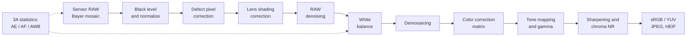

# ISP 101: The Classical Camera Pipeline

A camera sensor does not record an image you would want to look at. It records a mosaic of noisy, linear light
measurements, one color per pixel, in the sensor's own color space. The **image signal processor (ISP)** turns that
RAW mosaic into a display-ready sRGB (or YUV) image. This page walks through the classical stages in the order they
usually run, and points to the parts of the [paper list](../README.md) where learned methods replace or assist each
stage.

A runnable version of the core stages is in [`minimal_isp.py`](minimal_isp.py) (about 50 lines of NumPy).



Real ISPs differ in order and detail (some denoise after demosaicing, many do white balance before denoising, and
phones add multi-frame merging before everything else), but the stages below appear in almost every design.

## 1. Sensor and RAW data

- Each photosite counts photo-electrons during the exposure; an ADC turns the charge into a 10–14-bit integer.
- A **color filter array (CFA)** puts one color filter over each photosite. The most common layout is the 2×2
  **Bayer** pattern (RGGB and its rotations: GRBG, GBRG, BGGR). Newer phone sensors use Quad Bayer (2×2 blocks of one
  color), Nona (3×3) or RGBW layouts.
- RAW values are **linear** in scene light (until the sensor saturates) and are stored in camera-specific formats
  (CR2/CR3, NEF, ARW, ...) or Adobe's open [DNG](https://helpx.adobe.com/camera-raw/desktop/dng-and-file-formats/digital-negative.html)
  container, which also carries the metadata the rest of the pipeline needs: black/white levels, CFA pattern,
  as-shot white balance and color matrices.

## 2. Black level subtraction and normalization

The sensor adds an offset (black level) so that noise around zero is not clipped. The first step removes it and
scales to [0, 1]:

```
x = clip((raw - black_level) / (white_level - black_level), 0, 1)
```

The black level can differ per CFA channel and, on some sensors, per row or column (optical black regions at the
edge of the sensor are used to estimate it).

## 3. Defect pixel correction

Hot, dead or stuck photosites are either listed in a factory calibration map or detected on the fly as pixels that
disagree strongly with same-color neighbours, and are replaced by a median or directional interpolation of those
neighbours.

## 4. Lens shading correction

Lenses deliver less light to the corners than to the center (vignetting), and the falloff differs per color channel
(color shading). The fix is a per-channel gain map, calibrated per lens and often per illuminant, multiplied onto the
mosaic.

## 5. Noise and RAW denoising

RAW noise is well described by a **Poisson-Gaussian** model: shot noise whose variance grows with the signal, plus
signal-independent read noise,

```
Var[x] ≈ a · E[x] + b        (a depends on analog gain / ISO, b on read noise)
```

Classical denoisers either work directly with this heteroscedastic noise or first apply a **variance-stabilizing
transform** such as the generalized Anscombe transform (GAT), which makes the noise approximately Gaussian with unit
variance, run a Gaussian denoiser (e.g. BM3D), and invert the transform. Denoising in the RAW domain, before
demosaicing and tone mapping mix the noise across channels, is usually more effective than denoising the final image.

Learned methods: [RAW Denoising & Noise Modeling](../README.md#raw-denoising--noise-modeling),
[Low-Light RAW Enhancement](../README.md#low-light-raw-enhancement), [Burst & HDR](../README.md#burst--hdr).

## 6. White balance (auto white balance, AWB)

The same white wall looks orange under tungsten light and blue in shade. White balance estimates the illuminant's
color in camera RGB and divides it out with per-channel gains, usually normalized so green has gain 1:

```
R' = R · g_R,   G' = G,   B' = B · g_B
```

Classical illuminant estimators include **gray world** (the scene average is gray), **white patch / max-RGB** (the
brightest pixels are white) and **gray edge** (the average image derivative is gray). Cameras combine such
statistics with priors over plausible illuminants (the blackbody locus). Estimating the illuminant is the
**color constancy** problem.

Learned methods: [White Balance, Color & Tone](../README.md#white-balance-color--tone).

## 7. Demosaicing

Each pixel has one measured color; demosaicing interpolates the other two. Bilinear interpolation causes zipper
artifacts and false color at edges, so practical algorithms exploit inter-channel correlation (Malvar-He-Cutler adds
gradient corrections from the other channels) and edge direction (adaptive homogeneity-directed, AHD). Fine periodic
textures still produce **moiré**. Because noise makes demosaicing harder and demosaicing spreads noise, the two are
increasingly solved jointly.

Learned methods: [Demosaicing, Joint Restoration & RAW Super-Resolution](../README.md#demosaicing-joint-restoration--raw-super-resolution).

## 8. Color correction (camera RGB to sRGB)

Camera spectral sensitivities differ from the human color-matching functions, so white-balanced camera RGB still
has to be mapped to a standard space. The usual model is a 3×3 **color correction matrix (CCM)**:

```
[R, G, B]_linear-sRGB = M_sRGB←XYZ · M_XYZ←cam · [R, G, B]_camera
```

`M_XYZ←cam` is calibrated from a color chart under known illuminants; DNG stores two such matrices (typically for
illuminant A and D65) and interpolates between them based on the estimated white balance. Some ISPs add 3D lookup
tables for finer, non-linear color control.

## 9. Tone mapping and gamma

Linear sensor data spans more dynamic range than a display can show and looks dark and flat. **Tone mapping**
compresses it with a global curve (an S-curve, or a photographic operator such as Reinhard's) or local operators
that preserve detail in shadows and highlights; HDR pipelines first merge several exposures. Finally the image is
encoded with the display transfer function, e.g. the sRGB curve:

```
V = 12.92 · L                    if L ≤ 0.0031308
V = 1.055 · L^(1/2.4) − 0.055    otherwise
```

Photo-finishing styles (contrast, saturation, "looks") are applied around this stage, which is where most of a
phone's characteristic rendering comes from.

## 10. Enhancement, color space conversion and compression

The last stages convert to YUV, apply edge enhancement (unsharp masking), chroma and luma noise reduction, false
color suppression, scaling, and encode to JPEG or HEIF.

## 11. The 3A loop

In parallel with the image path, the ISP gathers statistics (histograms, per-zone color averages, focus metrics)
that drive **auto exposure (AE)**, **auto focus (AF)** and **auto white balance (AWB)** for the next frames. Hardware
ISPs expose hundreds of parameters for these loops and for every stage above; tuning them is a substantial manual
effort, which motivates the work in [ISP Parameter Tuning](../README.md#isp-parameter-tuning).

## Where neural ISPs fit

| Approach | What is learned | Sections |
|---|---|---|
| Replace one stage | a single block (denoiser, demosaicer, AWB) inside a classical ISP | Denoising, Demosaicing, White balance |
| Replace the whole ISP | a network maps RAW directly to sRGB | [End-to-End](../README.md#end-to-end-raw-to-srgb), [Mobile](../README.md#mobile--lightweight-isp) |
| Run the ISP backwards | recover RAW from sRGB for data synthesis or storage | [Inverse ISP](../README.md#inverse-isp-raw-reconstruction--compression) |
| Serve a machine | optimize the ISP (or skip it) for detection or segmentation | [ISP for Machine Vision](../README.md#isp-for-machine-vision) |
| Tune a classical ISP | keep the hardware, learn its parameters | [ISP Parameter Tuning](../README.md#isp-parameter-tuning) |

## Further reading

See [Learning Resources](../README.md#learning-resources) in the README for tutorials, books and the classical papers
behind each stage, and [Tools](../README.md#tools--open-source-isps) for RAW readers and open-source ISP
implementations.
